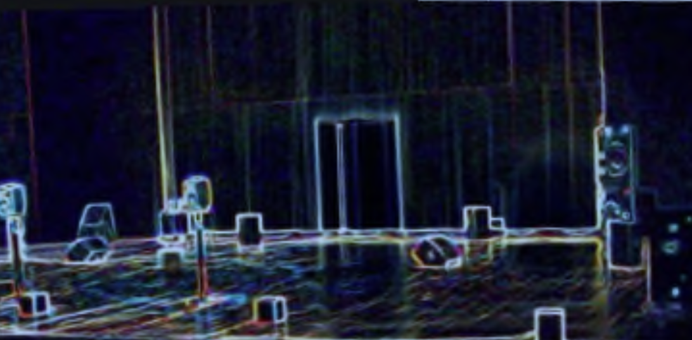

---
title:
---
Institute for Computer Music and Sound Technology / (ICST) Zurich University of the Arts

---

Acousmatic music and its associated performance practice aims to create a situation of focused listening by keeping the means of sound production invisible and largely eliminating visual stimuli. The ICST archive contains numerous historical pieces in this tradition and promotes the creation of new acousmatic works through artistic residencies. The concert series _ascolta – Akusmatische Hörstunde_ presents both newer and older works, played in the (usually multi-channel) original versions in the ICST composition studio (3.D02, level 3, Toni-Areal). 

| Termine (HS) 2024                       | Topic            | Date       | Time  | Raum  |
| --------------------------------------- | ---------------- | ---------- | ----- | ----- |
| [#15 ascolta Akusmatische Hörstunde]()  | **Listen twice** | 22.04.2025 | 18:00 | 3.D02 |
| [#14  ascolta Akusmatische Hörstunde]() | **Listen twice** | 06.05.2025 | 18:00 | 3.D02 |

|                                                                                                                   |                       |                |           |                |
| ----------------------------------------------------------------------------------------------------------------- | --------------------- | -------------- | --------- | -------------- |
| Termine (HS) 2024                                                                                                 | Topic                 | Date           | Time      | Raum           |
| **[#13 ascolta Akusmatische Hörstunde](https://www.zhdk.ch/veranstaltung/55821)**                                 | **Listen twice**      | **17.12.2024** | **18:00** | 3.D02, Ebene 3 |
| [#12 ascolta Akusmatische Hörstunde](https://icst-kompositionsstudio.ch/post/12-ascolta-akusmatische-horstunde)   | Porträt Georg Katzer  | 22.10.2024     | 18:00     | 3.D02, Ebene 3 |
| # [#11 ascolta Akusmatische Hörstunde](https://icst-kompositionsstudio.ch/post/11-ascolta-akusmatische-horstunde) | Porträt Mario Mary    | 11.06.2024     | 18:00     | 3.D02, Ebene 3 |
| # [#10 ascolta Akusmatische Hörstunde](https://icst-kompositionsstudio.ch/post/10-ascolta-akusmatische-horstunde) | The Composer, Herself | 19.03.2024     | 18:00     | 3.D02, Ebene 3 |

|     |     |     |     |     |
| --- | --- | --- | --- | --- |
| Termine (HS) 2023 | Topic | Date | Time | Raum |
| [#09 ascolta acousmatic listening lesseon](https://icst-kompositionsstudio.ch/post/09-ascolta-akusmatische-horstunde) | Hans Tutschku: **_Remembering Japan_** | 05.12.2023 | 18:00 | 3.D02, Ebene 3 |
| [#08 ascolta acousmatic listening lesseon](https://icst-kompositionsstudio.ch/post/08-ascolta-akusmatische-horstunde) | Mesias Maiguashca: **_La Canción de la Tierra_** | 24.10.2023 | 18:00 | 3.D02, Ebene 3 |

|     |     |     |     |     |
| --- | --- | --- | --- | --- |
| Termine (FS) 2023 | Topic | Date | Time | Raum |
| [#07 ascolta acousmatic listening lesson](https://icst-kompositionsstudio.ch/post/07-ascolta-akusmatische-horstunde) | 6 x 7 | 23.05.2023 | 18:00 | 3.D02, Ebene 3 |
| [#06 ascolta acousmatic listening lesson](https://icst-kompositionsstudio.ch/post/06-ascolta-acousmatic-listening-lesson) | ## Zbigniew Karkowski (Polen/Japan) | 04.04.2023 | 18:00 | 3.D02, Ebene 3 |
| [#05 ascolta acousmatic listening lesson](https://icst-kompositionsstudio.ch/post/05-ascolta-acousmatic-listening-lesson) | Field-Recordings  & Soundscapes | 14.03.2023 | 18:00 | 3.D02, Ebene 3 |

|     |     |     |     |     |
| --- | --- | --- | --- | --- |
| Termine (HS) 2022 | Topic | Date | Time | Raum |
| [#04 ascolta acousmatic listening lesson](https://icst-kompositionsstudio.ch/post/04-ascolta-akusmatische-horstunde-glocken) | Glocken | 13.12.2022 | 18:00 | 3.D02, Ebene 3 |
| [#03  ascolta acousmatic listening lesson](https://icst-kompositionsstudio.ch/post/03-ascolta-akusmatische-horstunde-granular) | GRANULAR | 01.11.2022 | 18:00 | 3.D02, Ebene 3 |
| [#02 ascolta acousmatic listening lesson](https://icst-kompositionsstudio.ch/post/ascolta-akusmatische-hoerstunde-02-gerald-bennett) | Gerald Bennett | 04.10.2022 | 18:00 | 3.D02, Ebene 3 |

|     |     |     |     |     |
| --- | --- | --- | --- | --- |
| Termine (HS) 2019 | Topic | Date | Time | Raum |
| [#01 ascolta acousmatic listening lesson](https://icst-kompositionsstudio.ch/post/icst-ascolta-akusmatische-horstunde-2019) | Jean-Claude Risset | 26.11.2019 | 18:00 | 3.D02, Ebene 3 |

* * *
