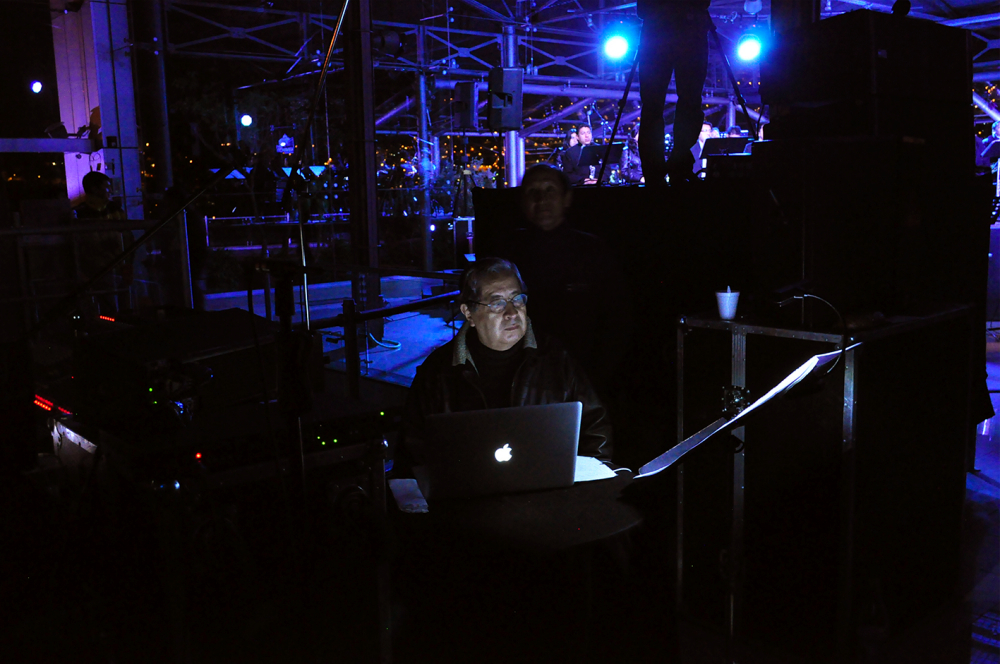

Institute for Computer Music and Sound Technology / (ICST) Zurich University of the Arts

---
# #08 ascolta Akusmatische Hörstunde

---
**Dienstag, 24. Oktober 2023, 18.00 Uhr**

- Toni-Areal, 
- ICST-Kompositionsstudio (3.D02, Ebene 3)
- Pfingstweidstrasse 96, 
- 8005 Zürich

_Eintritt frei_ 

----
# **_La Canción de la Tierra_**

Mesias Maiguashca
Artist in Residency am ICST: 2018 | 28.2. – 1.3.2019 | 25.4. – 26.4.2019 | 2020

* * *

La Canción de la Tierra
(eine Audiovisuelle Komposition 2017-2020)

Idee und Musik: Mesias Maiguashca,
Video: Carlos Poete.
Technik Audio-Ambisonics: Johannes Schütt.

Dieses Werk wird heute als 'Cinema pour l'oreille' ohne das Video gespielt!

* * *

Mesias Maiguashca
Born in Quito, Ecuador, the 24th of December, 1938, Mesías Maiguashca studied at the Conservatorio de Quito, the Eastman School of Music (Rochester, N.Y.), the Instituto di Tella (Buenos Aires) and at the Musikhochschule in Cologne. He realized compositions in the Studio for Electronic Music WDR (Cologne), the Centre Européen pour la Recherche Musicale (Metz), IRCAM (Paris), Acroe (Grenoble) and ZKM (Karlsruhe), and teached in Metz, Stuttgart, Karlsruhe, Basel, Sofía, Quito, Cuenca, Buenos Aires, Bogotá, Madrid, Barcelona, Györ y Szombathely (Hungary), Seoul (Corea) and his works were presented at the most important European festivals.Maiguashcas was professor for electronic music at the Musikhochschule Freiburg from 1990 until his retirement in 2004. Together with Roland Breitenfeld, he founded the [K.O.Studio](http://K.O.Studio) Freiburg in 1998, a private initiative for the practice of experimental music. He lives in Freiburg since 1996.
[www.maiguashca.de](http://www.maiguashca.de/index.php/de/)

* * *

Das erste Mal, als ich _DasLied von der Erde von_ Gustav Mahler (vor ungefähr 30 Jahren, als Studierender, bereits in Europa) hörte, beschloss ich, auch ein _Lied von der Erde_, una _Canción de La Tierra_ zu komponieren. Selbstverständlich sollte meine Komposition anders klingen. Wir wissen, dass unsere Geschichte, die amerikanische Geschichte, nicht mit der „Entdeckung“ und Eroberung seitens der Europäer anfängt. Wir wissen wohl, dass die Überlagerung der europäischen Kultur über die amerikanische Kultur diese an den Rand der Zerstörung und des Verschwindens brachte. Europäische Philosophie, Religion und Lebensformen wurden zur Norm des amerikanischen Lebens und in mehrerer Hinsicht sind sie das noch. Aber ich denke, dass eine spezifische Andinische Art, die Welt zu begreifen, existiert. Ich kann sie sicher nicht beschreiben, geschweige denn erklären. Kann man sie zum klingen bringen?

Die Komposition _La Canción de la Tierra,_ für ein Ensemble von Andeninstrumenten, für ein Bläserensemble, einen Chor von 6 Frauen- und 6 Männern sowie zwei Gruppen von „Klangobjekten“ aus Holz und Metall, die ich selbst entworfen habe, wurde 2013 in Quito uraufgeführt. Das Konzert konnte leider aufgrund der technischen und musikalischen Komplexität nicht zufriedenstellend dokumentiert werden. Ich habe deswegen als Erinnerung die hier beschriebene audiovisuelle Komposition entworfen. Sie ist nicht eine Dokumentation des Konzertes, sie ist ein autonomes Werk. Die Tonspur basiert weitgehend auf der Originalaufnahme des Konzerts. Die Version Audio mit Ambisonics-Technik wurde in dem Studio des ICST /ZHdK (Zürcher Hochschule der Künste), Tonmeister Johannes Schütt, realisiert.

* * *

_La Canción de la Tierra_ besteht aus 14 canciones:
Canción del ser,                                canción del ruido cósmico,             canción del hanan-pacha,
canción de la papa,                         canción del agua,                                canción del granizo,
canción de la brisa,                         canción del estar,                                canción del kay-pacha,
canción de los guacamayos,       canción del uku-pacha                     canción del paisaje seco,
canción de la cordillera,                canción del amanecer.

* * *

_La Canción de la Tierra_es una meditación
y un canto de homenaje y agradecimiento
a la Naturaleza, a la Madre Tierra, a la Pachamama.

* * *

Zitiert aus der Site von **[Mesias Maiguashca](https://maiguashca.de/) (2022)**

---
©2025 ICST
