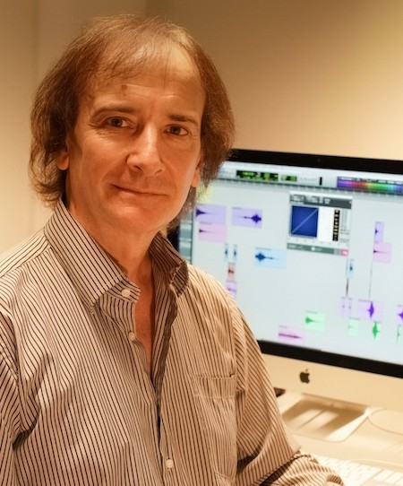

Institute for Computer Music and Sound Technology / (ICST) Zurich University of the Arts

---
# #11 ascolta Akusmatische Hörstunde

---

# Mario Mary, portrait

**Konzert**
- **11.06.2024, 18:00**
- Toni-Areal, 
- Kompositionsstudio 3.D02, Ebene 3, 
- Pfingstweidstrasse 96, Zürich

_Eintritt frei_ 

* * *

### **Programm:**

* 2015 **_Polyphonic philosophy_**  pièce électroacoustique en 8 pistes.  \[ 10' 43''\]

	Commande de l'ICST de Zurich, Suisse. Création à l'Université de Zurich en novembre 2015
		Continuing the aesthetic exploration about "electroacoustic orchestration" and "polyphony of space" of the previous works "Signes émergents" and "2261", the first section of this composition develops in the horizontal plane a concept that could be called "melody of sound objects". Here, polyphony and counterpoint of the musical discourse is interwoven through with small sound objects, creating polyphony and counterpoint taking advantage of the possibilities offered by the multitracks space with 8 tracks around public.

* * *

* 2018 **_Le sophistiqué son du Dasein_** pièce électroacoustique en 8 pistes.  \[ 17' \]

	Commande de l'INA-GRM / Réalisée au studio du compositeur.
		Création á la MPAA de Saint-Germain -  Paris - France en octobre 2018
		Second Prix Klang! 2019(France)
		Mention d'honneur CIME 2019 (France)  
		This music is concretized through personal techniques as well as reflective work to express electroacoustic art and today's world. In this piece I have put special interest in the quality of the sound materials, essential essence of electroacoustic art. And I have also given special importance to the musical discourse that makes us go through the different sections of the piece in a fluid way.

* * *

* 2022 **_Towards the Morondanga Galaxy_** pièce électroacoustique en 8 pistes.   \[ 10' \]

	Réalisée au studio du compositeur.
		This piece is inspired by the idea of a trip to an imaginary galaxy. The electroacoustic sounds suggest sounds inside the spaceship and illustrate the various events she goes through on her journey. The cosmic space and the space of the electroacoustic composition merge in the musical discourse.

* * *

* 2023  **_Pedro en su laberinto_**   pièce électroacoustique en 8 pistes.  \[ 10' 10''\]

	Création le 21 août 2023 au FIME -   ArtHaus Center - Buenos Aires - Argentine. Réalisée au studio du  compositeur.
		Distinction CIME   2023 (Grèce)
		This composition is a proposal with a high density of sound materials and few breaths. The work displays an indefatigable energy through an articulate and vital polyphonic discourse. The multiple trajectories and sound planes generate a rich and changing acoustic space around the listener. All this complexity could be linked to life itself, in which, without realizing it, we progressively create our own labyrinths and the terrains where our deepest joys and conflicts develop.

* * *

### Mario MARY

An Argentine composer born April 25, 1961 in Buenos Aires.

After gaining a diploma in composition at the University of La Plata  in Argentina, Mario Mary continued his training at the GRM, the Paris  Conservatory and Ircam. He obtained a doctorate in the aesthetics,  science and technology of the arts,  at the University of Paris VIII,  where he taught computer-assisted composition (1996-2010).

A teacher of electro-acoustic composition at the Académie de Musique  Prince Rainier III in Monaco, co-founder and artistic director of  Monaco/Electroacoustique (international electro-acoustic music  meetings), this teacher-researcher also lectures in Europe and South  America.

Mario Mary composes mainly electro-acoustic works (_Fuite en avant_, premiered at Festival Synthèse, 2005 ; _2261_, premiered at Radio France, 2009 ; _Le sophistiqué son du Dasein_, premiered at MPAA, 2018) but also chamber works with or without electro-acoustics (_La orilla secreta_ for  cello, piano, percussion and electro-acoustic sounds, premiered at  Rencontres internationales de musique électroacoustique de Monaco,  2011 ; _No sé_, musical theater for mixed voices, premiered at  Buenos Aires, 2014). He has also made experimental videos that relate to  his works (_Un souffle de vie_, premiered at Radio France in 2006). Since the 1990s his work has been directed towards the concept of spatial polyphony (_Signes émergents_, an electro-acoustic piece commissioned by the GRM, 2003) and a technique of electro-acoustic orchestration (_Double concerto_ for clarinet, violin and electro-acoustics, premiered by Ensemble orchestral Contemporain during Festival Manca, 2012).

* * *
Quelle: <http://www.cdmc.asso.fr/en/ressources/compositeurs/biographies/mary-mario-marcelo-1961>

---
©2025 ICST
