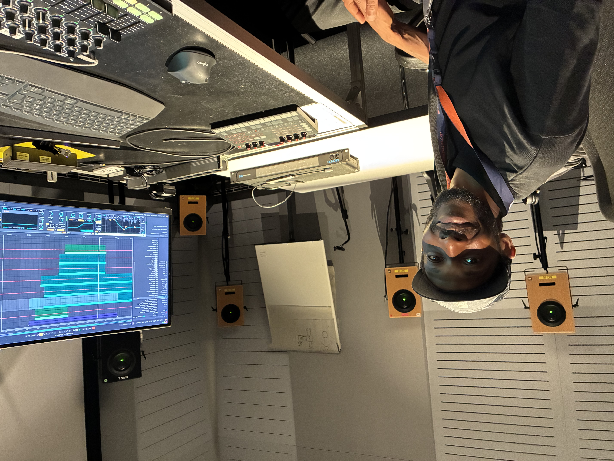

---
title:
---
Institute for Computer Music and Sound Technology / (ICST) Zurich University of the Arts

---
# Nandele Maguni 
ICST Artist in Residence from **16.06.2025 to 06.07.2025** (Studio-Residence)

### Exploring Sound at ZHdK – ICST

Being in residency at ZHdK – Zurich University of the Arts, within the ICST, has been an inspiring experience.
I'm currently developing the project Kampfumo, a sonic exploration based on the everyday soundscape of Maputo — especially the chapa 100 transport system and the vibrant energy of the Kampfumo district.
At the ICST spatial audio studio, I’m experimenting with immersive technologies to create a cinematic and multidimensional listening experience.
This is not just about sound — it’s about movement, memory, and space.  
Nandele Maguni

