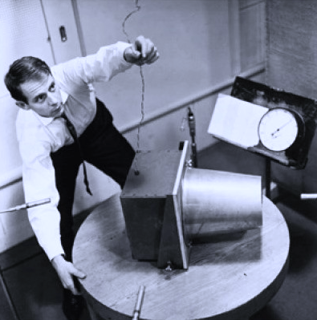

Institute for Computer Music and Sound Technology / (ICST) Zurich University of the Arts

---
# #14 ascolta Akusmatische Hörstunde

## **Listening twice**

**Experimental**
**22.04.2025, 18:00**
Toni-Areal, Kompositionsstudio 3.D02, Ebene 3, Pfingstweidstrasse 96, Zürich
_Eintritt frei_ 

---
### **In dieser Hörstunde widmen wir uns einem Klassiker von Karlheinz Stockhausen:**

#### **KONTAKTE**
No.12: KONTAKTE (Contacts)
for 4-channel tape
1958-60 (35:30)

  
_KONTAKTE_  is [Karlheinz Stockhausen](https://de.wikipedia.org/wiki/Karlheinz_Stockhausen)'s fifth electronic tape composition, following _ETUDE_, _STUDIE I & II_, and _GESANG DER JÜNGLINGE_. The composition plan—spanning approximately 700 sheets—was developed over six months (1958–1959). Stockhausen then realized the work at the [WDR Electronic Music Studio](https://en.wikipedia.org/wiki/Studio_for_Electronic_Music_(WDR)) with technicians [Gottfried-Michael Koenig](https://de.wikipedia.org/wiki/Gottfried_Michael_Koenig) and Jaap Spek between September 1959 and May 1960. The premiere took place on May 10, 1960, at a festival concert for the [International Society for Contemporary Music](https://iscm.org/) in Cologne.

In this lesson, we will listen to _Kontakte_ twice in two different versions:
1. A **5.1 DVD production** from [ICST/ZHdK](http://ppeam.zhdk.ch/song/kontakte/).
2. A **rare Ambisonics (UHJ) recording**, offering a unique spatial listening experience.

We look forward to comparing these versions.

---
### Additional Information:

- [**Kontakte**](https://stockhausenspace.blogspot.com/2015/11/kontakte-planning-design.html)
- [**ICST Production**](http://ppeam.zhdk.ch/song/kontakte/)
- [**UHJ Production**](https://en.wikipedia.org/wiki/Ambisonic_UHJ_format)
	- **Stereo UHJ**: A process that encodes strictly horizontal [Ambisonics](https://de.wikipedia.org/wiki/Ambisonics) signals into a compatible two-channel stereo format using matrix technology originally developed for [Quadraphonics](https://en.wikipedia.org/wiki/Quadraphonic_sound). However, this encoding is lossy.
	- We decoded the original UHJ into a **7th-order ambiX B-format** and used the [ICST Ambisonics MultiDecoder](https://ambisonics.ch/home/)for playback.

---
©2025 ICST
