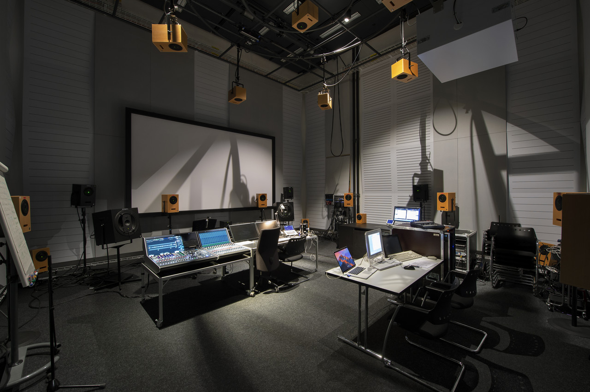

---
Institute for Computer Music and Sound Technology / (ICST) Zurich University of the Arts

# BLOG

- [Notes](https://ambisonics.ch/blog/notes/)
- [What we now](https://ambisonics.ch/blog/what_we_now/)

---
# ICST Composer Studio

- [ICST Composer Studio Overview](https://ambisonics.ch/blog/icst-composer-studio-overview/)

# ICST Studio Residencies

- [ICST Studio Residencies](https://ambisonics.ch/blog/icst-studio-residences/)
- [ICST Resident\*innen im Kompositionsstudio \| ICST-Kompositionsstudio](https://icst-kompositionsstudio.ch/post/icst-artist-in-residency-im-kompositionsstudio))

---
# ICST Ascolta Hörstunden

- [Ascolta Akusmatische Hörstunden](https://ambisonics.ch/blog/ascolta/)

---
# ICST Labor 

- [ICST Labor Dome](https://ambisonics.ch/blog/icst-labor/)

---
#  Explore 3D Audio Music

- #### Ambisonics
	- [ICST Bformat Archive](icst-bformat-archive)
	- [Sounding Future]([Sound Tracks - Browse Our Collection](https://audiospace.soundingfuture.com/tracks))
	- [Hoast Library](https://hoast.iem.at/)
	- [Nimbus UHJ](https://www.wyastone.co.uk/all-labels/nimbus.html)

# ICST Artists in Residence
 Impressions of Artist in Residence in the studio
- [Current ICST Artists in Residencies](https://www.zhdk.ch/forschung/icst/icst-air)
- [Former residencies](https://www.zhdk.ch/forschung/icst/icst-air/past-residents-20734)

---
## Additional downloads
- [Decoder Speaker Settings](decoder-speaker-settings)

---
©2025 ICST
