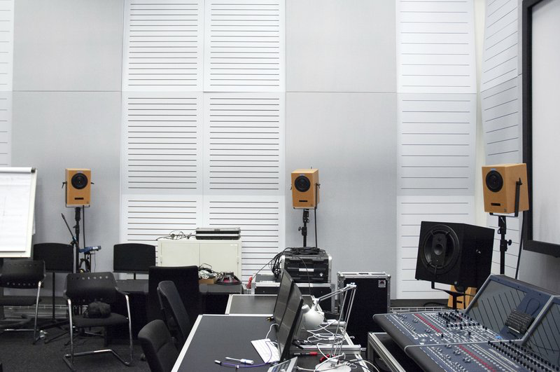

Institute for Computer Music and Sound Technology / (ICST) Zurich University of the Arts

---
#### **Studio for Composition**

The Studio of the ICST is a Surround-Studio with 17 Geithain Speakers (8+5+4) and stereo-monitoring. 
A Mac Pro is offering various software such as sequencers, HD-recording- and Sound-tools, MAX MSP/Jitter, and PD. The studio is suitable especially for producing ambisonic/surround music. It combines the latest technologies with musical practice and puts its focus on sound research, computer music, and media art. The Studio is a place to support the production and composition of new works of electronic music, sound- and media art.

* * *

## Help for the operation of the ICST Kompositionsstudio:

- [Overview](https://icst-kompositionsstudio.ch/post/icst-kompositionsstudio-regie)
- [Quick Start](https://icst-kompositionsstudio.ch/post/icst-kompositionsstudio-quick-start)
- [Support](https://icst-kompositionsstudio.ch/post/support)
- [Terms of use](https://icst-kompositionsstudio.ch/post/terms-of-use)
- [Speaker Settings](https://icst-kompositionsstudio.ch/post/speaker-settings)
- [Ambisonics Setup](https://icst-kompositionsstudio.ch/post/ambisonics-setup)
- [Software](https://icst-kompositionsstudio.ch/post/kompositionsstudio-software)
- [Software manuals](https://icst-kompositionsstudio.ch/post/05-manuals-and-tutorials)
- [Downloads](https://icst-kompositionsstudio.ch/post/downloads)
- [Pictures gallery](https://icst-kompositionsstudio.ch/post/gallery)

* * *

Room-address:  **[ZT 3.D02 ICST Kompositionsstudio](https://intern.zhdk.ch/?raum/ansicht/einzel&ts=1536789600&id=469)**
Contact:  [johannes.schuett@zhdk.ch](mailto:johannes.schuett@zhdk.ch)
