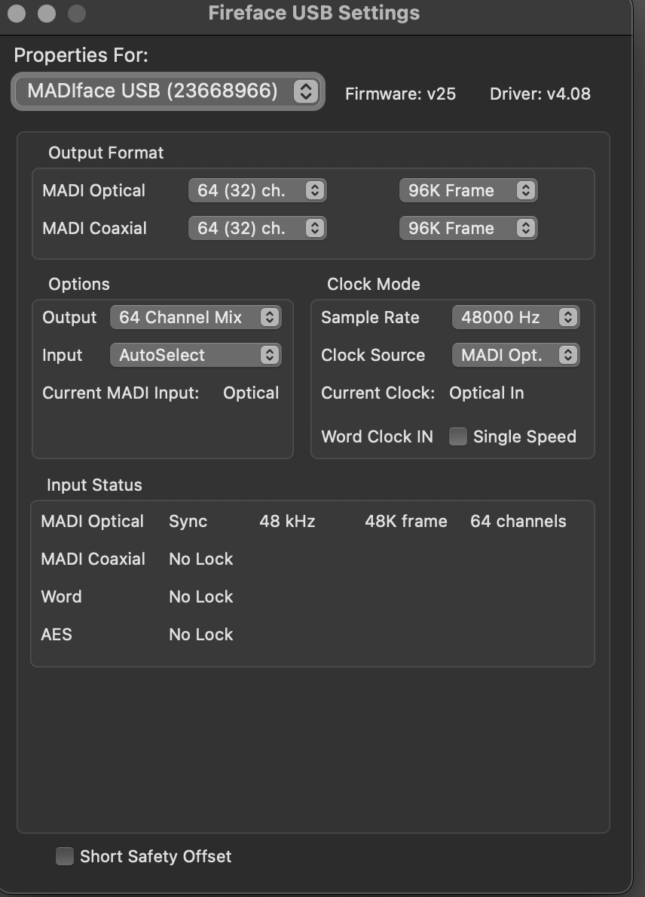
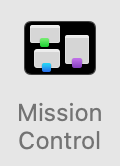
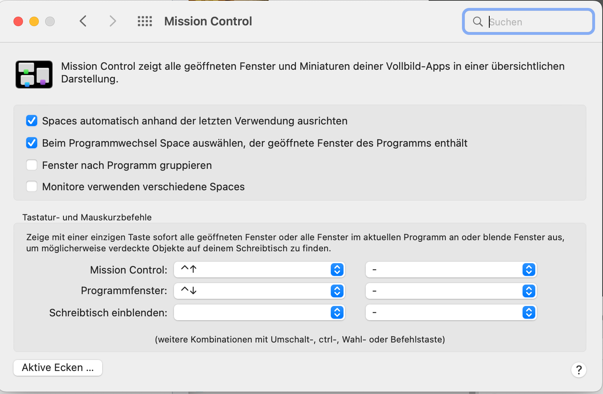

Institute for Computer Music and Sound Technology (ICST) Zurich University of the Arts

---

# Vorinstallation für deinen externen Laptop

**Für wen:** Level: Alle Levels | Zielgruppe: Komponist:in, Studierende, Researcher, Studio-Gäste.

### **AUDIO**

#### RME-Treiber installieren (DriverKit)

- **MadiFace USB herunterladen** und den Installationsanweisungen folgen.  
  [Produktseite](https://rme-audio.de/de_madiface-usb.html)

- **Systemkompatibilität:** macOS / Windows
- **USB Series Kernel Extension:** macOS 11+
- **Handbuch:** [PDF herunterladen](https://rme-audio.de/downloads/madiface_usb_d.pdf)

- [RME-Treiber für macOS](https://rme-audio.de/rme-treiber-macos.html)
- [Installationsanleitung](https://rme-audio.de/installationsanleitung.html)
- [Login Items & Extensions für DriverKit](https://rme-audio.de/de_login-items-extensions-driverkit-macos-sequoia.html) 

#### **Fehlersuche**
- Für Unterstützung das [Video](https://youtu.be/Ilkwtb2MKrM) ab Minute 2:36 ansehen.

#### RME MadiFace Sync:

Wie in der Abbildung oben ist die Synchronisation korrekt.

#### RME TotalMixer Setup für Mehrkanal:
- [RME TotalMix FX](https://rme-audio.de/totalmix-fx.html)

- Für Ambisonics den "stereo-mix" löschen.

---
# Video / Screen

**DisplayLink Manager installieren**  
Lade den [DisplayLink Manager für macOS](https://www.synaptics.com/products/displaylink-graphics/downloads/macos) für dein System herunter und installiere ihn.

#### **Tipp:**
Damit der Curved Screen als ein großer Bildschirm erscheint, ist eine zusätzliche Einstellung auf dem Mac nötig.

1. Systemeinstellungen -> Mission Control
2. Option "Monitore verwenden verschiedene Spaces" deaktivieren
3. Die Einstellung wird erst nach einem erneuten Login aktiv
   
   

---
# Support & Kontakt

**Hilfe:**
- Johannes Schütt &nbsp;&nbsp; Mobile: +41 79 786 12 49 &nbsp;&nbsp; Mail: [johannes.schuett@zhdk.ch](mailto:johannes.schuett@zhdk.ch)
- Peter Färber &nbsp;&nbsp;&nbsp;&nbsp;&nbsp;&nbsp;&nbsp;&nbsp;&nbsp; Mobile: +41 79 444 06 16 &nbsp;&nbsp; Mail: [peter.faerber@zhdk.ch](mailto:peter.faerber@zhdk.ch)

**Technischer Service A/V:**
- [simon.koenz@zhdk.ch](mailto:simon.koenz@zhdk.ch) &nbsp;&nbsp; Mobile: +41 76 330 11 02

---
# Downloads

→ Alle Downloads sind zentral auf der Seite [Downloads](/blog/downloads/) verfügbar.

---
©2025 ICST
