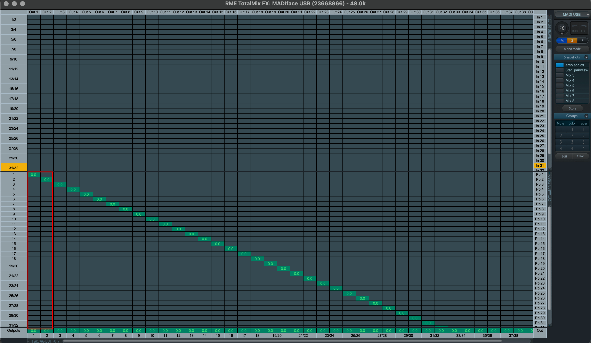
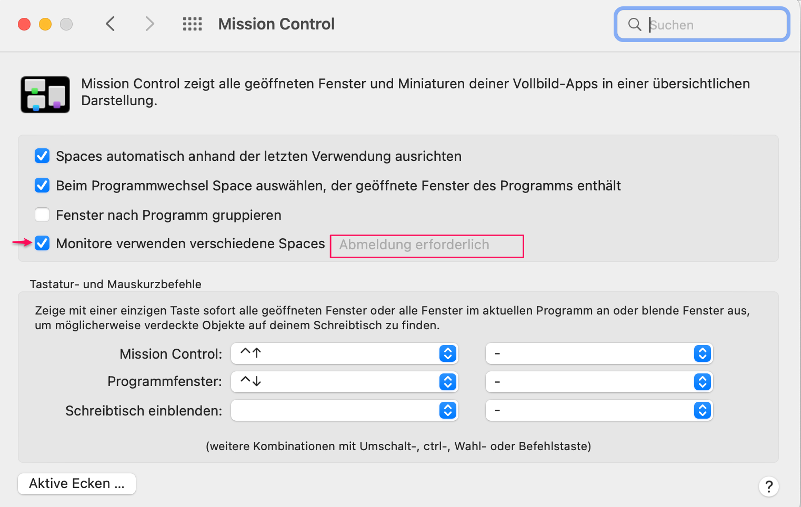

Institute for Computer Music and Sound Technology / (ICST) Zurich University of the Arts

---
# Pre-installation for your external laptop

### **AUDIO**

#### Install RME Driver (DriverKit)

- **Download MadiFace USB**  and follow the installer's instructions.
  [Product Page](https://rme-audio.de/de_madiface-usb.html)

- **System Compatibility:** macOS / Windows
- **USB Series Kernel Extension:** macOS 11+
- **Manual:** [Download PDF](https://rme-audio.de/downloads/madiface_usb_d.pdf)

- [RME Driver for macOS](https://rme-audio.de/rme-treiber-macos.html)
- [Installation Guide](https://rme-audio.de/installationsanleitung.html)
- [Login Items & Extensions for DriverKit](https://rme-audio.de/de_login-items-extensions-driverkit-macos-sequoia.html) 
	#### **Troubleshooting**
- Watch the [Video](https://youtu.be/Ilkwtb2MKrM) starting at 2:36 for assistance.
#### RME MadiFace Sync:

As in the figure above, the synchronization is correct.
#### RME TotalMixer Setup for Multichannel:

- for Ambisonics delete the 'stereo-mix'

---
# Video / Screen

**Install DisplayLink Manager**  
Download and install  [DisplayLink Manager for macOS](https://www.synaptics.com/products/displaylink-graphics/downloads/macos) for your system.

#### **Tip:** 
To get the curved screen as a single large screen, you need to make an additional setting on your Mac.

1. system preferences -> mission control
2. deactivate the flag 'monitors use different spaces.'
3. This setting will only become active after a new login!
   
   
   

---
# Downloads for the ICST Kompositionsstudio

---

- **RME-Drivers:**
- Please select the 'MADIface USB Driver' for your current architecture (PC/Mac) and operating system on the RME download page. Then follow the RME installation instructions.
- [https://rme-audio.de/de_madiface-usb.html](https://rme-audio.de/Downloadbereich.html)
---

- [ICST Ambisonics Plugins](https://github.com/schweizerweb/icst-ambisonics-plugins/releases)
- [ICST Ambisonics Tools](https://www.zhdk.ch/forschung/icst/software-downloads-5379/downloads-ambisonics-externals-for-maxmsp-5381) (please download the Ambisonics Tools over the 'Max Package Manager')
- [Studio Speaker-Settings (XML) & other helpers](https://drive.switch.ch/index.php/s/dM2GrZPe8EmPwzV)
- Labor Settings
---
- Curved Screen Driver : [https://www.synaptics.com/products/displaylink-graphics/downloads](https://www.synaptics.com/products/displaylink-graphics/downloads)

---
©2025 ICST