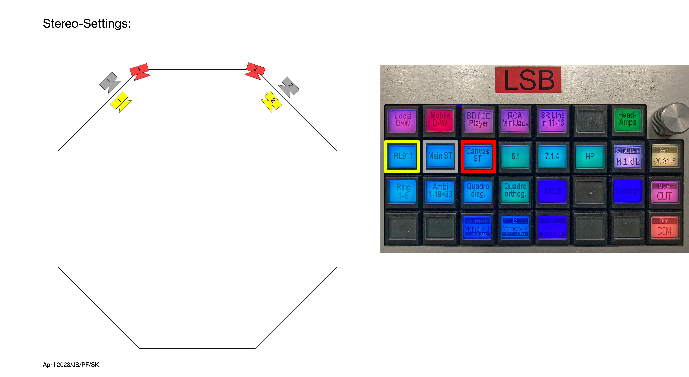
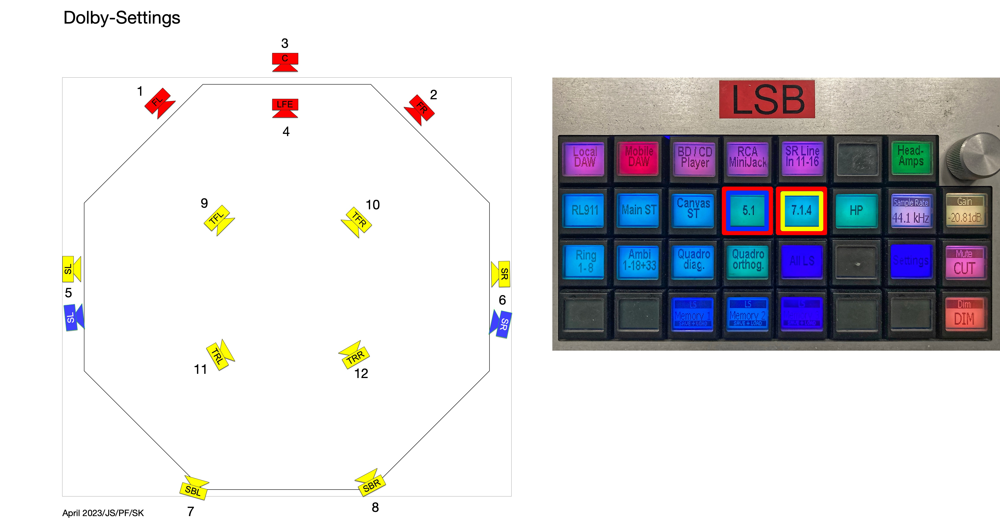
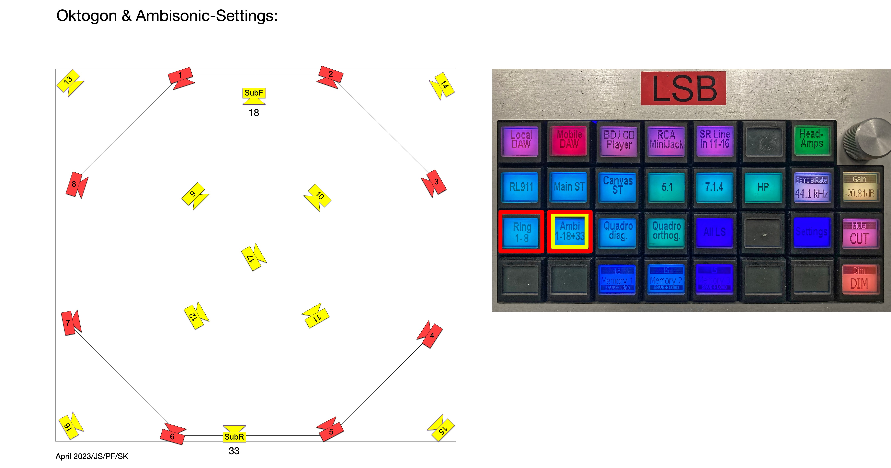
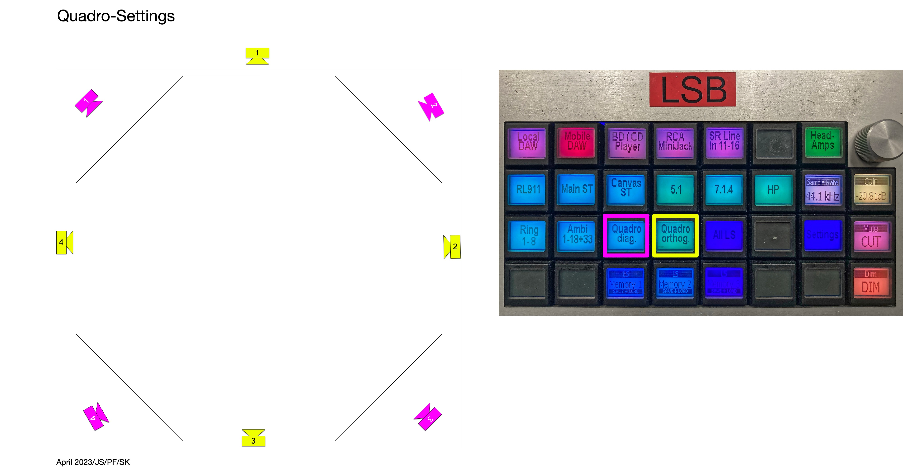
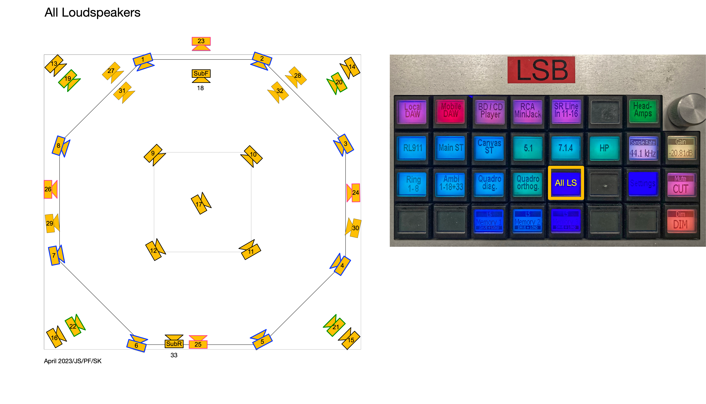

---
tags:
title: ICST Labor Ambisonics Speaker Settings
description: "Lautsprecher-Presets und Koordinatendateien für den ICST Decoder"
date: 2025-05-20T15:11:00
weight: 11
group: "Residents"
languageCode: de
---
Institute for Computer Music and Sound Technology (ICST) Zurich University of the Arts

---

Preset-Ansichten und Referenzlayouts für ein schnelles Setup im ICST Studio.

  <section class="home-card">
    <h4>Häufige Presets</h4>
    
Stereo-, Surround- und Ambisonics-Layouts als schnelle Startpunkte.

    

      <a class="hero__link hero__link--primary" href="#stereo-setting">Stereo</a>
      <a class="hero__link" href="#dolby-surround">Dolby</a>
      <a class="hero__link" href="#octogon--ambisonics">Ambisonics</a>
    

  </section>

  <section class="home-card">
    <h4>Flexible Routings</h4>
    
Zwischen vordefinierten Layouts wechseln oder alle Lautsprecher frei routen.

    

      <a class="hero__link hero__link--primary" href="#quadrophonie">Quadro</a>
      <a class="hero__link" href="#all-speakers">Alle Lautsprecher</a>
      <a class="hero__link" href="/blog/downloads/">Downloads</a>
    

  </section>

  
Stereo-Setting

  

    Gelb = RL911
    Grau = MO-2
    Rot = MO-2 (hinter der Leinwand)
  

  

  
Dolby Surround

  

    5.1 Surround
    7.1.4 Atmos
  

  

  
Octogon & Ambisonics

  

    Ring 1-8 (im Uhrzeigersinn) & Ambisonics (2D)
    Ambisonics Full (17 Lautsprecher)
  

  

  
Quadrophonie

  

    Quadro (diagonal)
    Quadro (orthogonal)
  

  

  
Alle Lautsprecher

  

    Eigene Lautsprecher-Routings erstellen
  

  

### Weitere Links

  <a class="hero__link hero__link--primary" href="/blog/downloads/">Speaker Files & Downloads</a>
  <a class="hero__link" href="/blog/icst-kompositionsstudio-regie/">Regie</a>
  <a class="hero__link" href="/blog/icst-kompositionsstudio-equipment/">Equipment</a>
  <a class="hero__link" href="/blog/icst-kompositionsstudio-software/">Software</a>
  <a class="hero__link" href="/blog/icst-kompositionsstudio-ambisonics-setting/">Legacy Speaker Settings</a>

©2025 ICST