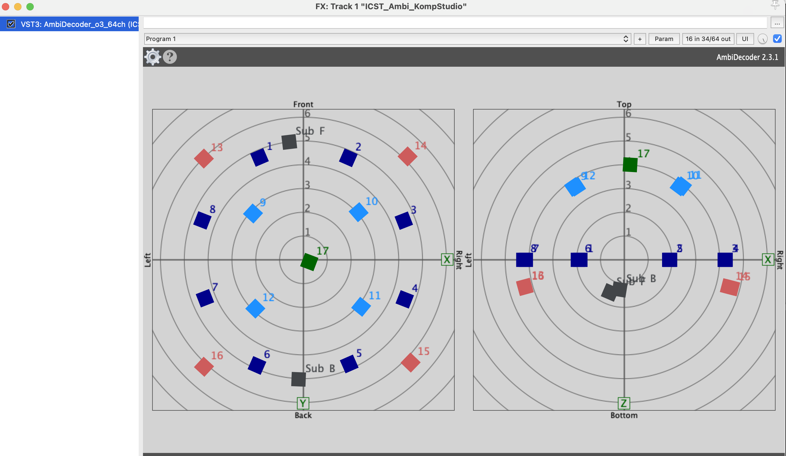
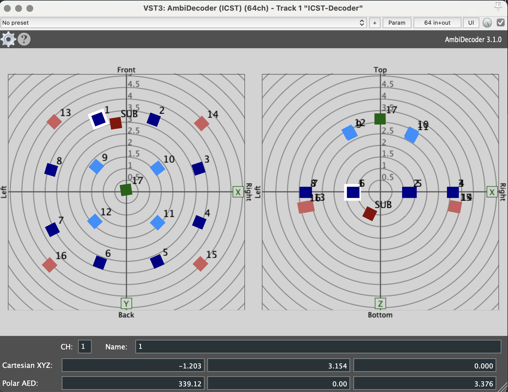
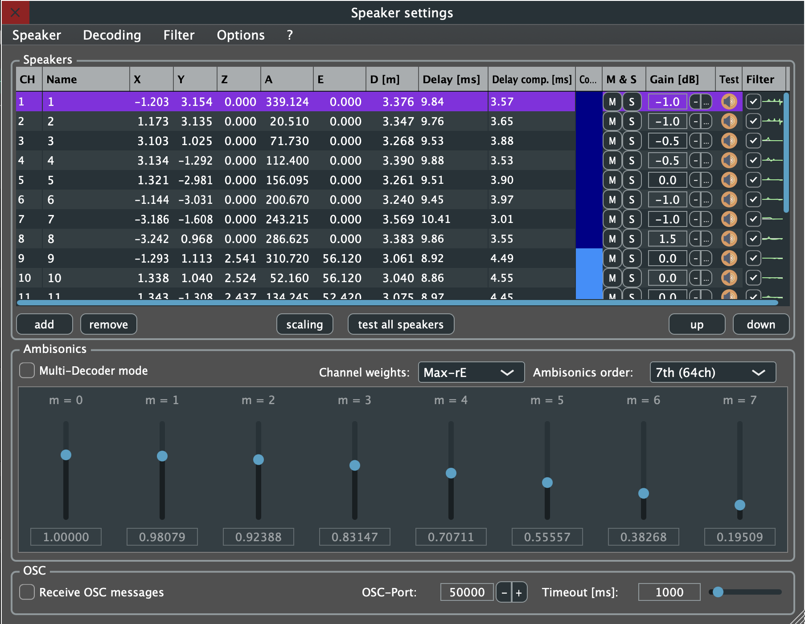
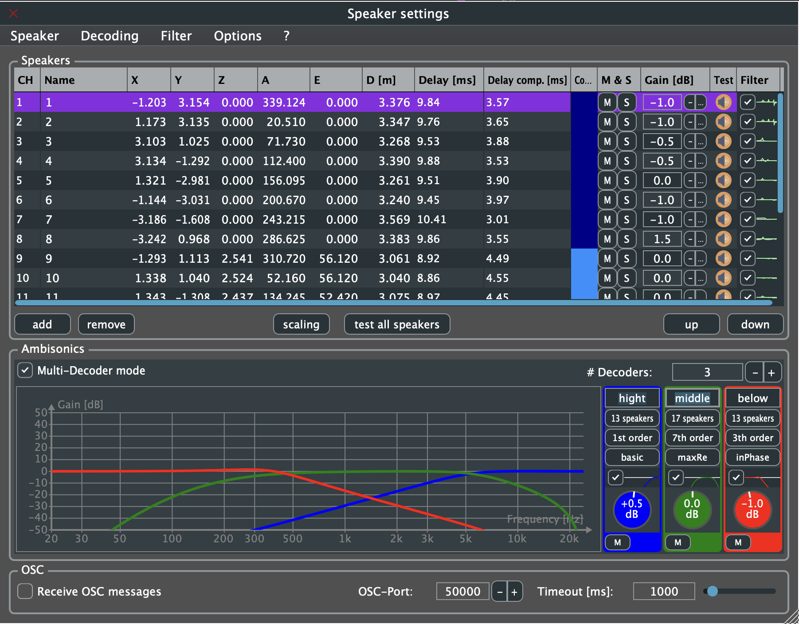

Institute for Computer Music and Sound Technology (ICST) Zurich University of the Arts

---

**Für wen:** Level: Alle Levels | Zielgruppe: Komponist:in, Studierende, Researcher, Studio-Gaeste.

Ambisonics-Lautsprecher-Setup und Koordinaten
**Beispiel für „ICST_AmbiDecoder 3.1.0" VST3 (2025)**

* * *

Der Studioraum ist ca. 7 m lang, 7 m breit und 7 m hoch.

Lautsprecher-Koordinaten für das "ICST Kompositionsstudio"

### **Koordinaten:**

#### Multi-Decoder-Setting (Beispiel)

 Lautsprecher 1 - 17 --> Kanäle 1 - 17
(Lautsprecher 17 = Voice of God)
 Sub/LFE --> Kanal 18

* * *

ICST Ambisonics Plugins Dokumentation:

* [ICST Ambisonics Plugins Home](https://github.com/schweizerweb/icst-ambisonics-plugins/wiki)
* [ICST Ambisonics Plugins Blog](https://ambisonics.ch/icst-ambisonics-plugins/)

* * *

**Downloads:** → [Downloads](/blog/downloads/)

* * *
©2025 ICST