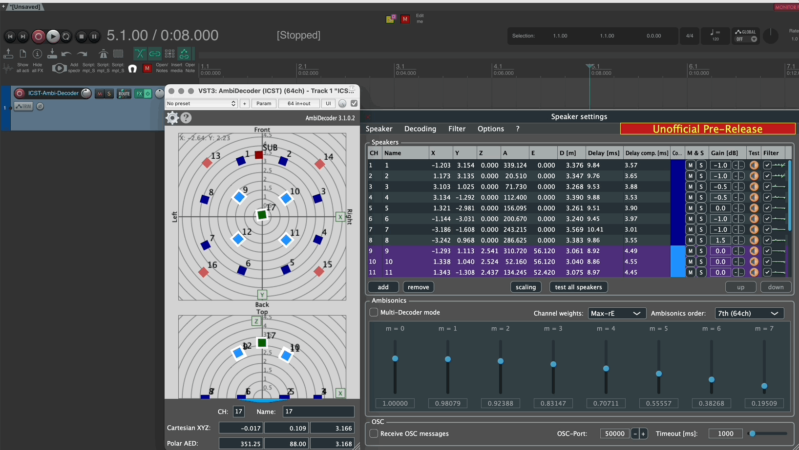
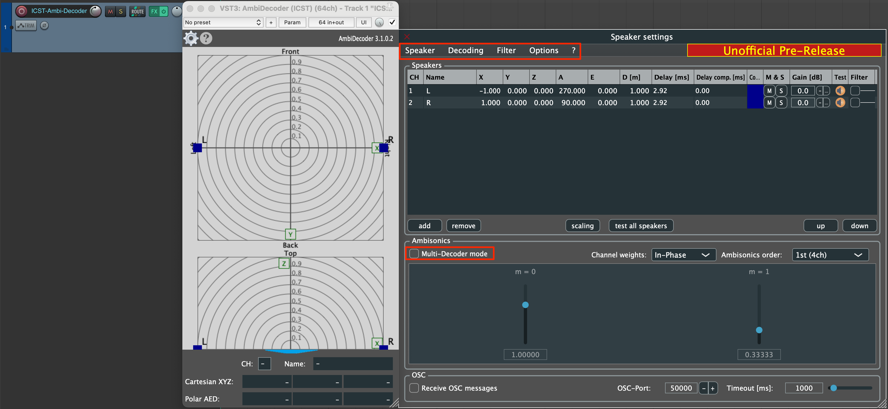
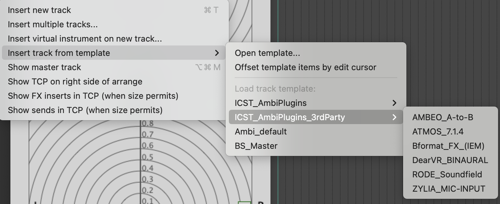

Institute for Computer Music and Sound Technology / (ICST) Zurich University of the Arts

----

# **ICST Ambisonics Plugins v3.1 Now Available!**

**Download:** [GitHub Releases](https://github.com/schweizerweb/icst-ambisonics-plugins/releases)

----
## **What’s New in v3.1?**

We’re excited to introduce **ICST Ambisonics Plugins v3.1**, featuring a new **multi-decoder** that incorporates the latest empirical research. With four **weightings** and **filter banks**, you can now fine-tune up to four loudspeaker arrays for a more detailed and spatially accurate **B-format** audio experience.

For full details, check out the official documentation: 
📖 **Documentation:** [Wiki](https://github.com/schweizerweb/icst-ambisonics-plugins/wiki)

---
# ICST AmbiDecoder v3.1

### **New Features & Enhancements**

- **Bidirectional Solo & Mute**  
- **Keyboard Shortcuts (Mac):** shift & control 's' / shift & control 'm'
  
### **New Layout**

- **Speaker Settings**
- **Decoding Settings**
- **Filter Options**
- **Additional Features (coming soon)**
  
### **New CSV Export Features**
- Export decoder "speaker coordinates" to Max via CSV (and vice versa).
- Backup and export all presets as XML.
- Import backup presets.

### Improved filter user interface

- 8 different filter options
	
	
  

### New Multi-Decoder Mode

- Four independent decoders with customizable names and colors.
- Individual speaker selection/deselection.
- Custom Ambisonic orders per decoder.
- Independent volume, weighting, and filter control for each decoder.
- Muting for each decoder.

📖 [**MultiDecoder Tutorial**] ()  
💡 For more details, visit the [Wiki](https://github.com/schweizerweb/icst-ambisonics-plugins/wiki).

### New Project-templates

- ICST_AmbiPlugins_MonoEncoder
- ICST_AmbiPlugins_MultiEncoder

### New Track Templates

- ICST AmbiPlugins
  
- ICST AmbiPlugins 3rdParty
  

---
# **ICST AmbiEncoder v3.1**

### **New Features & Layout**

- New Tap Layout
- Ambisonics Order Menu
-  Bidirectional Mute & Solo

🔹 **Example:** Layout

🔹 **Example:** Mute & Solo (bidirectional)

### **OSC Control**

Easily manipulate groups via **OSC** using absolute **[Euler angles](https://en.wikipedia.org/wiki/Euler_angles)**:

- Activate OSC port (e.g., **50001**)  
- Send absolute angles from externally for movement control in the AmbiEncoder.

🔹 **Example:** OSC from Max 9.0 to ICST AmbiEncoder  

💡 For more details, visit the [Wiki](https://github.com/schweizerweb/icst-ambisonics-plugins/wiki/ICST-AmbiEncoder).

---
### Bug fixes

- The output of the decoder audio channel was not initialized correctly.
- Radar frame disappears
- Point Labels flip was brocken
- If you close the OSC plugin window without first closing the OSC Javascript window, Reaper will crash.

---
©2025 ICST