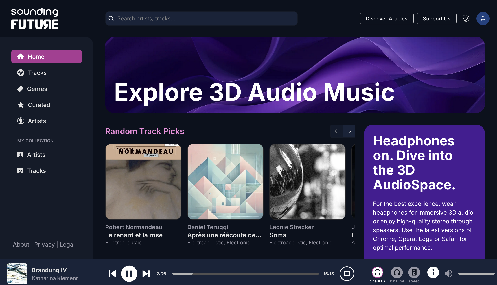
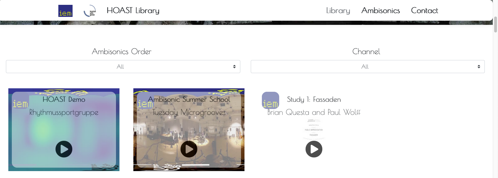

## Listen Online

**Für wen:** Zielgruppe: Komponist:in, Studierende, Researcher, Studio-Gäste.

[sounding FUTURE](https://audiospace.soundingfuture.com/)

---

[HOAST Library](https://hoast.iem.at/)

- [Nimbus UHJ](https://www.wyastone.co.uk/all-labels/nimbus.html)

---

## ICST B-Format Archiv

Das ICST pflegt ein Archiv von Werken, die im ambiX B-Format aufgenommen und kodiert wurden.

→ [Zum B-Format Archiv](https://ambisonics.ch/blog/audio-examples/)
