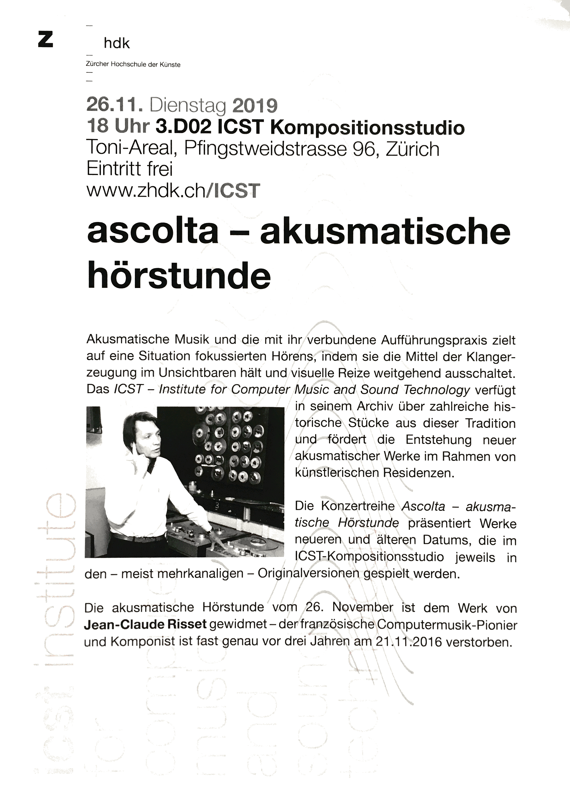

**Audience:** Composer, Student, Researcher, Studio visitor.

---
**Concert**

- 26.11.2019 18:00
- Toni-Areal, 
- Kompositionsstudio 3.D02, Ebene 3, 
- Pfingstweidstrasse 96, Zürich

_Free admission_ 

---
## Jean-Claude Risset   (13.3.1938 - 21.11.2016)

### Programm:

* **Songs              9:13**
* **Octant         12:08**
* **Sud I               9:42**
* **Sud II              5:44**
* **SUD III            8:02**
* **Resonant   14:37**
