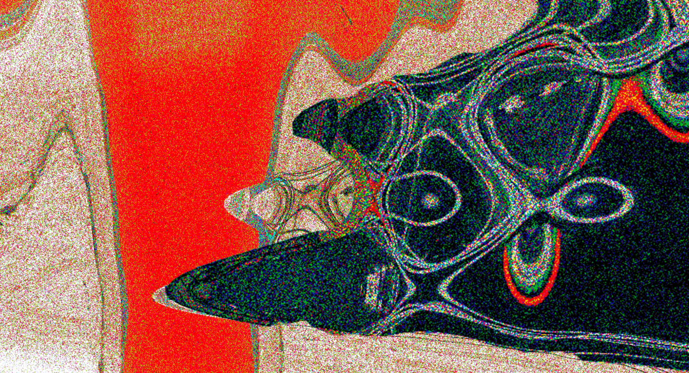
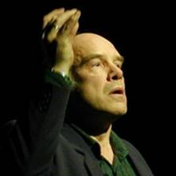

Institut für Computermusik und Soundtechnologie / (ICST) Zurich University of the Arts

---
# #02 ascolta Akousmatische Hörstunde

---
#### Konzert

**Dienstag, 4. Oktober 2022, 18:00**

- Toni-Areal,
- ICST-Kompositionsstudio (3.D02, Ebene 3)
- Pfingstweidstrasse 96,
- 8005 Zürich

_Freier Eintritt_

* * *

### Programm

_Vêpres vénitiennes – Il dì s'appressa_ (1999)
_Rainstick_ (1993)
_Im Eismeer – ein Schumann-Stück für Tonband_ (1997)
_Auf schwanker Halme Bogen_ (1985)
_Un Madrigal gentile_ (2004)

Gerald Bennett, 1942 in New Jersey (USA) geboren, studierte unter anderem an der _Harvard University_ bei Robert Moevs und in Basel bei Klaus Huber und Pierre Boulez. Von 1967–76 war er Dozent für Musiktheorie am _Basler Konservatorium_, ab 1969 dessen Direktor. 1976–1981 leitete er die _Département Diagonal_ am Pariser _Institut de Recherche et Coordination Acoustique/Musique_ (IRCAM), und ab 1993 war er Mitglied der _Internationalen Akademie für elektroakustische Musik Bourges_. Vom 1981 bis zu seiner Pensionierung unterrichtete Gerald Bennett Musiktheorie und Komposition an der _Hochschule für Musik Zürich_. Zusammen mit Bruno Spoerri, Antonio Greco und Rainer Boesch gründete er das _Schweizerische Zentrum für Computermusik_(SZCM) 1985, und zusammen mit Daniel Fueter das _ICST – Institut für Computermusik und Soundtechnologie_ 2005.

Die Werke von Gerald Bennett umfassen Orchester-, Kammer- und Vokalwerke in verschiedenen Besetzungen mit und ohne Elektronik sowie zahlreiche elektroakustische Stücke. Seine Kompositionen werden von Edition Modern/Ricordi und Mnémosyne veröffentlicht, Aufnahmen seiner Werke erschienen bei Wergo, Jecklin und Harmonia Mundi. Er ist Autor zahlreicher Publikationen, die bei Gallimard, Oxford University Press, Eulenburg, MIT Press und anderen erschienen sind.
 [Gerald Bennett](http://www.gdbennett.net/)

Aktuelle Informationen zur Veranstaltung finden Sie [hier](https://www.zhdk.ch/veranstaltung/48124).

* * *

# Programm-Noten:

### Gerald Bennett: Vêpres vénitiennes - Il dì s'appressa (1999)

"Il dì s'appressa" ist Teil eines größeren Werkes (das natürlich immer noch unvollständig ist): die "Venetian Vespers". Die Venezianischen Vesper in San Marco unterschieden sich von den Römischen Vespern durch ihren Reichtum an Musik. Dieses Werk ersetzt den antiken Marian, das gegen Ende der Vesper gesungen wurde. Es basiert auf den ersten zwei Zeilen des letzten Gedichts aus Petrarchs "Canzoniere", einem Gedicht über den Tod, das an die Jungfrau adressiert ist: Il dì s'appresa e non puot' esser lunge, Sì corr' il temp e vola ...
"Il dì s'appressa" wurde vom International Institute of Electroacoustic Music in Bourges, Frankreich, in Auftrag gegeben und 1999 in seinen Studios realisiert.

* * *

### Gerald Bennett: Rainstick (1993)

Der Rainstick ist ein rituelles Instrument der Indianer Mittel- und Südamerikas, das verwendet wird, um Regen herbeizubeschwören. In diesem Stück wird der Rainstick verwendet, um viele verschiedene Dinge herbeizubeschwören, sowohl real als auch imaginär (aber nicht Regen). Eine der Hauptideen des Stücks ist der Übergang von Kontinuität zu Diskontinuität. Natürlich kann diese Bewegung sowohl eine strukturelle als auch eine emotionale Trajektorie reflektieren und ausdrücken.
"Rainstick" wurde vom Groupe de Musique Expérimentale de Bourges in Auftrag gegeben und 1993 in ihren Studios realisiert.

* * *

### Im Eismeer – ein Schumann-Stück für Tonband (1997)

* * *

### Auf schwanker Halme Bogen (1985)

* * *

### Gerald BENNETT : Un Madrigal gentile (for tape alone)

"Un Madrigal gentile" soll ein Stück der Commedia dell'arte sein. Es wurde inspiriert von der Madrigalkomödie "Amfiparnaso" von Orazio Vecchi (1594) und beginnt dort, wo der Erzähler des "Amfiparnaso" den Gesang des Doktors ankündigt, eine Parodie des berühmtesten Madrigals des 16. Jahrhunderts, "Achor che col partire" von Cipriano da Rore. Auch mein Stück ist eine Parodie auf dasselbe Madrigal, das immer wieder während des ganzen Stücks zu hören ist. Cipranos Madrigal erzeugt viele musikalische Figuren in meinem Stück; jede wird als eine Figur aus einer imaginären Commedia dell'arte behandelt, überzeichnet, clownesk, unbeholfen oder willkürlich brutal. Die sentimentalen Liebenden oder das Madrigal begleiten das Stück aus ihrer unmöglichen Welt, und häufig herrscht fröhliches Chaos.
«Un Madrigal gentile» wurde vom französischen Kulturministerium in Auftrag gegeben, im IMEB 2004/2005 realisiert und ist Françoise Barrière und Christian Clozier in dankbarer Freundschaft gewidmet.

Die folgenden Texte werden zu hören sein:

Canta il Dottore un madrigal gentile
sotto'l balcon de la sua cara sposa
con voce soavissima e amorosa.

Der Doktor singt ein anmutiges Madrigal
unter dem Balkon seiner liebsten
mit der süßesten liebevollen Stimme.

(Enfants au Grand Guignol)
Attention! Attention!
(Kinder bei Kasperltheater)
Achtung! Achtung!

. . . tanto son dolci . . .
. . . wie süß sind . . .

Im Prolog des «Amfiparnaso» erzählt der Erzähler uns:

E la città dove si rappresenta
quest'opra è'l gran Teatro
del mondo, perch'ognun desìa d'urdirla.
Ma voi sappiat'intanto
che questo di cui parlo
spettacolo si mira con la mente,
dov'entra per l'orrecchie, e non per gl'occhi.
Però silenzio fatte,
e'n vece di vedere hora ascoltate.

Und die Stadt, wo dieses Stück
spielt, ist das große Theater
der Welt, das jeder gerne sehen möchte.
Doch ihr solltet wissen,
dass das Drama, von dem ich spreche,
nur im Verstand zu sehen ist,
in das es durch die Ohren und nicht die Augen eindringt.
Stille also,
und statt zu schauen, höret nun.

---
©2025 ICST
