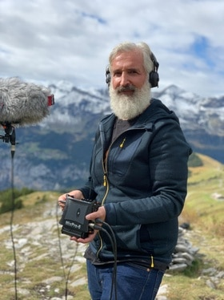
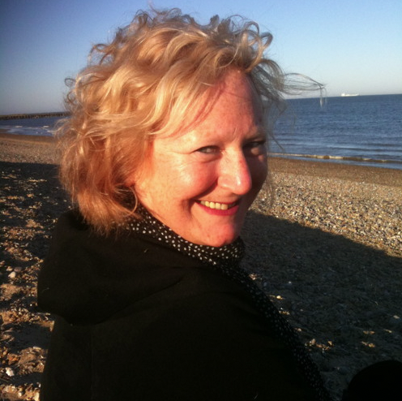

Institute for Computer Music and Sound Technology (ICST) Zurich University of the Arts

---

# #05 ascolta Akousmatische Hörstunde

---
#### Konzert

**Dienstag, 14. März 2023, 18:00**

- Toni-Areal,
- ICST-Kompositionsstudio (3.D02, Ebene 3)
- Pfingstweidstrasse 96,
- 8005 Zürich

_Freier Eintritt_

---
# Feldaufnahmen & Klanglandschaften

Philip Samartzis  (ICST Artist in Residency 2019)
[Atmospheres & Disturbances](https://bogongsound.com.au/projects/atmospheres-and-disturbances)

Dur: 28.30

2019 erhielt Philip einen Zuschuss der Schweizer Nationalfonds für Wissenschaft, um Forschungen im High Altitude Research Center auf dem Jungfraujoch durchzuführen. Dies ist das erste Mal, dass beide Organisationen einen Künstler-Forscher in ihren jeweiligen Programmen unterstützt haben, was ein wachsendes Bewusstsein für die Fähigkeit der Kunst zeigt, für seltene und bedrohte Ökologien einzutreten. Philips Hochalpen-Forschung wurde auf DW Radio, Swiss Info und Les Temps News-Services vorgestellt und 2019 in China und Japan sowie 2021 in der Schweiz ausgestellt. Sie wurde auch in einer Ausstellung mit dem Titel Sampling the Future (2021) in der NGV Australia gezeigt.

Dieses Projekt wird unterstützt von Creative Victoria; Hochaltitudenforschungsstation am Jungfraujoch und Gornergrat; Institut für Computermusik und Soundtechnologie an der ZhDK; RMIT School of Art; Schweizer Nationalfonds

Was Klimawandel klingt wie - SWI [swissinfo.ch](http://swissinfo.ch)
<https://www.zhdk.ch/forschung/icst/kreation-artist-in-residence-1031>

* * *

Cathy Lane   (ICST Artist in Residency 2022)

[The River goes on](https://ualresearchonline.arts.ac.uk/id/eprint/18663/)

Dur: 32'

Cathy Lane ist eine englische Komponistin, Soundkünstlerin und Akademikerin. Ihre Arbeit nutzt Sprache, Feldaufnahmen und Archive, um Aspekte unserer Hörbewegung zueinander und zum Multiversum zu erforschen. Sie konzentriert sich derzeit aus feministischer Perspektive darauf, wie Klang mit der Vergangenheit, unseren Geschichten, unserer Umwelt und unseren kollektiven und individuellen Erinnerungen verbunden ist.

[cathylane.co.uk](http://cathylane.co.uk)
<https://www.zhdk.ch/forschung/icst/kreation-artist-in-residence-1031>

---
©2025 ICST