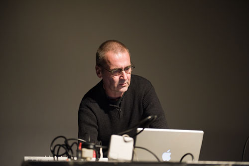

# #06 ascolta Akousmatische Hörstunde

**Für wen:** Level: Alle Levels | Zielgruppe: Komponist:in, Studierende, Researcher, Studio-Gäste.

---
#### Konzert

**Dienstag, 4. April 2023, 18:00**

- Toni-Areal,
- ICST-Kompositionsstudio (3.D02, Ebene 3)
- Pfingstweidstrasse 96,
- 8005 Zürich

_Freier Eintritt_

---
# Zbigniew Karkowski (Polen/Japan)

## Titel: \_kein Name\_

#### Dur: 60'

### Beschreibung:

Zbigniew Karkowski (Polen/Japan)

Der polnische Komponist Zbigniew Karkowski, der 2013 allzu früh starb und in Japan lebte, ist und bleibt in einer Liga für sich. In seinen fast elegischen Stücken aus feingliedrigem Rauschen und Rhythmuseinstellungen kommt seine gesamte visionäre Bandbreite zum Vorschein, ob seine Stücke mit einem Laptop oder mit elektroakustischen Mitteln geschaffen wurden.

Er studierte Komposition an der National Academy of Music in Göteborg, Schweden, Ästhetik der Moderne Musik an der Universität Göteborg und Computermusik an der Chalmers University of Technology. Nach Abschluss seiner Studien in Schweden studierte er Sonologie ein Jahr lang am Royal Conservatory of Music in Den Haag, Niederlande. Über 20 Jahre war er auf dem Gebiet der experimentellen elektronischen Musik tätig und komponierte Stücke für ein volles Orchester, eine Oper und mehrere Kammermusikstücke.

2008 war Zbigniew Karkowski Gast am ICST und realisierte das Stück 'No name' in Ambisonics. Das ICST führte dieses Stück am Freitag, 03.10.2008 im Walchenturm in Zürich auf. Wir können lebhafte Rauschattacken und zischende Stöhne erwarten. Seine Musik ist ein zeitloses Œuvre, verstörend und beruhigend, eruptiv und statisch.

 Zbigniew Karkowski im Walchenturm Zürich (2008)

#### Links:

[Zbigniew Karkowski - Wikipedia](https://en.wikipedia.org/wiki/Zbigniew_Karkowski)
<https://www.zhdk.ch/veranstaltung/50898>
