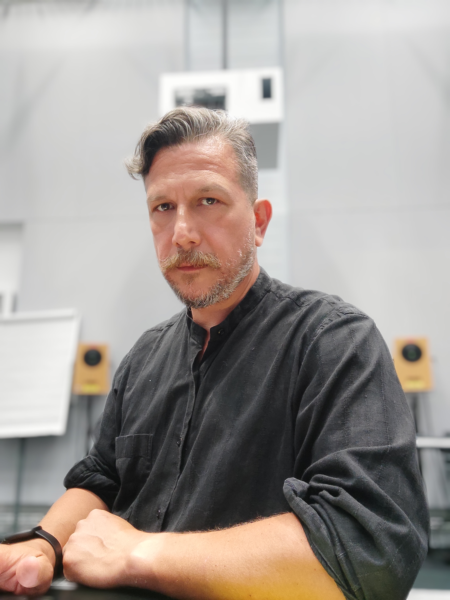
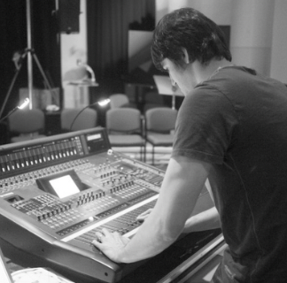
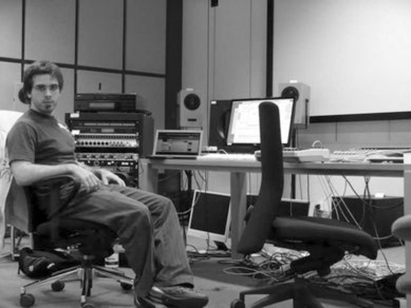
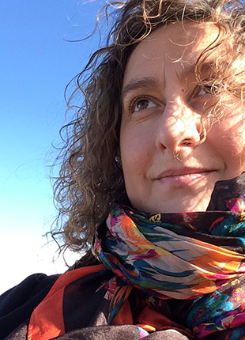
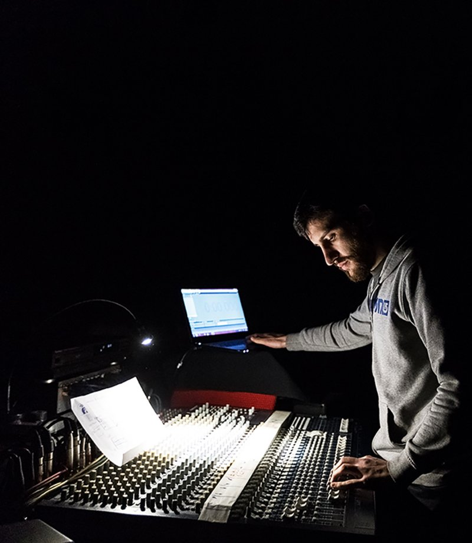

Institute for Computer Music and Sound Technology / (ICST) Zurich University of the Arts

---
# #07 ascolta Akusmatische Hörstunde

---
### A concert featuring some of the ICST artists in residence

**Dienstag, 04. April 2023, 18.00 Uhr**

- Toni-Areal, 
- ICST-Kompositionsstudio (3.D02, Ebene 3)
- Pfingstweidstrasse 96, 
- 8005 Zürich

_Eintritt frei_ 

---

**Nikos Stavropoulos**
Artist in Residency  3.7. – 14.7.2017 | 12.1. – 22.1.2018

Karst Grotto     7:15

* * *

[Oliver Carman](https://www.liverpool.ac.uk/music/staff/oli-carman/)
Artist in Residency  11.2. -24.2.2008

**dark\_zurich**   5:11

* * *

[Nahuel Sauza](https://www.zhdk.ch/forschung/icst/kreation-artist-in-residence-1031)
(Artist in Residency  20.4. – 4.5.2009)

A OCHO    7:35

* * *

[Zuriñe F. Gerenabarrena](https://www.zhdk.ch/forschung/icst/kreation-artist-in-residence-1031)
Artist in Residency 2.5. – 13.5.2016

IKUR         10:00

* * *

[Ratto Diego](https://www.diegoratto.com/)
Artist in Residency  18.6. - 29.6.2018

KOM     (Ambisonics  Version) 2018
8:00

* * *

Gregory Marteau

**Rituell metallique**    5:43

* * *

[Nikos Stavropoulos](https://www.leedsbeckett.ac.uk/staff/professor-nikos-stavropoulos/)
Artist in Residency  3.7. – 14.7.2017 | 12.1. – 22.1.2018

**Khemenu** 8:19
(1st Prize for ISAC-2023)   

---
©2025 ICST
