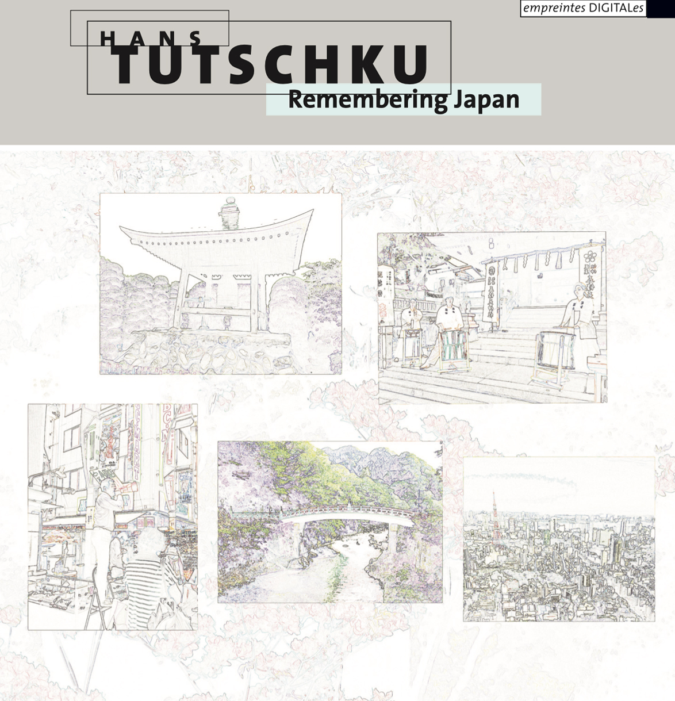
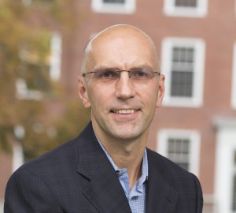

# #09 ascolta Akousmatische Hörstunde

**Für wen:** Level: Alle Levels | Zielgruppe: Komponist:in, Studierende, Researcher, Studio-Gäste.

---
**Dienstag, 5. Dezember 2023, 18:00**

- Toni-Areal,
- ICST-Kompositionsstudio (3.D02, Ebene 3)
- Pfingstweidstrasse 96,
- 8005 Zürich

_Freier Eintritt_

---
# Hans Tutschku: **_Erinnerung an Japan_**

 **Hans Tutschku**
 ICST Artist in Residence vom 31. Januar bis 13. Februar 2022.

* * *
# Remembering Japan

INFO: <https://tutschku.com/remembering-japan/>

<https://electrocd.com/en/album/6390/hans-tutschku/remembering-japan>

* * *

### Biografie

Foto: Tony Rinaldo
Hans Tutschku ist Komponist für Instrumental- und Elektroakustische Musik. 1982 trat er dem "Ensemble für intuitive Musik Weimar" bei und studierte später Theater und Komposition in Berlin, Dresden, Den Haag, Paris und Birmingham. Er arbeitete in Film-, Theater- und Tanzproduktionen mit und nahm an Konzertreihen mit Karlheinz Stockhausen teil. Seit 2004 leitet er die elektroakustischen Studios an der Harvard University.

Improvisation mit Elektronik war über die letzten 35 Jahre eine Kernaktivität. Er ist Gewinner mehrerer internationaler Wettbewerbe, darunter: Hanns Eisler Preis, Bourges, CIMESP Sao Paulo, Prix Ars Electronica, Prix Noroit, Prix Musica Nova, ZKM Giga-Hertz, CIME ICEM und Klang!. 2005 erhielt er den Kulturpreis der Stadt Weimar.

Neben seinen regulären Kursen an der Universität hat er internationale Workshops für Musiker und Nicht-Musiker zu Aspekten der Kunstschätzung, des Hörens, der Kreativität, der Komposition, der Improvisation, der Live-Elektronik und der Klangräumlichkeit in mehr als 20 Ländern gelehrt.
