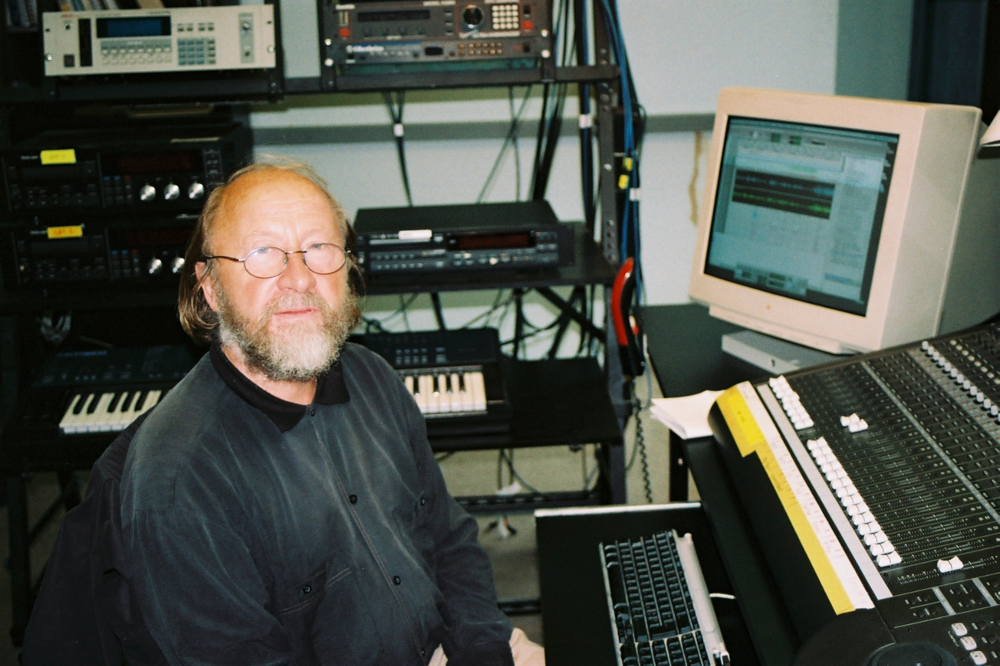

**Audience:** Composer, Student, Researcher, Studio visitor.

---

# Georg Katzer

**Concert**

**22.10.2024, 18:00**

- Toni-Areal,
- Kompositionsstudio 3.D02, Ebene 3,
- Pfingstweidstrasse 96, Zürich

_Free admission_

* * *

# Programm:

### Steinelied 2

2010
10'

Notes:

**Steinelied 2**
In a cloud chamber, ionising radiation leaves a condensation trail with tiny water droplets, thus making the particle 'visible'. Likewise, the 'stones', namely the silicon crystals of the computer, leave small 'droplet-shaped' sound events as they rush through the time-tone space in the computer I programmed.
Between the mostly impulsive sounds, a short tonal structure emerges several times, as if from a distance, perforated by the impulsive sounds.
It is reminiscent of a scent 'from distant planets', that of a bygone tonal music. In any case, it was just as welcome to me as the sometimes 'dirty sounds', which I did not try to embellish. And everything is shrouded in a 'blue fog'.
The piece is not composed with a climax in mind; rather, it remains static, revolving around itself, almost meditative.

2010, composer's studio

Notes:

Steinelied 2 2010 In a cloud chamber, ionising radiation leaves a condensation trail with tiny water droplets and thus makes the particle "visible". Likewise, the "stones", namely the silicon crystals of the computer, leave small "droplet-shaped" sound events as they rush through the time-tone space in the computer programmed by me. Between the mostly impulsive sounds, a short tonal structure emerges several times, as if "from a distance", pierced by the impulsive sounds. A memory of a scent "from distant planets", that of a bygone tonal music. It was just as welcome to me as some "dirty sounds", which I did not try to refine. And everything is wrapped in a "blue fog". The piece is not composed with climaxes in mind; rather it remains static, circling in itself, almost meditative.

2010, Studio of the Composer

* * *

###

### Prussian Blue. Daydream. Memory

2008
12'26''

Notes:

Like the deep blue of Yves Klein, my little clouds, which swim through my mind between waking and sleeping, with memories of those years in that city, in that bygone country. With the blue clouds come back the images, the pale reproductions of which spread in my subconscious, turn insistently around each other and bore themselves into my brain. But: the film is running backwards. The contours fade, at the end only blue, Prussian blue, Berlin blue.
The piece is also a reminder of a bygone technology with room-filling devices, space-consuming tape loops and the eternal struggle with noise. So in the piece analogue and digital sounds and signals mix.
The colouring agent was given the name Prussian Blue in the 18th century because it was used primarily to dye the Prussian uniform coats.

Studio GMEB, Bourges 1979/Studio of the composer 2008

Notes:

Like the rich blue of Yves Klein, my little clouds, which swim through my head between waking and sleeping with the memories of those years in that city, in that bygone country. With the blue clouds come back the images, their pale reproductions, which spread in my semi-consciousness, which turn stubbornly around each other and which inexorably bore themselves into my brain. But: the film runs backwards. The contours fade, at the end only blue, Prussian blue, Berlin blue.

The piece is also a memory of a bygone technology with room-filling devices, space-consuming tape loops and the eternal struggle with noise. So analog and digital sounds and signals mix in the piece.

Prussian Blue received its name in the 18th century because it was used primarily to dye Prussian uniform coats.

Studio GMEB, Bourges 1979/Studio of the Composer 2008

* * *

### AideMemoire

1985
14'30''

Notes:

In addition to entertainment, tape music can also serve the larger goal of documentation, either intact, as in Luc Ferrari's rural pastorals, or staged, as in Katzer's portrait of the horrific rise of Nazi intolerance. Katzer's collage, created at GDR radio, uses Nazi speeches, mass scenes and historical music and was put together for broadcast on the 50th anniversary of Hitler's rise to power.
The surface noise of the 78s is an integral element of the composition, telling us that the presented evidence is historical, but the danger is very present. Those who want to avoid devaluing terms such as equality and freedom in pithy pathos should pay attention to how cautiously and critically Georg Katzer addresses and sings about them.

Notes:

Alongside entertainment, tape music can also serve the greater purpose of documentation, either intact, as in the rural pastorals of Luc Ferrari, or staged, as in Katzer's portrait of the horrifying rise of Nazi intolerance. Katzer's collage, created at GDR radio, uses Nazi speeches, mass scenes and historical music and was compiled for broadcast on the 50th anniversary of Hitler's seizure of power.

The surface noise of the 78s is an integral element of the composition, which tells us that the presented evidence is historical, but the danger is very present. Whoever wants to avoid devaluing terms such as equality and freedom in grandiose pathos should pay attention to how cautiously and critically Georg Katzer addresses and sings about them.

* * *

###

### "Les paysages fleurissants" (The Blooming Landscapes)

2000
12'30''

Notes:

The troubles of the beginning, the constant failure, the falling back into beautiful melancholy, resignation, silence, the musical signals evaporate in the noise.
The short piece is made entirely from two familiar noises and is thus in the tradition of musique concrète.
The piece was created at a time when there was not yet much to be seen of the 'blooming landscapes'.

2000, Studio GMEB Bourses

Notes:

The troubles of the beginning, the constant failure, the falling back into beautiful melancholy, resignation, silence, the musical signals evaporate in the noise. The short piece is entirely made from two well-known noises and is thus in the tradition of musique concrète. The piece was created at a time when there was not yet much to be seen of the "blooming landscapes".

2000, Studio GMEB Bourses

* * *

### Steinelied 1

1984/1988
11:03

Notes:

'Steine-Lied' is a computer composition. A mainframe computer, equipped with a specific program package (a VAX with the program "Chant" developed at
IRCAM / Paris), calculated musical orders and sounds (based on prime number ratios) according to the composer's specifications and also made them sound.
The title means that it is the stones, the silicon crystals, that sing, as if they wanted to become subjects rather than objects, living rather than dead matter.
In 1984, I received an invitation to the EMS studio in Stockholm and produced my first computer composition there, using only synthetic sounds.
A special feature of the piece is that I only used frequencies that represent themselves in prime numbers (with the exception of a tonal section in just intonation). The title refers to the material of the chips, silicon, the most abundant element in our earth's mantle, and to the attempt to make the stones, i.e. the chips, sing.
At that time, programming was still extremely laborious and waiting for the sound results was exhausting, so I was able to work on a string quartet 'on the side'.
In the years that followed, I used the experience I had gained there to develop a computer programme that I had developed myself, a self-organising compositional process that generates musical sequences based on controlled randomness. This resulted in Steinelied 2 in 2010. From then on, the composer's work consisted of selecting from the recorded sounds and composing them.
Quelle: EMDocu (erstellt: 25.08.1993 Source: Ruschkowski-Kartei 1989)

Notes:

"Steine-Lied" is a computer composition. A mainframe computer, equipped with a specific program package (it was a VAX with the program "Chant" developed at IRCAM / Paris) calculated musical orders and sounds (based on prime number ratios) according to the composer's specifications and brought them to sound.

The title means that it is the stones, namely the silicon crystals, that sing, as if they wanted to become subjects instead of objects, from dead to living matter.

In 1984 I received an invitation to the EMS studio in Stockholm and produced my first computer composition there, in which I used only synthetic sounds. A special feature of the piece is that I used only frequencies (with the exception of a tonal section in just intonation) that represent themselves in prime numbers. The title refers to the material of the chips, silicon, the most abundant element of our Earth's mantle, and means the attempt to make the stones, i.e. the chips, sing. Programming was extremely laborious at that time and waiting for the sound results was exhausting, so that I could "incidentally" conceive a string quartet.

In the years that followed, I developed on the basis of the experiences made there with a computer program I had developed a self-organizing compositional process that generates musical sequences based on controlled aleatory. This resulted in Steinelied 2 in 2010. From then on, the composer's work consisted of making a selection from the recorded sounds and composing them.

Source: EMDocu (created: 25.08.1993 Source: Ruschkowski-Kartei 1989)

* * *

**Georg Katzer,** born in 1935 in Lower Silesia and died in 2019 in Zeuthen, is considered one of the most important composers of the East German school. Katzer, who was a master student of Hanns Eisler, left behind an extensive oeuvre of orchestral, instrumental and film music as well as radio plays. This portrait is dedicated to Georg Katzer as a pioneer of electroacoustic music.

In 1978 Katzer was elected a member of the Academy of Arts in East Berlin. In 1982 he founded the Studio for Electroacoustic Music "Studio for Electroacoustic Music" affiliated with the Music Department of the Academy of Arts, of which he was artistic director until 2005.

