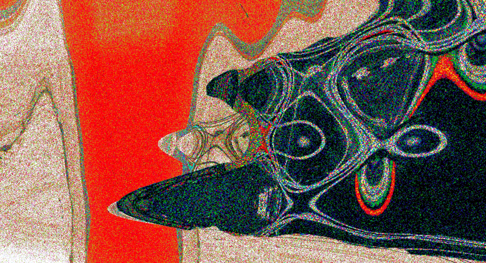

- Thursday, 29 October 2026, 18:00–19:00
- Toni-Areal, Composition Studio 3.D02, Level 3
- Pfingstweidstrasse 96, Zurich

_Free admission_

---

**#20 ascolta** is dedicated to two longer pieces by **Pierre Alexandre Tremblay**, who was a guest artist in the ICST residency programme from 28 April to 21 August 2026 and worked on his new 3D audio piece during several studio sessions. Together with an earlier work, he will present both pieces in person and talk about them.

---

## Programme

- _Espaces_negatifs_ (5OA ambiX)
- _Lugano_ (2026) (5OA ambiX)

---

## Pierre Alexandre Tremblay

Born in Montréal in 1975, Pierre Alexandre Tremblay is a composer and performer specialising in bass guitar and electronic devices. His work spans electroacoustic music, contemporary jazz, mixed music and improvisation, with releases on the empreintes DIGITALes label. He was Professor of Composition and Improvisation at the University of Huddersfield from 2005 to 2024 and currently holds a research professorship in composition at the Conservatorio della Svizzera italiana.

Personal link: [Website](https://www.pierrealexandretremblay.com/)
