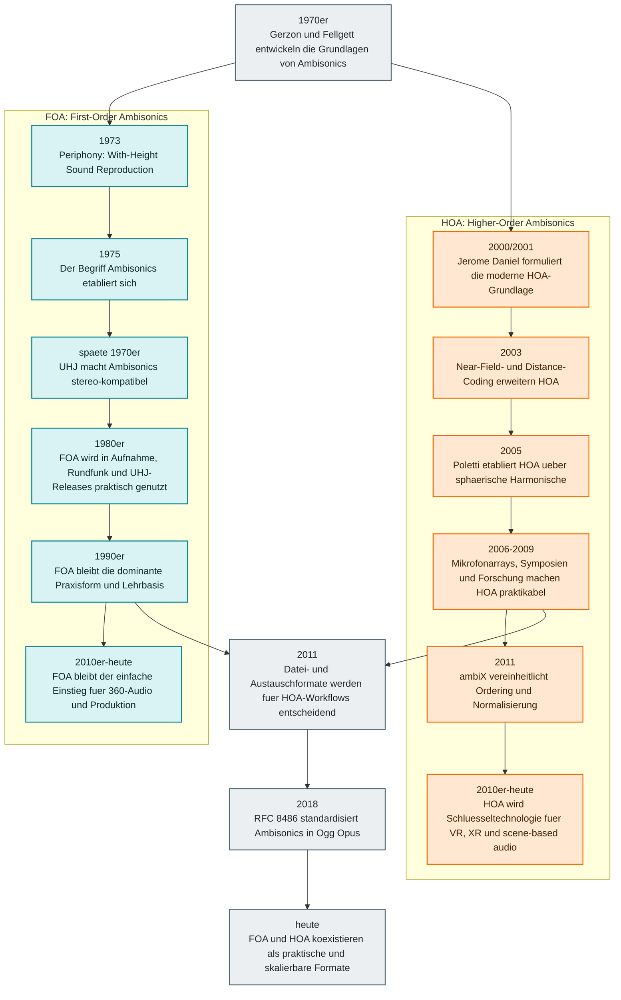

Diese Timeline trennt die Entwicklung von <strong>FOA</strong> und <strong>HOA</strong>, zeigt aber auch die gemeinsamen Meilensteine. So wird sichtbar: FOA ist die historische Basis von Ambisonics, HOA entsteht spaeter als systematische Erweiterung fuer hoehere raeumliche Aufloesung.

  FOA-Linie
  HOA-Linie
  Gemeinsame Standards und Medienpraxis

  <section class="ambisonics-history__note">
    <h3>FOA</h3>
    
FOA ist der historische Kern von Ambisonics. Es ist kompakt, robust und bis heute dort stark, wo einfache Produktion, Distribution und Kompatibilitaet wichtiger sind als maximale Richtungsaufloesung.

  </section>
  <section class="ambisonics-history__note">
    <h3>HOA</h3>
    
HOA baut auf denselben Grundlagen auf, erweitert sie aber systematisch. Mit hoeherer Ordnung wachsen Richtungsauflosung, Flexibilitaet im Rendering und Relevanz fuer immersive Medien und Forschung.

  </section>

## Lesart der Grafik

- **FOA** bezeichnet die erste Ordnung von Ambisonics und war die Form, in der das Verfahren historisch zuerst praktisch verbreitet wurde.
- **HOA** wird ab etwa 2000 als eigenes modernes Forschungs- und Produktionsfeld sichtbar.
- Die **gemeinsame Achse** zeigt, dass Formate, Standards und heutige Medienpraxis FOA und HOA nicht gegeneinander ausspielen, sondern beide in denselben Oekosystemen vorkommen.

## Warum diese Unterscheidung wichtig ist

Wer die Geschichte von Ambisonics nur als eine einzige Linie darstellt, uebersieht leicht, dass zwischen den fruehen FOA-Arbeiten der 1970er Jahre und der systematischen HOA-Entwicklung rund um 2000 ein deutlicher methodischer Sprung liegt. FOA ist nicht "veraltet", sondern oft die pragmatische Wahl. HOA ist nicht einfach "mehr Kanaele", sondern eine andere Groessenordnung an szenischer Praezision und Render-Flexibilitaet.

## Quellen und Referenzen

- Michael Gerzon, *Periphony: With-Height Sound Reproduction* (JAES, 1973)
- Michael Gerzon, *Practical Periphony* (1980)
- Jerome Daniel, Dissertation zu HOA-Grundlagen (2000/2001)
- Mark Poletti, Arbeiten zu 3D-Surround-Systemen auf Basis sphaerischer Harmonischer (2005)
- Ambisonics Symposium 2011, *ambiX - A Suggested Ambisonics Format*
- [RFC 8486: Ambisonics in an Ogg Opus Container](https://www.rfc-editor.org/info/rfc8486)
