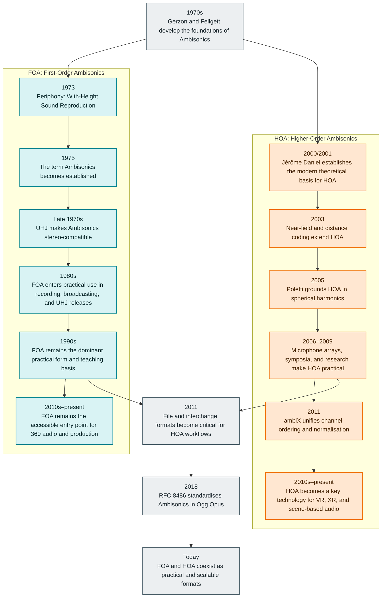

This timeline separates the development of <strong>FOA</strong> and <strong>HOA</strong> while also showing their shared milestones. The picture that emerges: FOA is the historical foundation of Ambisonics; HOA arrives later as a systematic extension for higher spatial resolution.

  FOA line
  HOA line
  Shared standards and media practice

  <section class="ambisonics-history__note">
    <h3>FOA</h3>
    
FOA is the historical core of Ambisonics. It is compact, robust, and still the stronger choice wherever straightforward production, distribution, and compatibility matter more than maximum directional resolution.

  </section>
  <section class="ambisonics-history__note">
    <h3>HOA</h3>
    
HOA builds on the same foundations but extends them systematically. Higher order brings greater directional resolution, more flexible rendering, and increasing relevance for immersive media and research.

  </section>

## How to read the diagram

- **FOA** refers to the first order of Ambisonics and was the form in which the technique first reached widespread practical use.
- **HOA** becomes visible as a distinct modern field of research and production from around 2000 onwards.
- The **shared axis** shows that formats, standards, and today's media practice do not pit FOA against HOA — both coexist within the same ecosystems.

## Why this distinction matters

Representing the history of Ambisonics as a single unbroken line makes it easy to miss that there is a clear methodological leap between the early FOA work of the 1970s and the systematic development of HOA around the year 2000. FOA is not "outdated" — it is often the pragmatic choice. HOA is not simply "more channels" — it represents a different order of scenic precision and rendering flexibility.

## Sources and references

- Michael Gerzon, *Periphony: With-Height Sound Reproduction* (JAES, 1973)
- Michael Gerzon, *Practical Periphony* (1980)
- Jérôme Daniel, dissertation on the foundations of HOA (2000/2001)
- Mark Poletti, work on 3D surround systems based on spherical harmonics (2005)
- Ambisonics Symposium 2011, *ambiX — A Suggested Ambisonics Format*
- [RFC 8486: Ambisonics in an Ogg Opus Container](https://www.rfc-editor.org/info/rfc8486)
