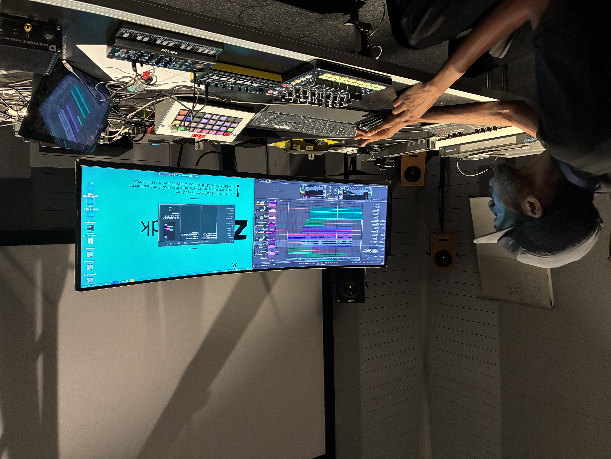

Institute for Computer Music and Sound Technology / (ICST) Zurich University of the Arts

---

ICST Artist in Residence from **16.06.2025 to 06.07.2025** (Studio-Residence)

### Exploring Sound at ZHdK – ICST

Being in residency at ZHdK – Zurich University of the Arts, within the ICST, has been an inspiring experience.

I'm currently developing the project Kampfumo, a sonic exploration based on the everyday soundscape of Maputo, especially the Chapa 100 transport system and the vibrant energy of the Kampfumo district.

At the ICST spatial audio studio, I’m experimenting with immersive technologies to create a cinematic and multidimensional listening experience.

![[content/Blog/nandele_maguni/Malhangalene.png]]
### listening:
- [Nandele Maguni "M" Stereo]([Nandele\_Kampfumo\_07\_04\_2025\_Stereo.wav - pCloud](https://e.pcloud.link/publink/show?code=XZcB96ZIpQd93jYp9YJyyVLT0aWOSThvLNV))
- [Nandele Maguni "M" Binaural](https://e.pcloud.link/publink/show?code=XZk296ZezHI5GUzScpbYWV0SADkCjkigCbV)
- [Nandele Maguni "M" Binaural+ ](https://e.pcloud.link/publink/show?code=XZV296ZHgMAiKBRIB0EGXgbV9g5V0hDomjk)

This is not just about sound but movement, memory, and space.  
Nandele Maguni

----
©2025 ICST
