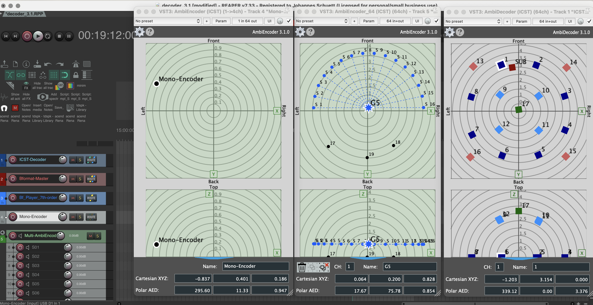
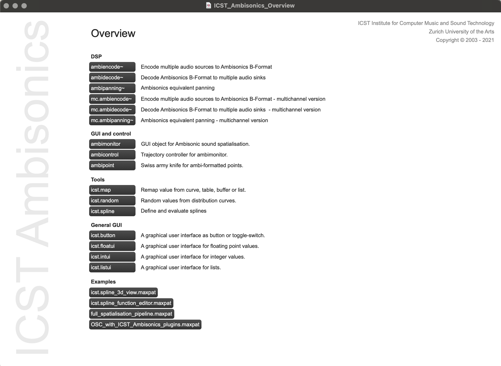

Institute for Computer Music and Sound Technology / (ICST) Zurich University of the Arts

------------------------------------------------------------------------
# HOME of the ICST Ambisonics

- ### The ICST Ambisonics Plugins (Reaper DAW)

	
	Info at ZHdK: https://www.zhdk.ch/forschungsprojekt/icst-ambisonics-plugins-555245
---

 - ###The Ambisonics Tools (Max 8.0)

Info at ZHdK: https://www.zhdk.ch/en/research/icst/software-downloads-5379/downloads-icst-tools-for-maxmsp-5385

### Content:

- [ICST Ambisonics Max Externals](https://ambisonics.ch/icst-ambisonics-tools/)
- [ICST Ambisonics Plugins](https://ambisonics.ch/icst-ambisonics-plugins/01_overview/)
- [Best practice tutorials](https://ambisonics.ch/post/)
- [ICST Ascolta Akusmatische Hörstunde](https://ambisonics.ch/blog/ascolta)
- [Blog](https://ambisonics.ch/blog/)

---
©2025 ICST