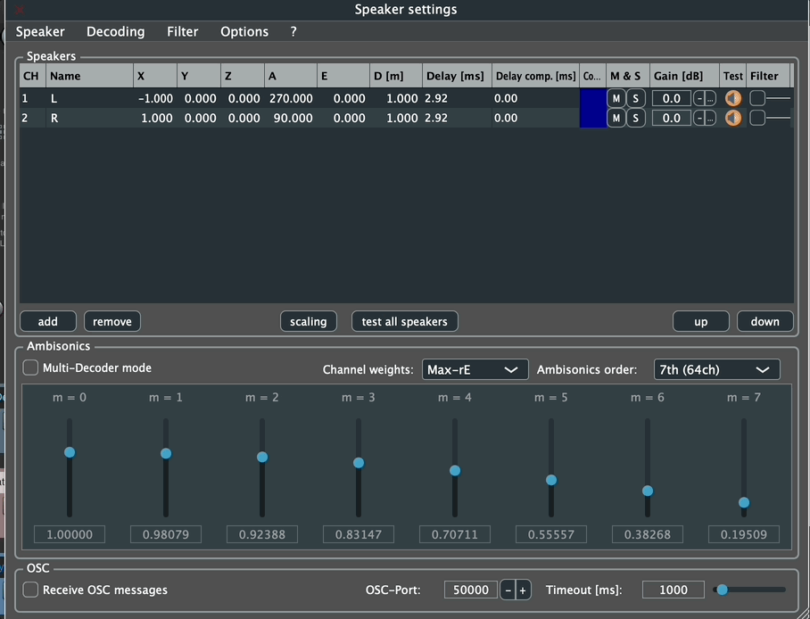
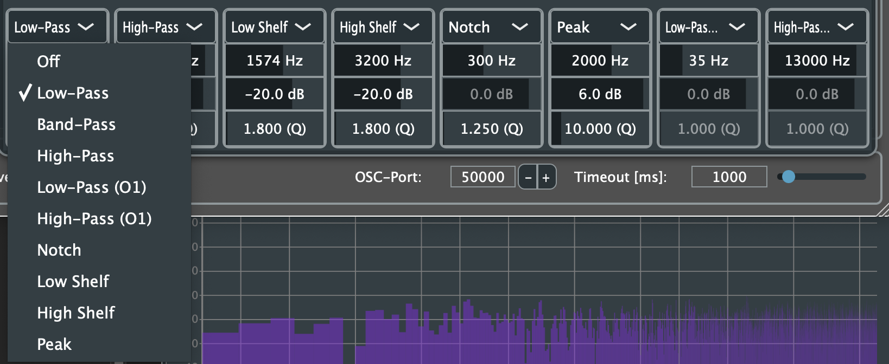
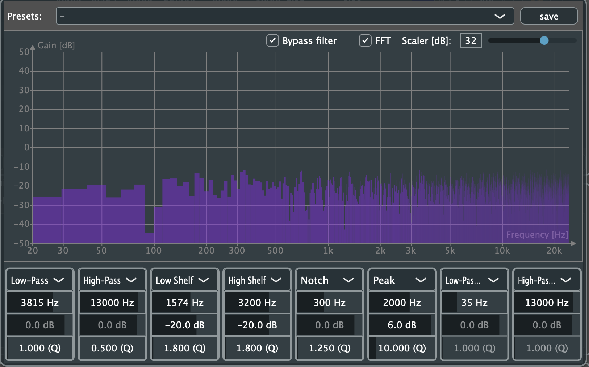
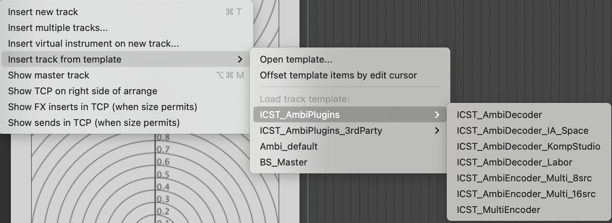
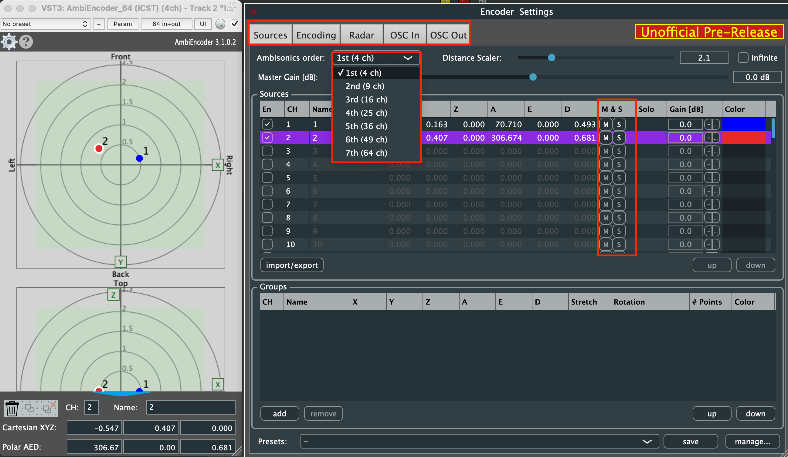
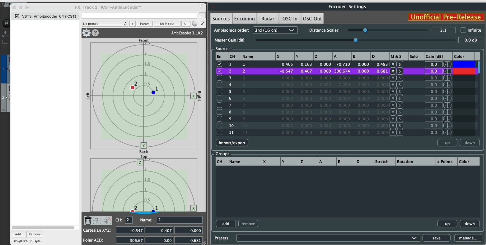
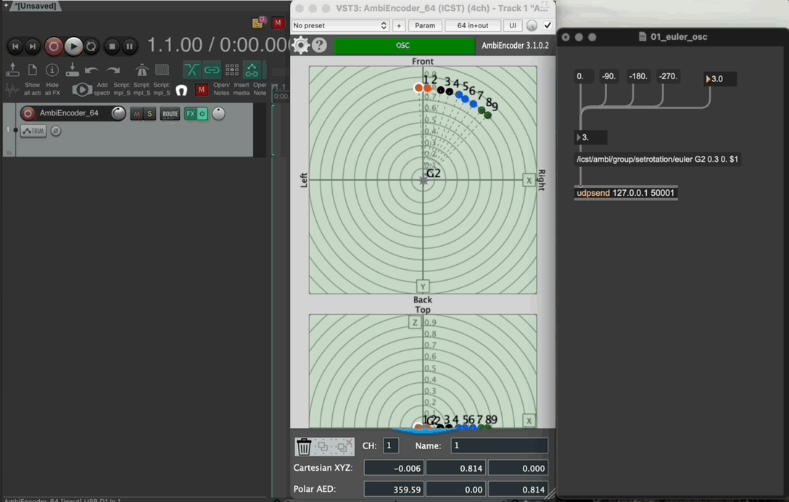

# ICST Ambisonics Plugins v3.2

_**Jetzt verfügbar!**_

**Download:**
🔗 [**GitHub Releases**](https://github.com/schweizerweb/icst-ambisonics-plugins/releases)

Wir freuen uns, **v3.2** ankündigen zu können, mit einem großen Update für den **Multi-Decoder**, neuen Benutzeroberflächen-Layouts, verbesserten Filteroptionen, verbesserter OSC-Steuerung und zahlreichen Workflow-Verbesserungen basierend auf laufender empirischer Forschung am ICST.

📖 **Vollständige Dokumentation:**
🔗 [**Wiki**](https://github.com/schweizerweb/icst-ambisonics-plugins/wiki)

---
# ICST AmbiDecoder v3.2

## **Neue Funktionen & Verbesserungen**

### Bidirektionales Solo & Stummschaltung
- Stummschalten oder Solo einzelner Lautsprecher oder Gruppen ganz einfach.
- **Tastaturkürzel (macOS):**
	`Shift + Control + S` / `Shift + Control + M`

  
### Neu gestaltetes Layout
Eine klarere und modularere Struktur:
- **Lautsprecher-Einstellungen**
- **Decoder-Einstellungen**
- **Filteroptionen**
- **Zusätzliche Funktionen** _(demnächst)_
  
### Neue CSV-Export- & Preset-Verwaltung
- Lautsprecherkoordinaten in **CSV** exportieren zur Verwendung in Max (und umgekehrt).
- Alle Presets als **XML** sichern und exportieren.
- Preset-Sicherungen direkt importieren.

### Verbesserte Filteroberfläche

- Acht neue Filteroptionen
- Aktualisierte Benutzeroberfläche für leichtere Vergleiche und Optimierung

	
	

### Neuer Multi-Decoder-Modus

- Vier vollständig unabhängige Decoder
- Benutzerdefinierte Namen und Farben
- Pro-Decoder-Lautsprecherauswahl
- Unabhängige Ambisonics-Ordnung, Gewichtung, Filter, Stummschaltung und Verstärkung
- Präzise räumliche Optimierung für komplexe Arrays

📖 **Multi-Decoder-Anleitung:** [ICST AmbiDecoder – Multi-Decoder-Modus](/post/multi-decoder-mode/)

### Neue Projektvorlagen

- ICST_AmbiPlugins_MonoEncoder
- ICST_AmbiPlugins_MultiEncoder

### Neue Spurvorlagen

- ICST AmbiPlugins
  
- ICST AmbiPlugins 3rdParty
  

---
# **ICST AmbiEncoder v3.2**

## Neue Funktionen & Layout

- Neue Tab-basierte Layout-Struktur
- Ambisonics-Ordnung-Selektor
- Bidirektionales Solo & Stummschaltung

🔹 **Beispiel:** Layout

🔹 **Beispiel:** Stummschaltung & Solo (bidirektional)

## **OSC-Steuerung**

Steuern Sie Gruppen über OSC mit **absoluten Euler-Winkeln**:
- OSC-Eingabe aktivieren (z.B. **50001**)
- Absolute Winkel von externen Tools senden (Max, TouchDesigner, usw.)
- Sanfte, präzise Rotation und Bewegung kodierter Quellen

🔹 **Beispiel:** OSC von Max 9.0+ zu ICST AmbiEncoder

💡 Weitere Details finden Sie im [Wiki](https://github.com/schweizerweb/icst-ambisonics-plugins/wiki/ICST-AmbiEncoder).

---
# **Fehlerbehebungen**

- Initialisierung der Decoder-Audioausgabe behoben
- Problem mit der Radarrahmen-Sichtbarkeit gelöst
- Beschriftungsumkehrung korrigiert
- Absturz durch falsches Schließen von OSC-Fenstern behoben
- Tutorial-Link im Hilfemenü aktualisiert
- Lautsprecher-Test aktualisiert: White-Noise → **Pink-Noise**

