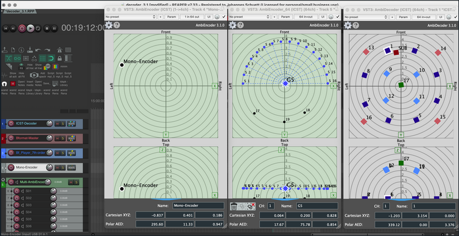

Referenzübersicht zu den ICST Ambisonics Plugins für REAPER: Plugin-Umfang, unterstützte Formate, Downloads und zentrale Dokumentationseinstiege.

Die ICST Ambisonics Plugins kodieren und dekodieren das Ambisonics B-Format und stellen zusätzliche Werkzeuge für räumliche Audioproduktion in der [REAPER](https://www.reaper.fm/) Digital Audio Workstation (DAW) bereit.

## Plugin-Formate

Die ICST Ambisonics Plugins sind in den folgenden Formaten verfügbar:
-   VST3 / Components (AU) /LV2
    (LV2-Version unterstützt derzeit keine Automatisierungsparameter)

## Zentrale Referenzen

- [Was ist neu](https://ambisonics.ch/blog/new/)

- [ICST AmbiEncoder](https://github.com/schweizerweb/icst-ambisonics-plugins/wiki/ICST-AmbiEncoder) (Mono & Multi Encoder)

- [ICST AmbiDecoder](https://github.com/schweizerweb/icst-ambisonics-plugins/wiki/ICST-AmbiDecoder) (Decoder)

## Downloads und externe Ressourcen
-  Binärer Download: <https://github.com/schweizerweb/icst-ambisonics-plugins/releases>
-  Dokumentation: <https://github.com/schweizerweb/icst-ambisonics-plugins/wiki>
- Tutorials, Blog: <https://ambisonics.ch/>
- Youtube: <https://www.youtube.com/@ICSTAmbisonics>
- Warnung:  LV2 ist sehr experimentell

Download: <https://github.com/schweizerweb/icst-ambisonics-plugins/releases/>

## Entwicklung

**Entwickler-Team**:
-   Christian Schweizer/Johannes Schuett/Martin Neukom
-   Video-Editor: Axel Kolb

----
