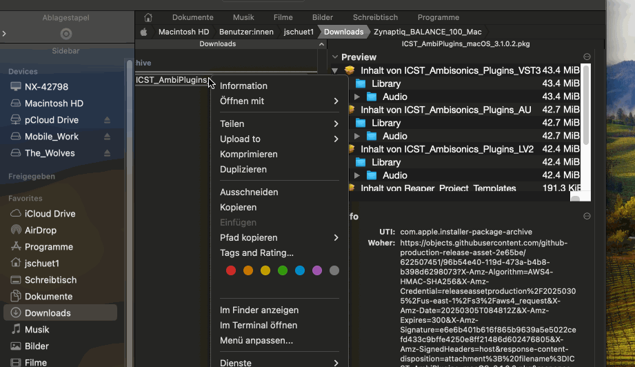
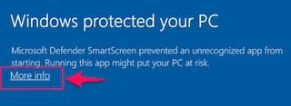
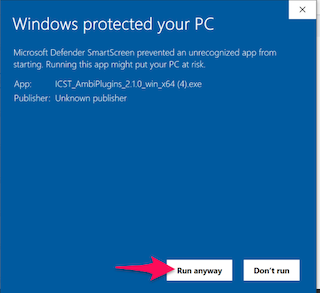
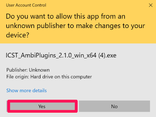
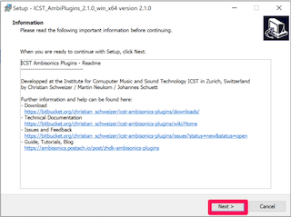
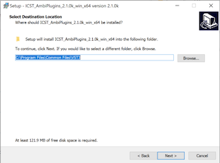
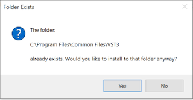
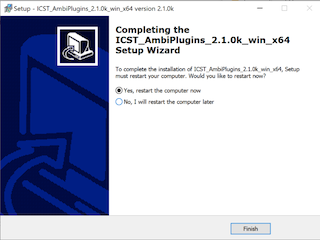

Level: Beginner | Zielgruppe: Komponist:in, Techniker:in, Studierende, Studio-User.

Nutze diese Seite, wenn du vor Templates oder manuellem REAPER-Setup zuerst eine saubere Plugin-Installation brauchst.

## Bevor du startest

Für eine verlässliche Installation solltest du Folgendes bereit haben:

- eine aktuelle Version von **REAPER**
- die **SWS / S&M Extension**
- **ReaPack**
- Zugriff auf das aktuelle Release-Paket der ICST Plugins

Empfohlener nächster Schritt nach der Installation:

- [Schnellstart](/icst-ambisonics-plugins/04_quick_start/) für die erste funktionierende Session
- [Schritt-für-Schritt-Setup](/icst-ambisonics-plugins/06_step_by_step_setup/) wenn du das Routing manuell aufbauen willst

## Installation unter macOS

1. Lade **REAPER** für Apple Silicon oder Intel von [reaper.fm](https://www.reaper.fm/) herunter.
2. Installiere REAPER und öffne es einmal.
3. Schliesse REAPER wieder.
4. Installiere die **SWS / S&M Extension** von <https://www.sws-extension.org/>.
5. Installiere **ReaPack** von <https://reapack.com/>.
6. Folge der ReaPack-Installationsanleitung: <https://reapack.com/user-guide#installation>
7. Lade das aktuelle Release der ICST Ambisonics Plugins von <https://github.com/schweizerweb/icst-ambisonics-plugins/releases> herunter.
8. Starte den macOS-Installer.

## Installation unter Windows

1. Lade **REAPER** für Windows von [reaper.fm](https://www.reaper.fm/) herunter.
2. Installiere REAPER und öffne es einmal.
3. Schliesse REAPER wieder.
4. Installiere die **SWS / S&M Extension** von <https://www.sws-extension.org/>.
5. Installiere **ReaPack** von <https://reapack.com/>.
6. Folge der ReaPack-Installationsanleitung: <https://reapack.com/user-guide#installation>
7. Lade das aktuelle Release der ICST Ambisonics Plugins von <https://github.com/schweizerweb/icst-ambisonics-plugins/releases> herunter.
8. Starte den Windows-Installer oder kopiere das Release manuell in den üblichen VST3-Ordner, falls das Paket keine automatische Installation verwendet.

## Installierte Dateien und Ordner

Typische Zielpfade der Installation:

- `/Library/Audio/Plugins/VST3`
- `/Library/Audio/Plugins/Components`
- `/Library/Audio/Plugins/LV2` (experimentell)
- `Users/Shared/AmbiPluginsTemp/ProjectTemplates`
- `Users/Shared/AmbiPluginsTemplatesTemp/TrackTemplates`

Enthaltene Vorlagen sind typischerweise:

- `ICST_AmbiPlugins_MonoEncoder.RPP`
- `ICST_AmbiPlugins_MultiEncoder.RPP`
- `ICST_AmbiPlugins`
- `ICST_AmbiPlugins_3rdParty`

## Wenn die Plugins nicht erscheinen

Prüfe zuerst diese Punkte:

- REAPER wurde nach der Installation neu gestartet.
- Die **SWS**-Extension ist korrekt installiert.
- **ReaPack** ist korrekt installiert.
- Die Plugin-Dateien liegen in den erwarteten VST3-, AU- oder LV2-Verzeichnissen.
- Die ICST Plugins erscheinen nach einem Rescan im **FX Browser** von REAPER.

Wenn die Vorlagen fehlen, prüfe zusätzlich die oben genannten gemeinsamen Template-Ordner.

## Weiterführende Referenzen

- Projekt-Wiki: <https://github.com/schweizerweb/icst-ambisonics-plugins/wiki>
**Installationsvideo: ICST Ambisonics Plugins – 01 – How to Install**



## Nächster Schritt

- [Schnellstart](/icst-ambisonics-plugins/04_quick_start/)
- [Schritt-für-Schritt-Setup](/icst-ambisonics-plugins/06_step_by_step_setup/)
