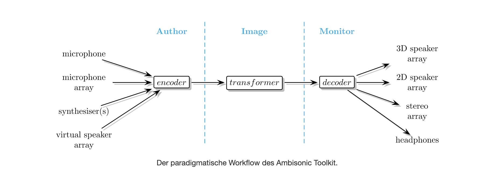
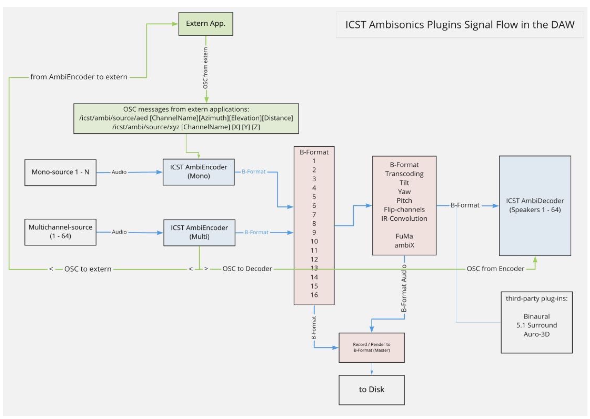
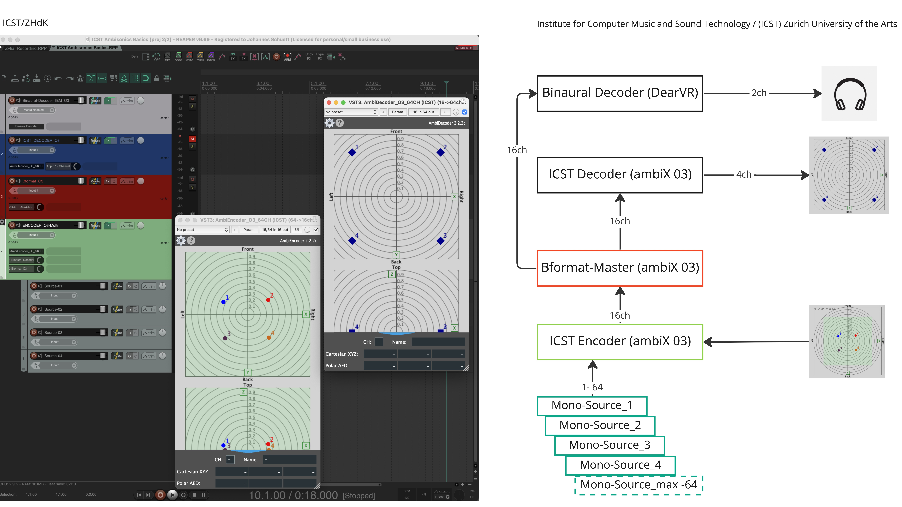

---
tags:
title: Wie es funktioniert
weight: 70
date: 2025-02-01T19:26:00
---

Referenzübersicht des Standard-Signalflusses für Ambisonics in REAPER: Quelle, Encoder, B-Format-Bus und Decoder.

## Grundmodell des Workflows

Zum Erstellen von **Ambisonics-Inhalten** sollte deine Einrichtung folgende Komponenten umfassen:

- **Monoquellen** – Einzelne Soundquellen
- **Encoder** – Positioniert oder bewegt Monoquellen im Ambisonics-Feld
- **B-Format Master-Track** – Erfasst das kodierte Audio zum Durchmischen oder Aufnehmen
- **Decoder** – Konvertiert B-Format-Audio für Lautsprecherausgabe oder binaurales Kopfhörer-Monitoring

### Signalflussübersicht

Die folgende Darstellung zeigt einen typischen Ambisonics-Workflow:
  

Das nächste Bild zeigt den Signalfluss der ICST Plugins:
  

In **REAPER** sieht der Signalfluss wie folgt aus:

  

- **Master Output**
- **Decoder**
- **B-Format Master**
- **B-Format (ambiX) Player**
- **MultiEncoder** mit 16-Kanal Monoquellen als Child-Tracks

Natürlich kannst du deinen Workflow auch anpassen, um deinen Anforderungen zu entsprechen!

----
