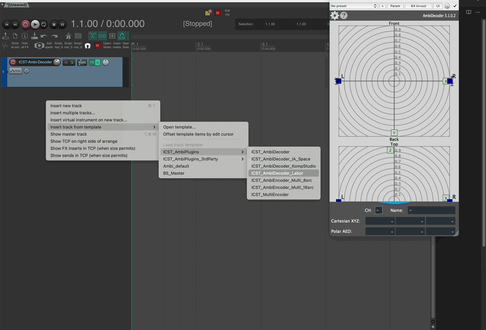

Level: Beginner | Zielgruppe: Komponist:in, Techniker:in, Studierende, Studio-User.

Nutze diese Seite, wenn du die passende ICST-Projekt- oder Spurvorlage auswählen willst, statt jeden Routing-Block manuell aufzubauen.

Die ICST Ambisonics Plugins installieren zwei Arten von REAPER-Vorlagen: **Projektvorlagen** für den Start einer vollständigen Session und **Spurvorlagen** zum Einfügen vorkonfigurierter Tracks in eine bestehende Session.

## Projektvorlagen vs. Spurvorlagen

**Projektvorlagen** (`.RPP`-Dateien) liefern eine vollständige, leere Session mit der gesamten Signalkette: Encoder, B-Format-Master und Decoder. Geeignet für den Start von Null.

**Spurvorlagen** ermöglichen es, einen vorkonfigurierten Encoder-Block — mit korrekter Kanalzahl und Routing — in ein bestehendes Projekt einzufügen. Geeignet für das Erweitern einer laufenden Session oder den Aufbau eigener Layouts.

## Verfügbare Projektvorlagen

Zwei Projektvorlagen werden nach `Users/Shared/AmbiPluginsTemp/ProjectTemplates` installiert:

| Vorlage | Inhalt | Wann verwenden |
|---|---|---|
| `ICST_AmbiPlugins_MonoEncoder.RPP` | Einzelne Monoquelle, Encoder, B-Format-Master, Decoder | Erste Sessions, minimale Setups oder Test einer einzelnen bewegten Quelle |
| `ICST_AmbiPlugins_MultiEncoder.RPP` | MultiEncoder mit 16 Monoquellen als Child-Tracks, B-Format-Master, Decoder | Für die meisten Produktionen — hier beginnen bei Multi-Source-Sessions |

## Verfügbare Spurvorlagen

Zwei Gruppen von Spurvorlagen werden nach `Users/Shared/AmbiPluginsTemplatesTemp/TrackTemplates` installiert:

**ICST AmbiPlugins** — Kern-Encoder-Blöcke:

- `ICST_AmbiEncoder_Multi_8src` — MultiEncoder mit 8 vorgerouteten Monoquellen. Häufigster Ausgangspunkt zum Hinzufügen einer neuen Quellengruppe zu einer bestehenden Session.
- MonoEncoder-Vorlage — Einzelquellen-Track mit vorgeladenem Encoder und 64-Kanal-Ausgang.

**ICST AmbiPlugins 3rdParty** — Integrationen mit Drittanbieter-Plugins wie IEM- und SPARTA-Werkzeuge. Sinnvoll, wenn ICST-Encoder mit externer Bearbeitung im selben Signalpfad kombiniert werden.

## Spurvorlagen einfügen

1. Mit der rechten Maustaste in den leeren Spurbereich in **REAPER** klicken.
2. **Spur aus Vorlage einfügen** wählen.
3. Zur gewünschten Vorlagengruppe (**ICST AmbiPlugins** oder **ICST AmbiPlugins 3rdParty**) navigieren und die Vorlage auswählen.

Nach dem Einfügen das Routing zwischen den neuen Spuren und dem bestehenden B-Format-Master prüfen, bevor Audio hinzugefügt wird.

## Verwandte Seiten

- [Schnellstart](/icst-ambisonics-plugins/04_quick_start/)
- [Schritt-für-Schritt-Setup](/icst-ambisonics-plugins/06_step_by_step_setup/)
- [Best Practices](/icst-ambisonics-plugins/15_best_practices/)
