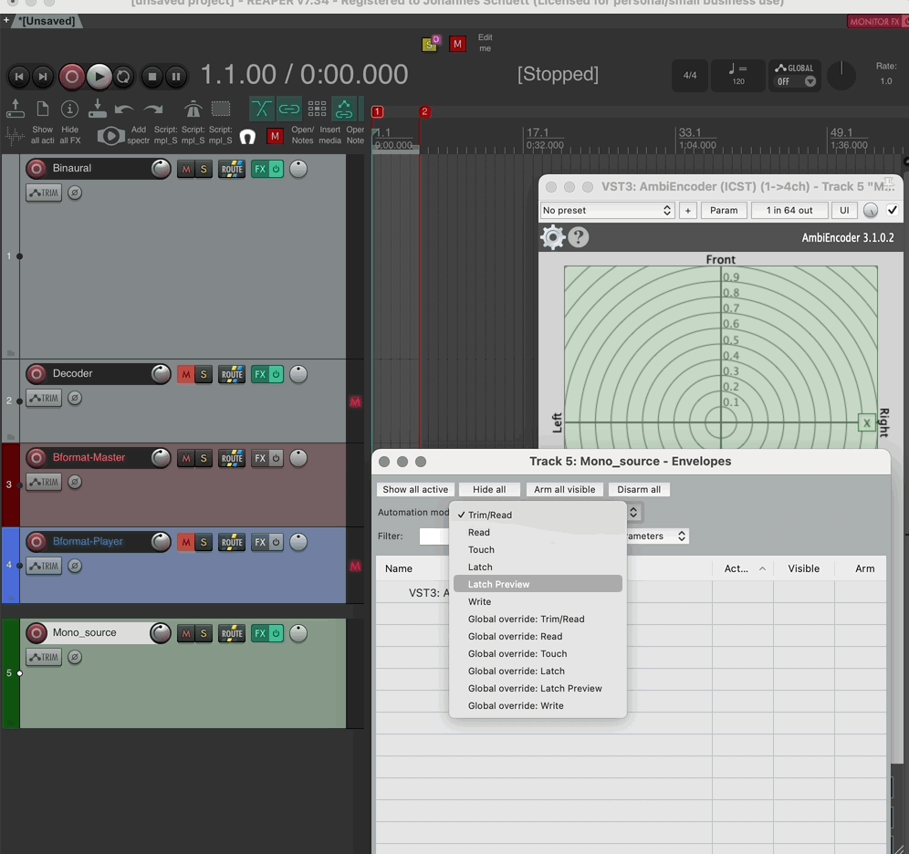

---
date:
---
Institute for Computer Music and Sound Technology / (ICST) Zurich University of the Arts

---
## 03 step by step setup

This tutorial assumes that you have already installed Reaper, the ICST Ambisonics plugins, and all other recommended third-party plugins!

### So let's create this template for Reaper together step by step.

We begin from the top down:

1. Open a empty Reaper session
    
2. Double-click in the empty field in Reaper or open a new track from the menu.
3. Name this track 'decoder' and remove the master bus.
    

> [!Tip:]
>  Generally, always enter 64ch tracks and 'routing'.

- The decoder routing for this example is an octagon.
	- Inputs = 64ch from 'Bformat Master track'
    - Outputs = 8 channels to your audio interface
4. Add ICST AmbiPlugins 'Decoder in the FX
   
5. open the AmbiDecoder
   
6. Choose the speaker-preset. (in this example the octagon)
    
7.Now select your AmbiDec settings
- Ambisonics weighting
- Ambisonics order (1. to 7th order)

4. If everything is set up correctly in this AmbiDec setting, you can test your 8 speakers.
- Press the “Speaker Test” button or each speaker individually, and you will hear “white noise” in each of the 8 speakers.

> [!Tip:]
> If you don't hear the sound, make sure the output routing is correct.

> [!Attention:]
> Watch your volume!

9. Create the 'Bformat-Master track'

The 'Bformat-Master' track should receive all outputs from these tracks:
- All ambient encoders
- All BFormat_SFX
- All BFormat players
Since it is the master track we need to bounce or record our final B-format.
So in the future, route all outputs that contain or generate a B-format signal to this 'B-format master track'!
We will therefore color it red.
It is also the only track that leads to the AmbiDecoder and in parallel to a binaural track.

10. Create a B-Format player track with (64 channels) and route this track into the B-Format master track.

> [!Tip:]
With this method, you can play back any B-Format from the 1st to the 7th order.

Example A shows a first-order b-format Ambisonic.

Example B shows a 5th-order b-format Ambisonic.

Now we can play back and listen to B-format files on eight speakers.
11. So that we can also listen to the B format using headphones, we will now create a decoder for binaural listening. 
	- Create a new 64channel track and open the binaural plugin of your choice in the FX. (in this example the 'DearVR Ambi Micro.vst3')  
	- Move the new track to the top of the Reaper rack.  
	- Then route the output from the 'Bformat-Master track' to this binaural decoder. (as shown in the gif)

- Then we mute the AmbiDecoder track and listen to the binaurally decoded signal through headphones.

>[!Tip:] 
>You can switch between the AmbiDecoder and the Binaural Decoder for an acoustic comparison. Press the 'solo' button on the muted track (on/off).

You will have noticed that a new track (mono source) has already been created in the last two images.  You should now do the same: create a new track called 'Mono-source' and insert a 'Mono-audiofile' into it. Please note that this channel also contains a 64-channel bus in the 'Route'! 

12. Mono AmbieEncoder overview.
	

- in the FX, open the MonoEncoder Plugin.

Overview of the ICST MonoEncoder:

13. Record the MonoEncoder movements in the Reaper-Track:

14. Play the recorded movement.

