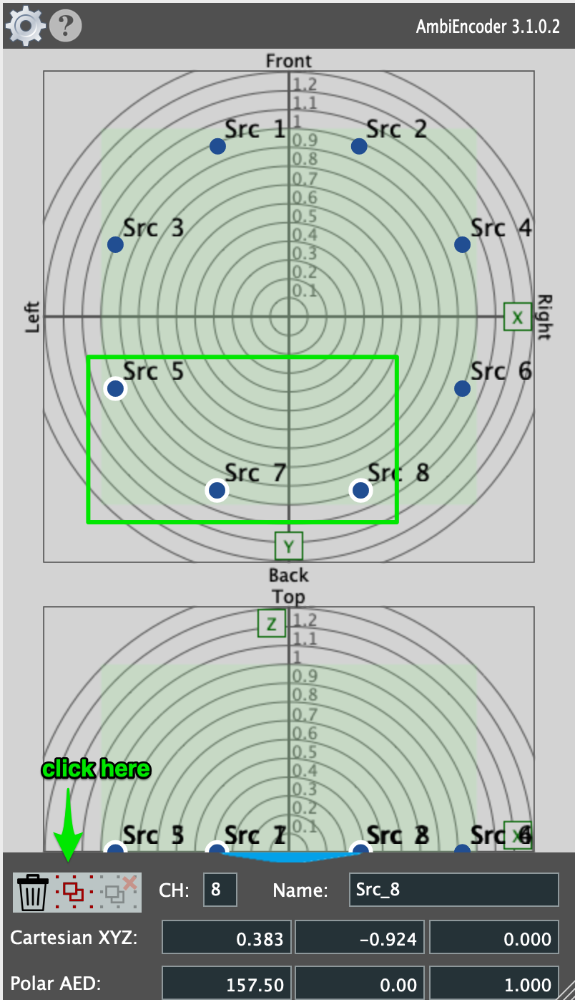
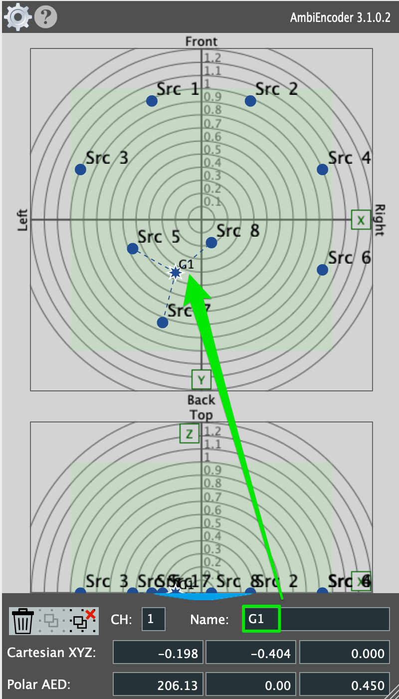

---
date:
---
Institute for Computer Music and Sound Technology / (ICST) Zurich University of the Arts

---
## 03 step by step setup

This tutorial assumes that you have already installed Reaper, the ICST Ambisonics plugins, and all other recommended third-party plugins!

### So let's create this template for Reaper together step by step.

We begin from the top down:

1. Open a empty Reaper session
    
2. Double-click in the empty field in Reaper or open a new track from the menu.
3. Name this track 'decoder' and remove the master bus.
    

> [!Tip:]
>  Generally, always enter 64ch tracks and 'routing'.

- The decoder routing for this example is an octagon.
	- Inputs = 64ch from 'Bformat Master track'
    - Outputs = 8 channels to your audio interface
4. Add ICST AmbiPlugins 'Decoder in the FX
   
5. open the AmbiDecoder
   
6. Choose the speaker-preset. (in this example the octagon)
    
7.Now select your AmbiDec settings
- Ambisonics weighting
- Ambisonics order (1. to 7th order)

4. If everything is set up correctly in this AmbiDec setting, you can test your 8 speakers.
- Press the “Speaker Test” button or each speaker individually, and you will hear “white noise” in each of the 8 speakers.

> [!Tip:]
> If you don't hear the sound, make sure the output routing is correct.

> [!Attention:]
> Watch your volume!

9. Create the 'Bformat-Master track'

The 'Bformat-Master' track should receive all outputs from these tracks:
- All ambient encoders
- All BFormat_SFX
- All BFormat players
Since it is the master track we need to bounce or record our final B-format.
So in the future, route all outputs that contain or generate a B-format signal to this 'B-format master track'!
We will therefore color it red.
It is also the only track that leads to the AmbiDecoder and in parallel to a binaural track.

10. Create a B-Format player track with (64 channels) and route this track into the B-Format master track.

> [!Tip:]
With this method, you can play back any B-Format from the 1st to the 7th order.

Example A shows a first-order b-format Ambisonic.

Example B shows a 5th-order b-format Ambisonic.

Now we can play back and listen to B-format files on eight speakers.
11. So that we can also listen to the B format using headphones, we will now create a decoder for binaural listening. 
	- Create a new 64channel track and open the binaural plugin of your choice in the FX. (in this example the 'DearVR Ambi Micro.vst3')  
	- Move the new track to the top of the Reaper rack.  
	- Then route the output from the 'Bformat-Master track' to this binaural decoder. (as shown in the gif)

- Then we mute the AmbiDecoder track and listen to the binaurally decoded signal through headphones.

>[!Tip:] 
>You can switch between the AmbiDecoder and the Binaural Decoder for an acoustic comparison. Press the 'solo' button on the muted track (on/off).

You will have noticed that a new track (mono source) has already been created in the last two images.  You should now do the same: create a new track called 'Mono-source' and insert a 'Mono-audiofile' into it. Please note that this channel also contains a 64-channel bus in the 'Route'! 

>[!Tip:] Have look on this [Video](https://www.youtube.com/watch?v=aDa-vNWriLM&t=119s)

12. Mono AmbieEncoder overview.
	
- in the FX, open the MonoEncoder Plugin.

Overview of the ICST MonoEncoder:
- Add a AmbiEncoder(ICST) (1-4) --> Mono-Encoder
- Route the Audio (64channels) from Encoder to the 'Bformat-Master bus'.

13. Record the MonoEncoder movements in the Reaper-Track: Follow the next gif animation.

14. Play the recorded movement, see the next gif.

You can now continue track by track and spatialize your N-sources. But let me consider an economic component. As you know, at max 7th-order all MonoEncoders work with 64-channels, which may cause a CPU problem on the computer. To make the computer's work more ecological, we have implemented the MultiEncoder. It can handle up to 64 mono sources and sends them as a 64ch Bformat to the Bformat master track. This reduces the processing power of your computer and allows more audio sources.

15. In the next example, I'll show you how we used the multi-encoder. Right-click in the empty Reaper track field and select “Insert Track from Template”. Then go to “ICST AmbiPlugins” and select “ICST_AmbiEncoder_Multi_8src”. This opens a MultiEncoder with 8x mono sources that are already routed into the MultiEncoder.
    
If you have linked the routing correctly, you can now control the four sources with different placements or movements in the MultiEncoder.
16. The AmbiEncoder Settings are a very importend chapter in the Workflow!
	 The next Gif you see the AmbiEncoder-Setting Features.
	 

>[!Tip: ] See the AmbiEncoder [Video](https://www.youtube.com/watch?v=aDa-vNWriLM&t=31s)

17. A specialty of the ICST Ambisonics Encoder is the implementation of the distance function. It was created at the ICST by Martin Neukom. The distance function allows you to create several different room configurations so that the train moves quickly or very slowly through your room. (next gif)
       Please refer to the tutorial 'Distance' for detailed instructions.
> [!Tip: If you are working with distance, it is important to define it at the beginning of your work in order to scale all xyz coordinates to this space.(Here in the example, the distance is 0.0 to 1.0)]
18. To give you an idea of how the MultiEncoder works, here are a few gifs that illustrate it. To give you an idea of how to work with the multi-encoder, here are a few gifs that illustrate it. You can move the source in the multi-encoder's radar and record this movement individually. 
	(Gif_01)Record first movement with the Src_1 
    
     - First set Automations Envelopes to Mode: Write
     - Then start Reaper (space) and move the Src_01 in the MultiEncoder Radar.
     - You can do that with all others.
Gif_02 shows the movement with the 'Src_3'

The next step demonstrates how to manually edit the xyz envelopes.

- To create a new editing point, click the envelope while holding down the Shift key.
- Then move the point to change the xyz coordinates.

(Gif_03) Playing the entire recorded/edited Ambisonics scene.

19. Finally, here's an idea of how you can work with groups. In Radar, mark the 'Src' points that you want to have in a group.
	                            
	   You have created a group and can now name the group point (e.g. G1).
	                          
20. Record the Group:
     
     Recording modes in Reaper:
	-  “Latch” to record only one source point.
	- “Touch” to start recording from the moment you touch a point.
	- “Write” to overwrite the recording.

21. Finally, we check the final recording and listen to it through the decoder (speaker) and through the binaural decoder with headphones.
       

22. If we are satisfied with the result, we can now bounce or record (realtime) it as our master B format.

