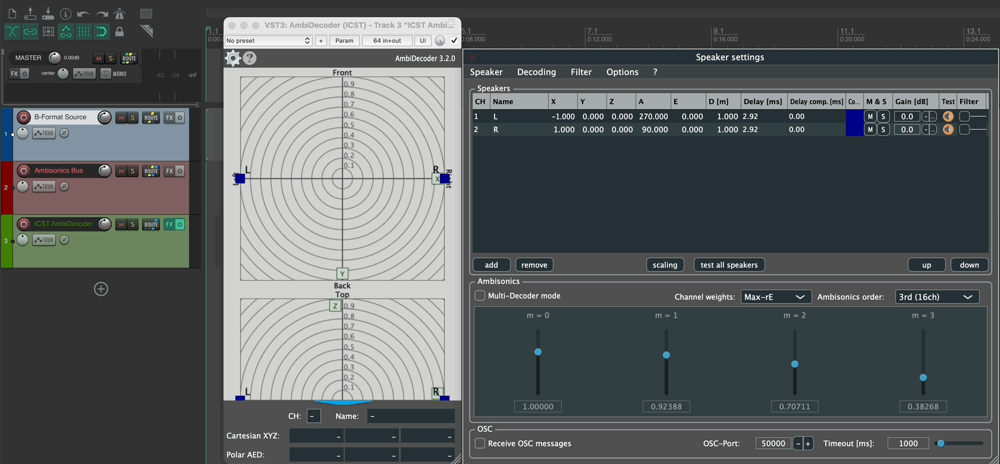

Institut für Computermusik und Klangtechnologie (ICST) · Zürcher Hochschule der Künste

---

# ICST Ambisonics Decoder

Decodierung ist die zentrale Schnittstelle zwischen dem Ambisonics-B-Format und der physischen Lautsprecherwiedergabe – ihre Qualität bestimmt räumliche Präzision, Tiefenstaffelung und Lokalisation.

Während die binaurale Wiedergabe über Kopfhörer durch etablierte Plug-ins (z. B. IEM, SPARTA) heute weitgehend ausgereift ist, bleibt die Decodierung für reale Lautsprecheranordnungen eine technisch und psychoakustisch anspruchsvolle Aufgabe. Geometrie, Laufzeiten, Gewichtungen, Filterung und Ambisonics-Ordnung müssen präzise aufeinander abgestimmt werden.

Der **ICST Ambisonics Decoder** ist ein leistungsfähiges, praxisorientiertes Werkzeug, das speziell für flexible Lautsprecheraufbauten in Studio- und Live-Kontexten entwickelt wurde. Neben Standardkonfigurationen (z. B. Quadro, Oktagon, 7.1.4) können auch asymmetrische oder individuell eingemessene Lautsprecheranordnungen präzise abgebildet werden.

Der Decoder wurde im Kontext des 3D-Kompositionsstudios der ZHdK entwickelt und kontinuierlich im Studio- und Konzertbetrieb erprobt. Ziel war ein **flexibles, reproduzierbares und klanglich transparentes Decodiersystem** für Higher-Order-Ambisonics-Workflows.

---

## Plugin-Formate

Die **ICST Ambisonics Decoder Plugins** sind verfügbar als:
- VST3
- AU (Component)
- LV2 _(experimentell – nicht für den Produktionseinsatz empfohlen)_

Wiki: [ICST AmbiDecoder · schweizerweb/icst-ambisonics-plugins Wiki · GitHub](https://github.com/schweizerweb/icst-ambisonics-plugins/wiki/ICST-AmbiDecoder)

Alle Beispiele in diesem Artikel werden in REAPER durchgeführt. REAPER unterstützt bis zu 128 Audiokanäle pro Spur und eignet sich daher besonders gut für Higher-Order-Ambisonics-Produktionen.

---

## Übersicht ICST Ambisonics Decoder

### Hauptbereiche der Benutzeroberfläche

1. **Radar – horizontale Ansicht** der Lautsprecheranordnung (ICST Kompositionsstudio)
2. **Vertikale Radar-Ansicht (Z-Achse)**
3. **Lautsprecherparameter**
    - CH = Index
    - Name = Lautsprecherbezeichnung
    - Koordinaten: Kartesisch (XYZ) & Polar (Azimut, Elevation, Distanz)

> [!tip]
> Doppelklick auf die Parameterfelder ermöglicht die direkte Eingabe von Werten.

### Einstellungen & Hilfe 

4. Zahnrad-Icon → Öffnet das _Lautsprecher-Einstellungen_-Fenster
5. Fragezeichen → Hilfefenster

**Lautsprecher-Parameter-Editor:**

### Tastenkürzel

| Aktion                              | Kürzel             |
| ----------------------------------- | ------------------ |
| Ausgewählte Quelle/Lautsprecher muten | `Ctrl + Shift + M` |
| Ausgewählte Quelle/Lautsprecher solo  | `Ctrl + Shift + S` |

> [!example]
> Video: ICST Ambisonics Plugins Übersicht
> https://www.youtube.com/watch?v=xkauhHMYt5k

> [!info]
> Wiki: ICST Ambisonics Plugins
> https://github.com/schweizerweb/icst-ambisonics-plugins/wiki

---

## Workflow: Ambisonics-Decodierung in REAPER

### Empfohlene Spurstruktur

Drei 64-Kanal-Audiospuren in REAPER anlegen:

1. **B-Format-Quellspur** – Ambisonics-Datei 1.–7. Ordnung
2. **Ambisonics-Bus** – sammelt mehrere B-Format-Signale, beherbergt Mastering-FX
3. **Decoder-Spur** – beherbergt den ICST Ambisonics Decoder, Ausgabe an Lautsprecher

Diese klare Trennung gewährleistet Transparenz, Modularität und reproduzierbare Setups.

---

## ICST AmbiDecoder – Schritt-für-Schritt-Einrichtung

1. Das **ICST AmbiDecoder**-Plugin zur Decoder-Spur hinzufügen.

    

    Standardmäßig öffnet der Decoder mit der Stereo-Einstellung (90°).

    

2. Das _Lautsprecher-Einstellungen_-Fenster öffnen (Zahnrad-Icon → „Speaker"). Eine der vielen Standard-Voreinstellungen (Presets) auswählen oder eine eigene Lautsprecherkonfiguration eingeben.

    

3. Optional den **Filter**-Bereich aktivieren, um einzelne Lautsprecher zu entzerren.

    

    Verfügbare Filtertypen pro Lautsprecher:

    

    > [!todo]
    > Screenshot hinzufügen: eingemessenes Lautsprecher-Setup des ICST Kompositionsstudios

4. Unter **„Lautsprecher"** die Lautsprecherparameter direkt bearbeiten und als Voreinstellung speichern.

    

5. Unter **„Ambisonics"** die gewünschte Ordnung (bis zur 7. Ordnung) und Kanalgewichtungen auswählen.

    

6. Raumdimensionen bei Bedarf skalieren – Lautsprecherkoordinaten und Laufzeiten werden automatisch neu berechnet.

    

---

## Audio-Testfunktion

Der Decoder verfügt über einen integrierten Testbereich:

- Pink-Noise-Generator
- Einzeltest pro Lautsprecher
- Sequenzieller Test aller Lautsprecher im Uhrzeigersinn („Test all speakers")
- Stumm / Solo mit `Ctrl + Shift + M` / `Ctrl + Shift + S`

Dies ermöglicht eine schnelle technische Überprüfung des gesamten Systems vor Probe oder Aufführung.

---

### Schnellcheck vor Session / Konzert (60 Sek.)

Bevor du mit Probe oder Aufnahme startest, prüfe kurz:

1. **Routing aktiv:** Pegel am Decoder-Eingang sichtbar.
2. **Lautsprecher-Reihenfolge korrekt:** „Test all speakers“ läuft in erwarteter physischer Reihenfolge.
3. **Voreinstellung geladen:** passendes Setup (Raum / Array / Ordnung) ist aktiv.
4. **Ordnung konsistent:** Decoder-Ordnung passt zur B-Format-Quelle.
5. **Monitoring klar:** Lautsprecher- oder binauraler Abhörweg ist eindeutig (keine unbeabsichtigte Doppelabhöre).

> [!Tip]
> Speichere Voreinstellungen pro Raum mit einem stabilen Namensschema, z. B.:
> `RoomName_Array_Order_Date` (Beispiel: `ICST_Octagon_O5_2026-03`).

### Fehlerbehebung (Kurz)

- **Kein Decoder-Ausgang:** Send vom Ambisonics-Bus zur Decoder-Spur prüfen und 64 Kanäle bestätigen.
- **Falsche Lokalisation:** Lautsprecher-Voreinstellung mit der realen Hardware-Ausgangszuordnung abgleichen.
- **Diffuse Höhenabbildung:** Ordnung/Gewichtung prüfen und ggf. MultiDecoder-Layer-Trennung verwenden.
- **Unausgewogene Pegel:** Pro-Lautsprecher-Filter sowie Distanz/Laufzeiten im Lautsprecher-Editor nachjustieren.
- **Voreinstellung passt im neuen Raum nicht:** Raumskalierung neu setzen und unter neuem Namen speichern.

### Nächster Schritt

Wenn dein Array mehrere Höhenschichten nutzt (z. B. Boden / Mitte / Höhe), gehe weiter zu:
**[ICST MultiDecoder](/icst-ambisonics-plugins/09_icst_multidecoder/)**
für ebenenspezifische Ordnung, Filterung und Lautsprecher-Teilmengen.

## Voreinstellungen speichern & laden

Lautsprecherkonfigurationen können als Voreinstellungen gespeichert und jederzeit neu geladen werden. Dies gewährleistet Reproduzierbarkeit über Sessions und Spielorte hinweg.

> [!tip]
> Die Lautsprecherkonfiguration als TXT-Datei exportieren und über ein `coll` in das externe `ambidecode~`-Objekt laden.

---

## Zusammenfassung

Der ICST Ambisonics Decoder bietet:

- Präzise Higher-Order-Ambisonics-Decodierung
- Flexible Lautsprechergeometrien (symmetrisch & asymmetrisch)
- Lautsprecherindividuelle Filterung und Entzerrung
- Integrierte Test- und Messfunktionen
- Multi-Layer-MultiDecoder-Architektur
- Voreinstellungs-Verwaltung für reproduzierbare Setups
- Nahtlose Integration in professionelle DAW-Workflows

Er bildet damit eine robuste Grundlage für künstlerische, wissenschaftliche und produktionsorientierte Anwendungen im Bereich 3D-Audio.

---
