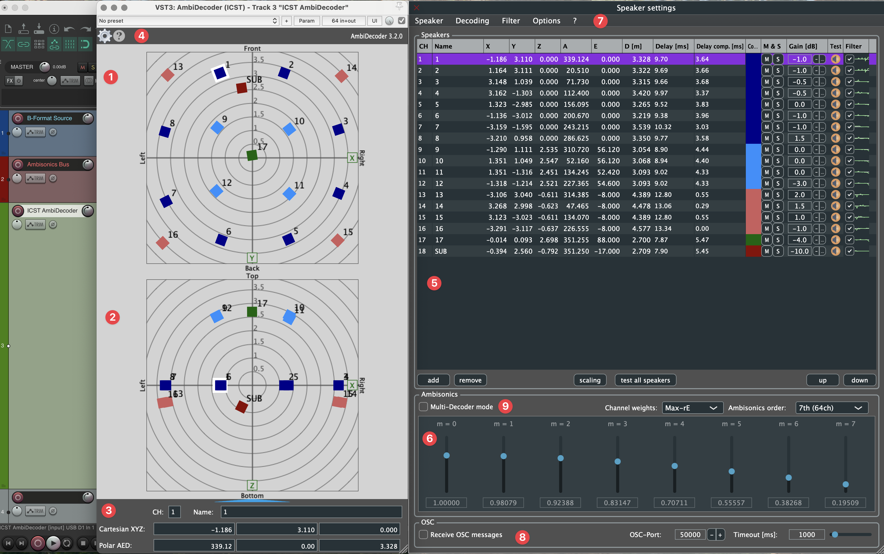
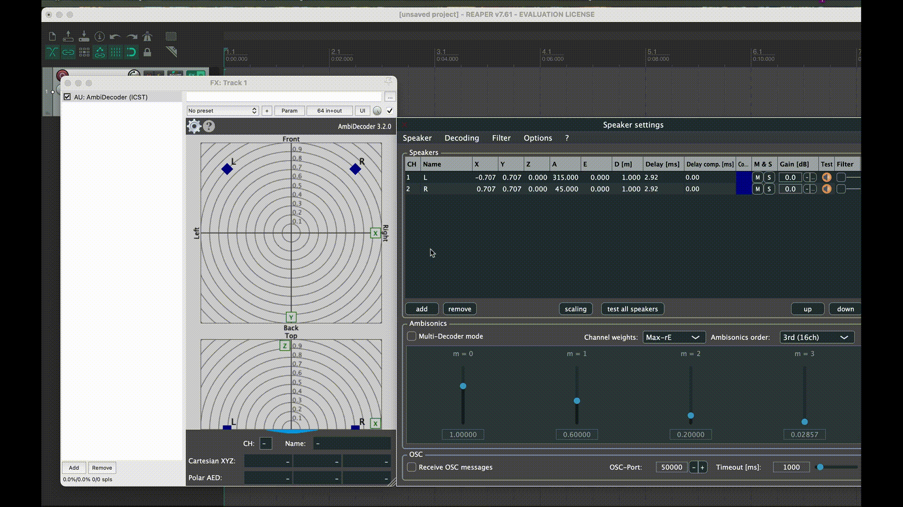

Level: Intermediate | Audience: Technician, composer, student, studio user.

Use this page when you want reliable loudspeaker playback from the B-format master and need a decoder that matches a real speaker array.

## When to use ICST Decoder

Use the **ICST Decoder** when:

- you need playback on a defined loudspeaker array
- you want to load or build speaker presets for a room
- you need control over Ambisonics order, weighting, delay, and filtering
- you want reproducible speaker-based monitoring in REAPER

Use a separate **binaural decoder** when the goal is headphone monitoring only.

## What the decoder does

Decoding is the stage between the Ambisonics B-format field and physical loudspeaker reproduction. Geometry, delay, weighting, filtering, and order all influence the resulting spatial image.

The **ICST Decoder** was developed for flexible loudspeaker setups in studio and live contexts. In addition to standard arrays such as Quadro, Octagon, or 7.1.4, it can also handle asymmetric or individually measured speaker layouts.

## Plugin formats

The **ICST Decoder** is available as:

- `VST3`
- `AU (Component)`
- `LV2`  
  LV2 is experimental and should not be treated as the main production path.

All examples on this page assume **REAPER**, which supports up to 128 audio channels per track.

## Overview

### Main areas of the interface

1. **Radar** for the horizontal speaker view
2. **Vertical radar view**
3. **Speaker parameters**
   - channel index
   - speaker name
   - Cartesian and polar coordinates

> [!tip]
> Double-click parameter fields to enter values directly.

### Settings and help

4. Gear icon -> speaker settings window  
5. Question mark -> help window

**Speaker Parameter Editor:**

### Keyboard shortcuts

| Action | Shortcut |
|---|---|
| Mute selected source or speaker | `Ctrl + Shift + M` |
| Solo selected source or speaker | `Ctrl + Shift + S` |

## Recommended REAPER structure

Create three 64-channel tracks:

1. **B-format source track**
2. **Ambisonics bus / Bformat Master**
3. **Decoder track**

This separation keeps the session transparent and makes later troubleshooting much easier.

> [!note]
> The decoder is not just a speaker router. It projects a **B-format sound field** onto a real loudspeaker array.
> This is why speaker geometry, Ambisonics order, weighting, delay, and filtering all affect the perceived image.
>
> If you want the conceptual background, see:
> [Why the decoder sounds the way it does – Methodological context](/post/decoder-methodological-context/)

## Basic setup

1. Insert the **ICST AmbiDecoder** on the decoder track.
2. Open the speaker settings.
3. Load a preset or define your own loudspeaker layout.
4. Set the Ambisonics **order** and **channel weighting**.
5. Scale room dimensions if needed.
6. Run a speaker test before rehearsal, recording, or export.

### Choosing a weighting scheme

Weighting changes the trade-off between spatial focus and stability.

- **Max-rE:** usually the best starting point for clear localization and focused images
- **In-Phase:** often more stable on irregular arrays or difficult listening positions
- **Basic:** useful as a neutral reference when comparing behaviours

If you are unsure, start with **Max-rE**, then compare with **In-Phase** on the real array.

## Per-speaker control

You can edit speaker-specific parameters and save them as presets.

Optional filter processing is available per speaker:

## Audio test function

The integrated test section includes:

- pink noise generator
- individual speaker tests
- sequential speaker test
- mute and solo shortcuts

This is the fastest way to verify whether the physical system matches the preset and output routing.

## Quick session check

Before rehearsal or recording, verify:

1. level is visible at the decoder input
2. the speaker order matches the room
3. the correct preset is loaded
4. the decoder order matches the B-format source
5. loudspeaker and binaural monitoring are not accidentally running in parallel

> [!tip]
> Save presets with a stable naming scheme such as `Room_Array_Order_Date`.

## Common mistakes

- sending the wrong track into the decoder
- loading a speaker preset that does not match the real hardware mapping
- forgetting to verify order and weighting against the source material
- treating the decoder as the render target instead of the Bformat Master
- running loudspeaker and binaural monitoring in parallel unintentionally

## Presets

Speaker presets can be saved and reloaded at any time, which is essential for reproducible room setups.

## Next step

If your array uses multiple elevation layers or different speaker subsets, continue with:

- [ICST MultiDecoder](/icst-ambisonics-plugins/09_icst_multidecoder/)

Related pages:

- [Step by Step Setup](/icst-ambisonics-plugins/06_step_by_step_setup/)
- [Render B-Format in REAPER](/icst-ambisonics-plugins/12_render_bformat/)
- [Best Practices](/icst-ambisonics-plugins/15_best_practices/)

## Go deeper

These articles extend the concepts on this page with practical examples and theoretical background:

- [Why the decoder sounds the way it does – Methodological context](/post/decoder-methodological-context/)
- [How it Works](/icst-ambisonics-plugins/03_how_it_works/)
- [ICST MultiDecoder](/icst-ambisonics-plugins/09_icst_multidecoder/)
- [Best Practices](/icst-ambisonics-plugins/15_best_practices/)
- [Glossary](/composing-in-ambisonics/10-glossary/)
