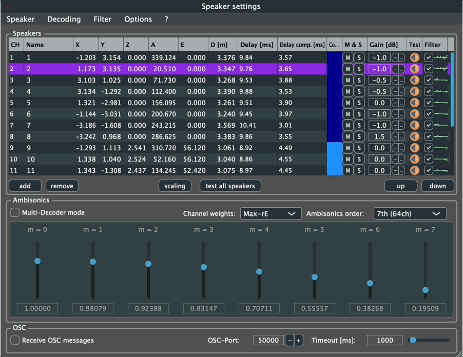

Institut für Computermusik und Klangtechnologie (ICST) · Zürcher Hochschule der Künste

---

> [!warning]
> 🚧 Dieser Abschnitt ist noch im Aufbau.

---

Der **ICST MultiDecoder** erweitert den konventionellen Ambisonics-Decoder um bis zu vier parallel arbeitende Decodereinheiten innerhalb eines gemeinsamen HOA-Systems. Jede Einheit kann ein eigenes Lautsprecher-Subset ansteuern, eine eigene Ambisonics-Order und individuelle Weightings verwenden sowie separat gefiltert und in der Lautstärke geregelt werden. So lassen sich z.B. Main-, Height- und Low-Layer eines 3D-Arrays unterschiedlich behandeln, ohne das feldbasierte B-Format aufzugeben.

Die wichtigsten Bedienelemente im Überblick:

| # | Steuerelement | Funktion |
|---|---------------|----------|
| 1 | **Multi-Decoder Schalter** | Aktiviert / deaktiviert den Multi-Decoder-Modus |
| 2 | **Decoder hinzufügen** | Fügt eine neue Decodereinheit hinzu (max. 4) |
| 3 | **Lautstärke & Mute** | Pegelregelung und Stummschaltung pro Einheit |
| 4 | **Filterbänder** | Öffnet die Filtersektion der jeweiligen Einheit |

---

## Funktionsweise

### 1. Aktivierung des MultiDecoder-Modus

Der MultiDecoder-Modus kann jederzeit ein- oder ausgeschaltet werden. Dies ermöglicht einen direkten Vergleich zwischen klassischem Single-Decoder-Betrieb und segmentierter Mehrfach-Decodierung.

### 2. Parallele Decodereinheiten

Es können **bis zu vier unabhängige Decodereinheiten** konfiguriert werden. Typische Anwendungsbeispiele:

- Höhenebenen (z. B. _Top / Mid / Bottom_)
- Frequenzbasierte Segmentierung
- Unterschiedliche Lautsprecher-Subsets
- Vergleich verschiedener Decoding-Strategien

### 3. Individuelle Parameter pro Decodereinheit

Jede aktivierte Decodereinheit kann separat konfiguriert werden:

#### a) Lautsprecherauswahl

Individuelle Auswahl oder Definition der Lautsprecherkonfiguration pro Einheit.

#### b) Ambisonics-Sequenz und Gewichtung

Auswahl der Ambisonics-Sequenz und Anpassung der Gewichtungsfaktoren. Dies ermöglicht differenzierte energetische oder richtungsbasierte Verteilungen innerhalb desselben B-Formats.

#### c) Spezifische Filterung

Jede Decodereinheit kann mit einer eigenen Filtersektion versehen werden – etwa um die oberen Lautsprecher spektral abweichend zu bearbeiten und eine psychoakustisch präzisere Höhenabbildung zu erzielen.

#### d) Individuelle Audio-Parameter

Pro Einheit stehen zur Verfügung:

1. **Filter Ein/Aus** – Aktivierung oder Deaktivierung der Filtersektion
2. **Individuelles Volumen** – separate Pegelsteuerung jeder Decodereinheit
3. **Mute / Unmute** – schnelles Ein- und Ausschalten einzelner Decoder

---

## Konzeptueller Hintergrund

Klassisches Ambisonics-Decoding kann trotz natürlich klingender Ergebnisse zu einem diffusen Tiefenbild führen. Durch frequenz- oder ebenenspezifische Decodereinheiten lassen sich psychoakustische Aspekte gezielt modellieren, ohne das feldbasierte Ambisonics-Paradigma zu verlassen.

Das Ergebnis ist eine präzisere Tiefenstaffelung und eine differenziertere Raumstruktur – besonders bei komplexen, vertikal erweiterten Lautsprecheranordnungen.

Der ICST MultiDecoder stellt damit ein erweitertes Werkzeug für künstlerische wie auch forschungsbasierte Anwendungen im Bereich der Higher-Order Ambisonics dar.

---
