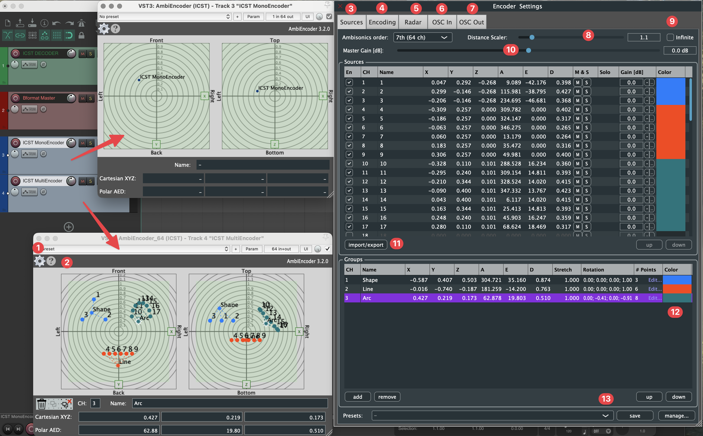
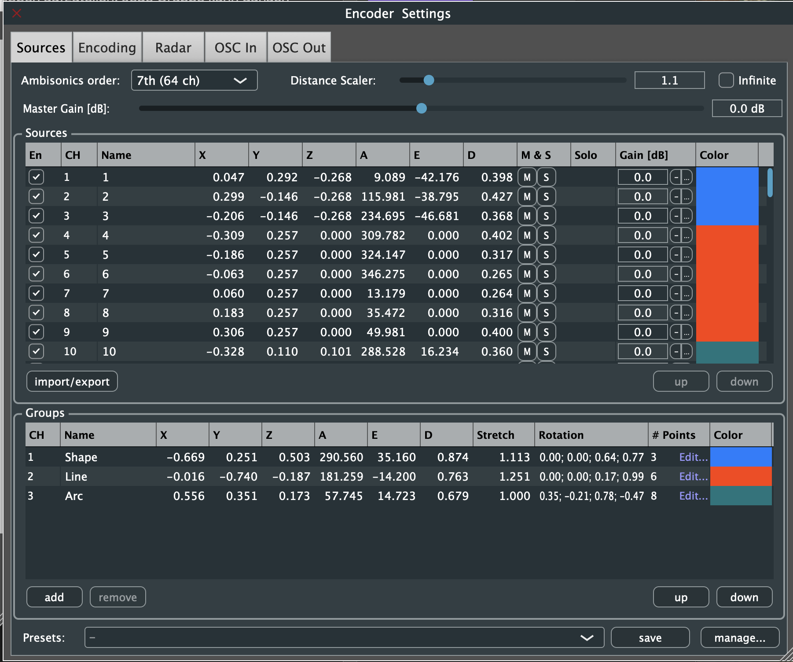
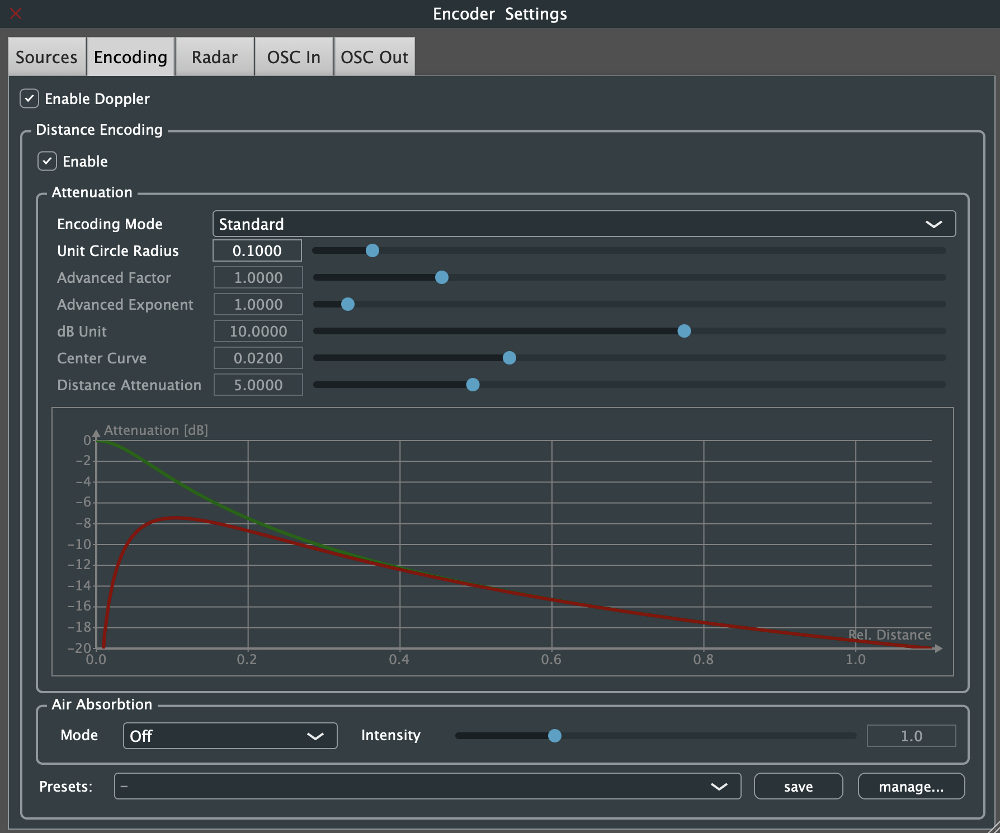

Institut für Computermusik und Klangtechnologie (ICST) · Zürcher Hochschule der Künste

---

# ICST AmbiEncoders

Die **ICST AmbiEncoders** positionieren und bewegen Klangquellen innerhalb des Ambisonics-B-Format-Feldes. Zwei Encoder-Varianten stehen zur Verfügung:

- **Mono-Encoder (A)** – Positioniert oder bewegt eine einzelne Mono-Quelle im 3D-Raum.
- **Multi-Encoder (B)** – Positioniert oder bewegt bis zu 64 Quellen pro Audiospur, organisiert in bis zu 8 Gruppen. Jede Gruppe kann relativ zu ihrem Gruppenzentrum manipuliert werden, was komplexe räumliche Choreografien ermöglicht.

Ein wesentliches Merkmal der ICST-Encoder ist die integrierte **Distanzsimulation**: Ein Distanz-Scaler wendet Tiefpassfilterung und einen einfachen Doppler-Effekt an, um Tiefen- und Nähewahrnehmung zu modellieren.

Ein- und ausgehende Parameter können über [OSC](https://en.wikipedia.org/wiki/Open_Sound_Control) gesendet und empfangen werden.

> [!info]
> Wiki: [ICST AmbiEncoder · GitHub](https://github.com/schweizerweb/icst-ambisonics-plugins/wiki/ICST-AmbiEncoder)

> [!example]
> Video: ICST Ambisonics Plugins – 02 – Encoder und Routing
> https://youtu.be/-U0t8sjeTsw?si=zJh9QpgOKeFe2BL0

---

## Übersicht

| Label | Beschreibung                                                        |
| ----- | ------------------------------------------------------------------- |
| **A** | Mono-Encoder – positioniert/bewegt eine einzelne Mono-Quelle        |
| **B** | Multi-Encoder – positioniert/bewegt bis zu 64 Quellen pro Spur      |

---

## Benutzeroberfläche

### Hauptbedienelemente

1. **Einstellungen** – Öffnet das Encoder-Einstellungsfenster
2. **Hilfe** – Öffnet das Hilfefenster

### Quellen-Fenster (3)

Zeigt und steuert einzelne Quellen. Jede Quelle kann nach Azimut, Elevation und Distanz positioniert werden.

### Encoding-Einstellungen (4)

Konfiguriert die Ambisonics-Encoding-Parameter wie Ordnung und Kanalformat.

### Radar (5)

Visuelle Draufsicht des Schallfeldes mit den aktuellen Positionen aller Quellen.

---

## OSC-Integration (6 & 7)

6. **OSC-Eingänge & JavaScript** – Empfängt OSC-Nachrichten und ermöglicht benutzerdefiniertes JavaScript zur Parametersteuerung
7. **OSC-Ausgang** – Sendet den Encoder-Zustand als OSC-Nachrichten an externe Anwendungen

> [!example]
> Video: ICST Ambisonics Plugins – 03 – OSC Teil 1
> https://youtu.be/7_s-jaUQa14?si=NM8TPRrigY_egDfC

---

## Weitere Bedienelemente

8. **Distanz-Scaler** – Simuliert die Distanzwahrnehmung über Tiefpassfilterung und Doppler-Effekt
9. **Infiniti** – Aktiviert den Unendlich-Distanz-Modus und platziert Quellen an der Fernfeld-Grenze
10. **Gain / Lautstärke** – Regelt den Eingangs- oder Ausgangs-Gain des Encoders
11. **Import & Export** – Importiert oder exportiert Quellkonfigurationen als Dateien
12. **Gruppen-Editor** – Verwaltet Quellengruppen; jede Gruppe kann relativ zu ihrem Gruppenzentrum repositioniert werden

#### Beispiel: Gruppen erstellen

#### Beispiel: Gruppenmanipulation & Animation

13. **Presets speichern & laden** – Speichert und lädt vollständige Encoder-Konfigurationen

---

## Zusammenfassung

Die ICST AmbiEncoders bieten:

- Mono- und Mehrquellen-Encoding (bis zu 64 Quellen pro Spur)
- Gruppenbasierte räumliche Choreografie mit bis zu 8 Gruppen
- Distanzsimulation mit Tiefpassfilterung und Doppler-Effekt
- Vollständige OSC-Integration (Eingang, Ausgang und JavaScript-Scripting)
- Preset-Verwaltung für reproduzierbare Sessions
