# Animator-Handbuch

> Gegenstand der aktuellen Tests ist der neue timeline-basierte Animator mit den Menüs **File**, **Edit**, **View** und **Playback** sowie separaten Spuren für **Movement** und **Action**. Die folgenden Abschnitte werden während der gemeinsamen Tests schrittweise ersetzt und dürfen bis dahin nicht als Anleitung für die neue Version verwendet werden.

## Bestätigte Bedienoberfläche des neuen Animators

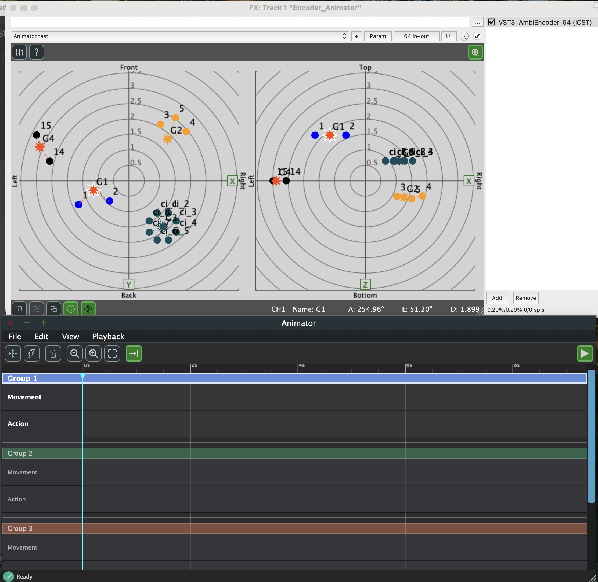

### File-Menü

Im getesteten Zustand enthält das Menü **File** folgende Einträge:

| Menüeintrag | Beobachteter Zustand |
| --- | --- |
| **Add Timeline** | Deaktiviert; Tastenkürzel `Command + N` wird angezeigt. |
| **Remove Timeline...** | Aktiv; besitzt ein Untermenü. |
| **Preferences** | Deaktiviert. |
| **Import Scene...** | Aktiv; besitzt ein Untermenü. |
| **Export Scene...** | Aktiv; besitzt ein Untermenü. |
| **Preferences** | Ein zweiter, ebenfalls deaktivierter Eintrag wird am Menüende angezeigt. |

Das Untermenü von **Import Scene** bietet:

| Untermenüeintrag | Funktion |
| --- | --- |
| **Append as new timeline** | Importiert eine Szene und fügt sie als neue Timeline an. |
| **Overwrite Group 1** | Überschreibt den Inhalt von Group 1 mit der importierten Szene. |
| **Overwrite Group 2** | Überschreibt den Inhalt von Group 2 mit der importierten Szene. |

Das Untermenü **Remove Timeline** bietet:

| Untermenüeintrag | Funktion |
| --- | --- |
| **Remove Group N** | Entfernt die Animator-Spur (inkl. aller Clips) für die betreffende Gruppe. Die Gruppe bleibt im AmbiEncoder erhalten. |
| **Remove all invalid timelines** | Entfernt alle Spuren, deren AmbiEncoder-Gruppe nicht mehr existiert. Wird aktiviert, sobald solche Spuren vorhanden sind. |

Spuren ohne zugehörige Encoder-Gruppe werden im Animator mit dem Zusatz **(No Source)** gekennzeichnet.

> **Hinweis:** Animator und AmbiEncoder sind nicht automatisch synchronisiert. Gruppen müssen in beiden Systemen getrennt verwaltet werden (v3.2.0.4).

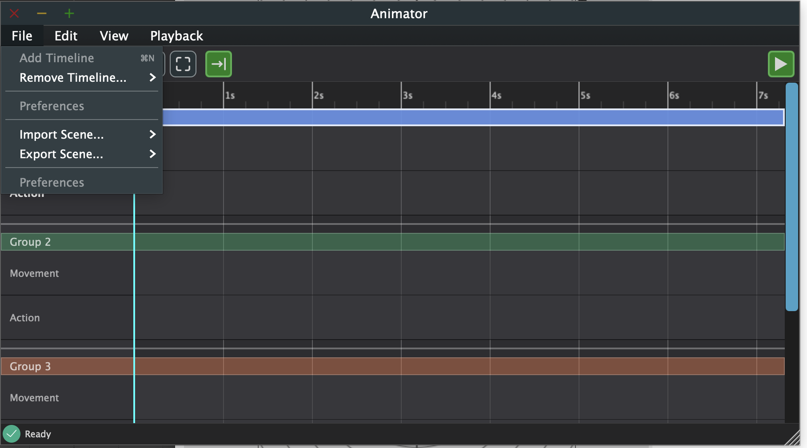

### Edit-Menü

Im Ausgangszustand ohne ausgewählten Clip sind alle Einträge des Menüs **Edit** deaktiviert:

| Menüeintrag | Tastenkürzel |
| --- | --- |
| **Undo** | `Command + Z` |
| **Redo** | `Command + Y` |
| **Cut** | `Command + X` |
| **Copy** | `Command + C` |
| **Paste** | `Command + V` |
| **Delete** | Löschtaste bzw. Rückschritttaste |
| **Duplicate** | `Command + D` |
| **Select All** | `Command + A` |
| **Deselect All** | `Escape` |
| **Add Movement Clip** | kein Kürzel angezeigt |
| **Add Action Clip** | kein Kürzel angezeigt |

Die Befehle sind nur aktiv, wenn ein Clip in der Timeline ausgewählt ist. **Copy** und **Paste** sind bestätigt: Ein Clip kann auf einer Gruppenspur kopiert und auf einer anderen Gruppenspur eingefügt werden.

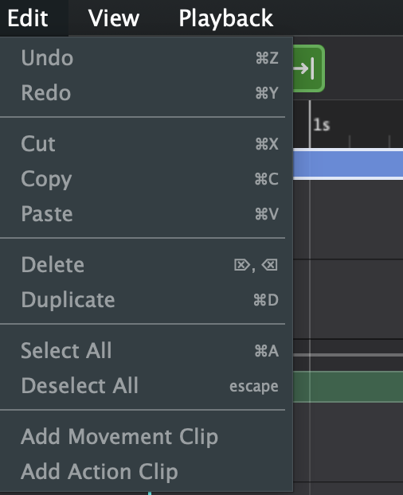

### View-Menü

Das Menü **View** enthält Steuerungen für die zeitliche Darstellung:

| Menüeintrag | Tastenkürzel | Beobachteter Zustand |
| --- | --- | --- |
| **Zoom In** | `Command + =` | deaktiviert |
| **Zoom Out** | `Command + -` | deaktiviert |
| **Reset Zoom** | kein Kürzel angezeigt | deaktiviert |
| **Auto-follow** | kein Kürzel angezeigt | deaktiviert |

Die Aktivierungsbedingungen und das genaue Verhalten werden geprüft, sobald eine Timeline mit bearbeitbaren Clips vorhanden ist.

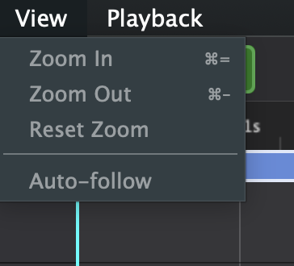

### Playback-Menü

Das Menü **Playback** enthält einen einzelnen Eintrag:

| Menüeintrag | Beobachteter Zustand |
| --- | --- |
| **Toggle ON/OFF** | deaktiviert |

Die Funktion dürfte den Animator-Wiedergabemodus ein- oder ausschalten; diese Bedeutung ist noch nicht praktisch bestätigt.

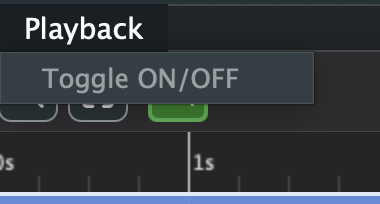

### Werkzeugleiste

Die Werkzeugleiste wird von links nach rechts getestet. Bisher bestätigt:

| Position | Symbol | Tooltip/Funktion |
| --- | --- | --- |
| 1 | vier Richtungspfeile | **Add Movement Clip** |
| 2 | Blitz | **Add Action Clip** |
| 3 | Papierkorb | **Delete Selected Clips** |
| 4 | Lupe mit Minus | **Zoom Out** |
| 5 | Lupe mit Plus | **Zoom In** |
| 6 | Rahmen | **Reset Zoom** |
| 7 | Pfeil an senkrechter Linie | **Toggle Auto-follow** |
| rechts | Play-Symbol | **Turn Animator ON/OFF** |

Wie Zielspur, Startzeit und Dauer eines neuen Clips bestimmt werden, wird im Funktionstest geprüft.

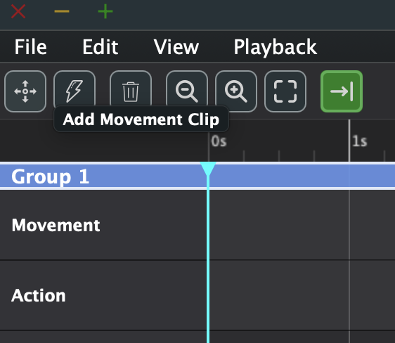

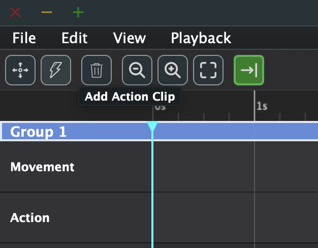

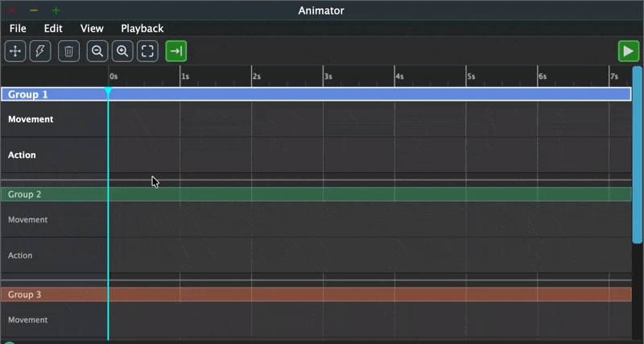

## Movement-Clips

### Movement-Clip anlegen

Im bestätigten Ausgangsfall wird ein Movement-Clip folgendermaßen angelegt:

1. Gewünschte Gruppe beziehungsweise Gruppenspur auswählen.
2. Playhead auf die gewünschte Startzeit setzen.
3. In der Werkzeugleiste auf **Add Movement Clip** klicken.

Der Clip wird ohne zusätzlichen Dialog erzeugt. Im ersten Test entstand:

- Name: **Movement 1**
- Zielspur: **Movement** von **Group 1**
- Startzeit: `0 ms`
- Endzeit: `1000 ms`
- Standarddauer: `1000 ms`
- Zustand nach dem Anlegen: ausgewählt

Der Clip zeigt Name sowie Start- und Endzeit direkt in der Timeline an.

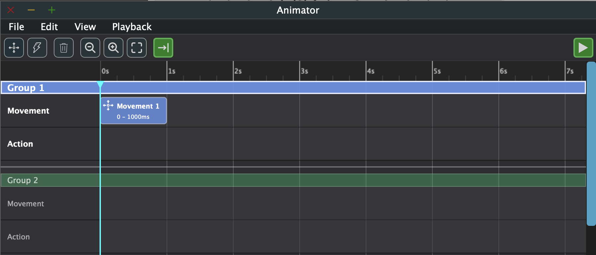

### Movement-Clip bearbeiten

Ein Klick auf das Symbol eines Movement-Clips öffnet den Dialog **Edit Movement Clip**.

#### Clip Properties

| Feld | Beobachteter Standardwert |
| --- | --- |
| **Name** | `Movement 1` |
| **Start (ms)** | `0` |
| **Duration (ms)** | `1000` |
| **End (ms)** | `1000` |
| **Colour** | `6495ED` |

#### Movement Properties

Im ersten Test werden folgende Einstellungen angezeigt:

- **Movement Type:** `MoveTo (Cartesian)`
- **Show Polar Coordinates (AED):** ausgeschaltet
- **Use Defined Start Position:** eingeschaltet
- **Start X / Y / Z:** jeweils `0.00`
- **Target X / Y / Z:** jeweils `0.00`

Für Start- und Zielposition existiert jeweils eine Schaltfläche, die die aktuelle Gruppenposition anbietet. Im Test für Group 1 lautet diese:

`-1.15 (X); -0.31 (Y); 1.48 (Z)`

Die Felder **Count** und **Radius change** sind beim Bewegungstyp `MoveTo (Cartesian)` deaktiviert. Der Dialog wird mit **Apply** übernommen oder mit **Cancel** verworfen.

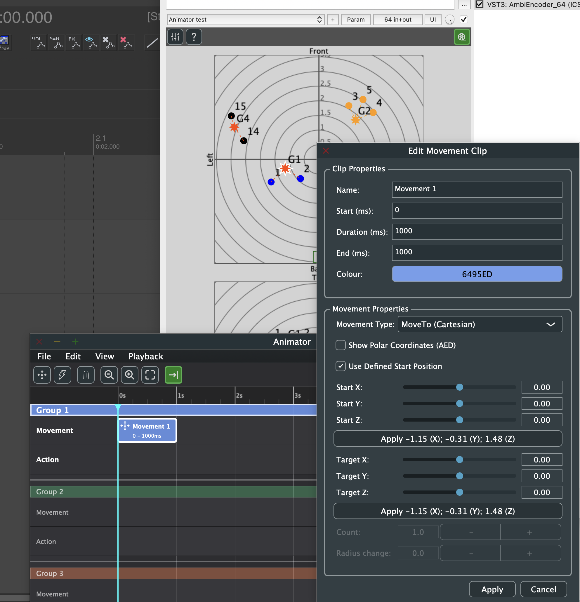

### Movement-Typen

Das Dropdown **Movement Type** bietet vier Bewegungstypen:

1. **MoveTo (Cartesian)**
2. **MoveTo (Polar)**
3. **Circle**
4. **Spiral**

Die genaue Bewegungslogik und die jeweils aktivierten Parameter werden für jeden Typ separat getestet.

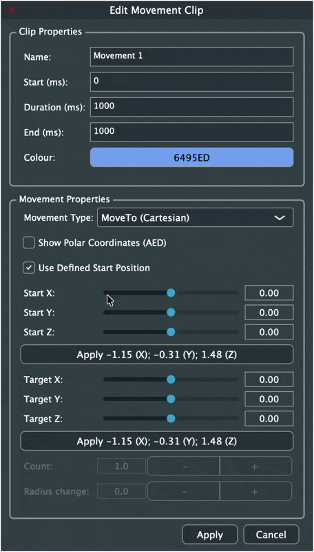

#### MoveTo (Polar)

Bei Auswahl von **MoveTo (Polar)** wird **Show Polar Coordinates (AED)** automatisch aktiviert. Die Positionsfelder wechseln zu:

- **Start Azimuth**
- **Start Elevation**
- **Start Distance**
- **Target Azimuth**
- **Target Elevation**
- **Target Distance**

**Use Defined Start Position** ist im beobachteten Zustand eingeschaltet. Start- und Zielwerte stehen zunächst auf `0`.

Für die aktuelle Position von Group 1 werden separate Übernahmeschaltflächen angeboten:

`255.0° (A); 51.2° (E); 1.90 (D)`

Die Parameter **Count** und **Radius change** bleiben bei `MoveTo (Polar)` deaktiviert.

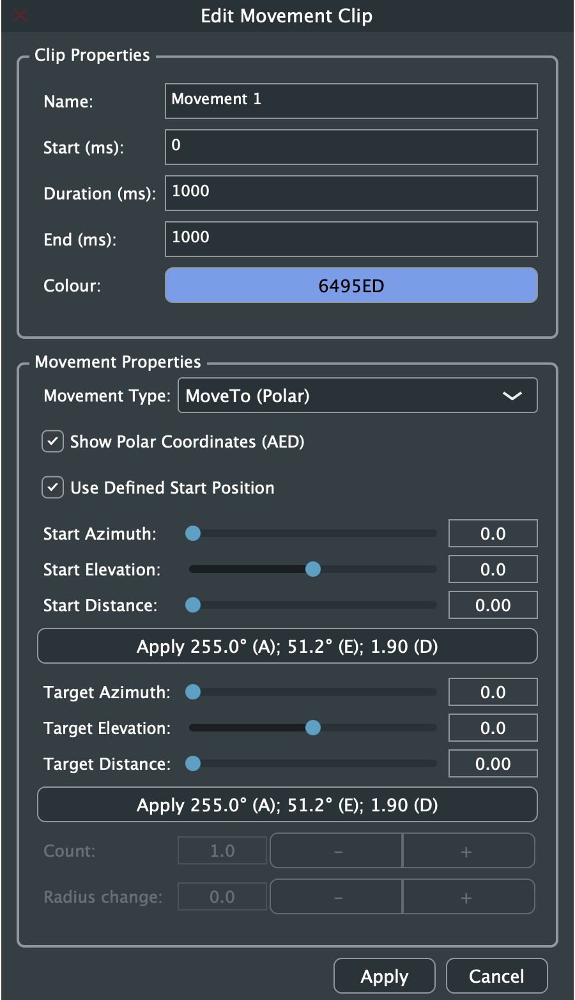

#### Circle

Bei Auswahl von **Circle** bleibt **Show Polar Coordinates (AED)** im beobachteten Zustand ausgeschaltet. Die Positionsfelder werden kartesisch dargestellt.

**Use Defined Start Position** ist eingeschaltet. Sichtbar sind:

- **Start X**
- **Start Y**
- **Start Z**
- **Center X**
- **Center Y**
- **Center Z**

Sowohl für den Startpunkt als auch für das Kreismittel gibt es jeweils eine Übernahmeschaltfläche für die aktuelle Gruppenposition:

`-1.15 (X); -0.31 (Y); 1.48 (Z)`

Die sichtbaren Standardwerte stehen auf `0` beziehungsweise `0.00`.

Der Parameter **Count** ist bei `Circle` aktiv und steht standardmäßig auf `1.0`. Die Tasten **-** und **+** sind aktiv. Der Parameter **Radius change** bleibt dagegen deaktiviert und steht auf `0.0`.

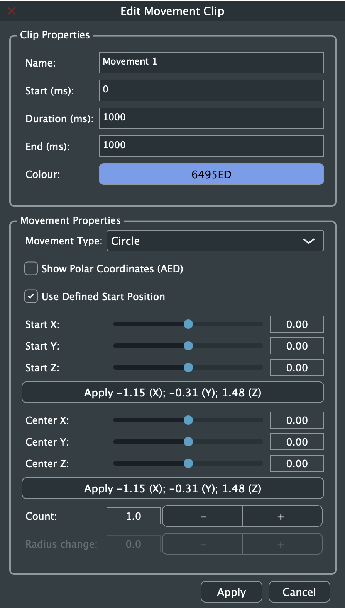

#### Spiral

Bei Auswahl von **Spiral** bleibt **Show Polar Coordinates (AED)** im beobachteten Zustand ausgeschaltet. Die Positionsfelder werden kartesisch dargestellt.

**Use Defined Start Position** ist eingeschaltet. Sichtbar sind:

- **Start X**
- **Start Y**
- **Start Z**
- **Center X**
- **Center Y**
- **Center Z**

Sowohl für den Startpunkt als auch für das Spiralzentrum gibt es jeweils eine Übernahmeschaltfläche für die aktuelle Gruppenposition:

`-1.15 (X); -0.31 (Y); 1.48 (Z)`

Die sichtbaren Standardwerte stehen auf `0` beziehungsweise `0.00`.

Im Unterschied zu `Circle` sind bei `Spiral` sowohl **Count** als auch **Radius change** aktiv. Die Standardwerte stehen auf `1.0` beziehungsweise `0.0`; die Tasten **-** und **+** sind in beiden Zeilen aktiv.

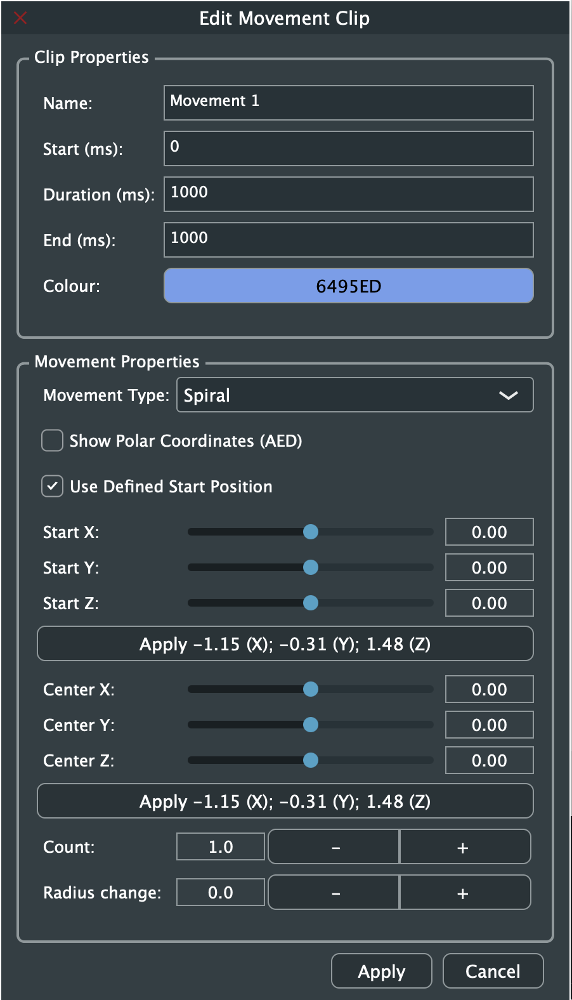

#### Beobachteter UI-Vergleich bei `Count = 1.2`

Ein direkter Sichtvergleich mit identischem **Count**-Wert `1.2` bestätigt zunächst einen klaren UI-Unterschied:

- Bei **Circle** bleibt **Radius change** deaktiviert.
- Bei **Spiral** ist **Radius change** aktiv und bleibt editierbar.

Der Vergleich bestätigt damit die unterschiedliche Parametrierung beider Bewegungstypen bereits auf Dialogebene. Die tatsächliche Bewegungswirkung im Raum ist damit noch nicht praktisch bestätigt und muss in einem späteren Wiedergabetest geprüft werden.

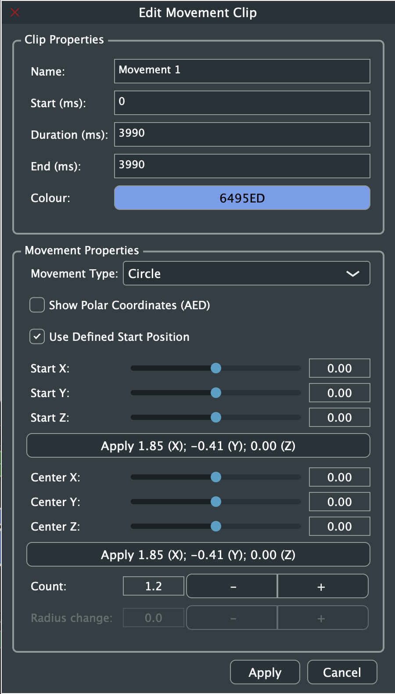

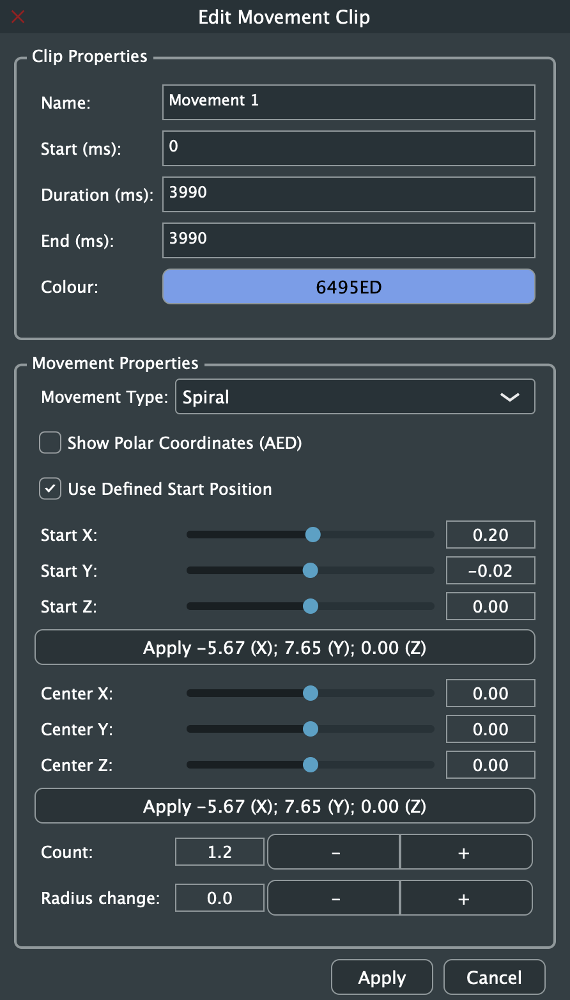

#### Erster Wiedergabetest mit `Circle`

Ein erster GIF-Nachweis bestätigt inzwischen die grundsätzliche Wiedergabekette für einen `Circle`-Movement-Clip:

- Im Animatorfenster ist ein Movement-Clip von `0` bis `3990 ms` auf der Spur von **Group 1** sichtbar.
- Während der Wiedergabe läuft der Playhead durch die Timeline.
- Gleichzeitig ändert sich die sichtbare Position der zugehörigen Gruppe im Encoder-Fenster.

Damit ist praktisch bestätigt, dass ein angelegter Movement-Clip während aktiver Wiedergabe tatsächlich auf die Szene wirkt. Die exakte Kreisbahn, Drehrichtung und Interpolation müssen in weiteren gezielten Bewegungstests noch getrennt geprüft werden.

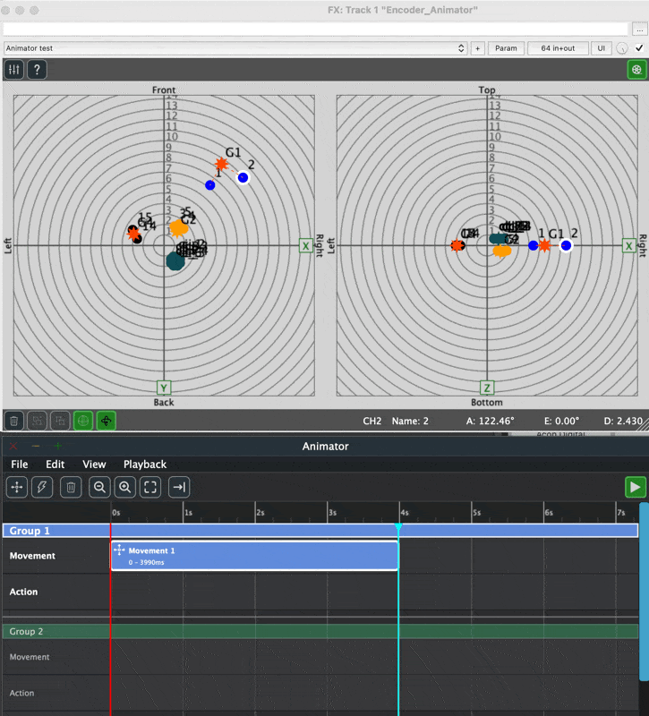

#### Erster Wiedergabetest mit `Spiral`

Ein weiterer GIF-Nachweis bestätigt dieselbe Wiedergabekette auch für `Spiral`:

- Im Animatorfenster ist ein Movement-Clip von `0` bis `4020 ms` auf **Group 1** sichtbar.
- Während der Wiedergabe läuft der Playhead durch die Timeline.
- Gleichzeitig ändert sich die sichtbare Position der Gruppe im Encoder-Fenster.
- Im geöffneten Dialog ist dabei `Movement Type = Spiral` mit `Count = 1.2` und `Radius change = 1.7` sichtbar.

Damit ist nicht nur die grundsätzliche Wiedergabewirkung eines Movement-Clips bestätigt, sondern auch, dass ein Spiral-Clip mit aktivem `Radius change` im realen Testsetup abgespielt wird. Für eine belastbare Aussage über die genaue Spiralform sind dennoch weitere gezielte Bahnvergleiche sinnvoll.

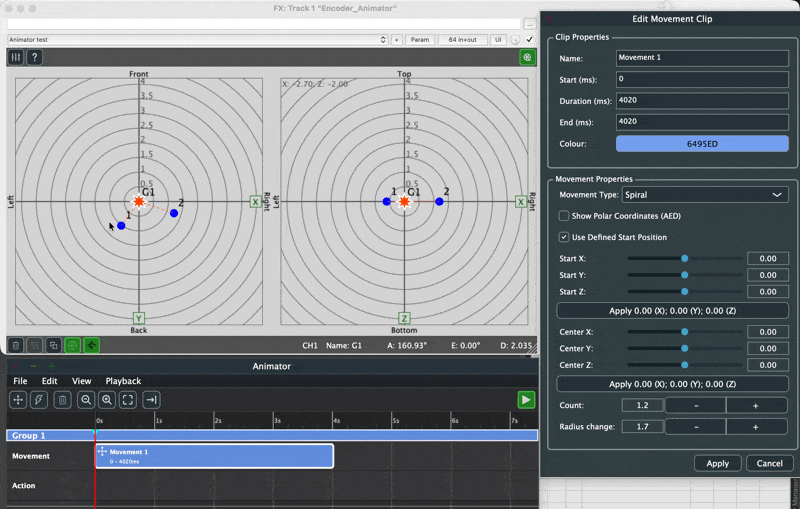

#### Direkter Bahnvergleich: `Circle` gegen `Spiral` bei `Radius change = 0.0`

Ein weiterer Vergleichstest zeigt `Circle` und `Spiral` mit möglichst identischem Grundaufbau und einem `Spiral`-Dialogzustand mit:

- `Duration = 3960 ms`
- `Count = 1.0`
- `Radius change = 0.0`

Im sichtbaren GIF-Vergleich ist dabei kein klarer Bahnunterschied erkennbar. Die Bewegung wirkt in beiden Fällen kreisförmig um dasselbe Zentrum.

Als vorsichtige Arbeitsannahme für die Dokumentation gilt damit:

- **Circle** beschreibt eine Kreisbahn.
- **Spiral** verhält sich bei `Radius change = 0.0` im beobachteten Test visuell wie ein Circle.

Diese Aussage ist bislang rein beobachtungsbasiert. Eine mathematisch oder framegenau bestätigte Gleichheit ist damit noch nicht bewiesen.

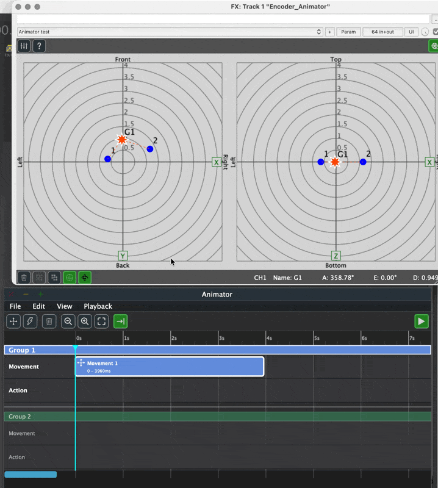

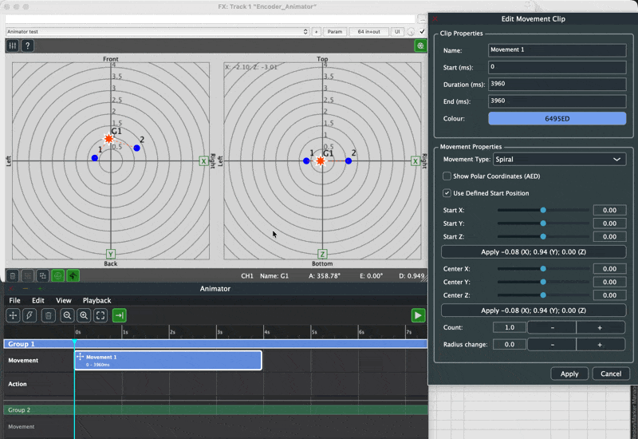

#### Sichtbare Abweichung bei `Spiral` mit `Radius change = -2.0`

Ein weiterer Spiral-Test mit deutlich abweichendem Parameterwert zeigt im geöffneten Dialog:

- `Duration = 3960 ms`
- `Count = 1.0`
- `Radius change = -2.0`

Im zugehörigen GIF ist nun eine sichtbare Abweichung vom zuvor beobachteten Kreisfall erkennbar. Die Bahn wirkt nicht mehr wie ein konstanter Kreisradius, sondern zeigt eine radiale Veränderung während der Bewegung.

Damit ist auf Beobachtungsebene erstmals praktisch bestätigt:

- `Radius change = 0.0` lässt `Spiral` visuell wie einen Kreis erscheinen.
- Ein deutlich negativer Wert wie `-2.0` führt zu einer sichtbar anderen Bahnform.

Die genaue Richtung der Radiusänderung und ihre numerische Gesetzmäßigkeit müssen für eine endgültige Beschreibung noch gezielt vermessen werden.

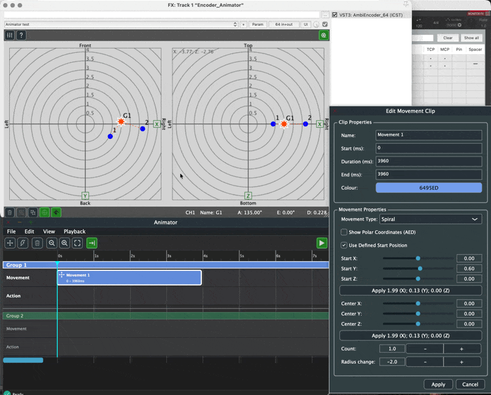

#### Gegenprobe mit `Spiral` und `Radius change = +2.0`

Eine weitere Gegenprobe mit positivem Parameterwert zeigt im Dialog:

- `Duration = 3960 ms`
- `Count = 1.0`
- `Radius change = +2.0`

Auch in diesem GIF ist die Bahn nicht mehr als konstanter Kreisradius sichtbar. Damit ist praktisch bestätigt, dass sowohl negative als auch positive Werte von `Radius change` die Bahnform gegenüber dem Kreisfall verändern.

Als vorsichtige Dokumentationsaussage lässt sich damit festhalten:

- `Radius change = 0.0` ergibt visuell den Kreisfall.
- `Radius change != 0.0` führt zu einer sichtbar veränderten Spiralbahn.

Die exakte Richtungswirkung des Vorzeichens sollte dennoch in einem gezielten Mess- oder Overlay-Test separat bestätigt werden.

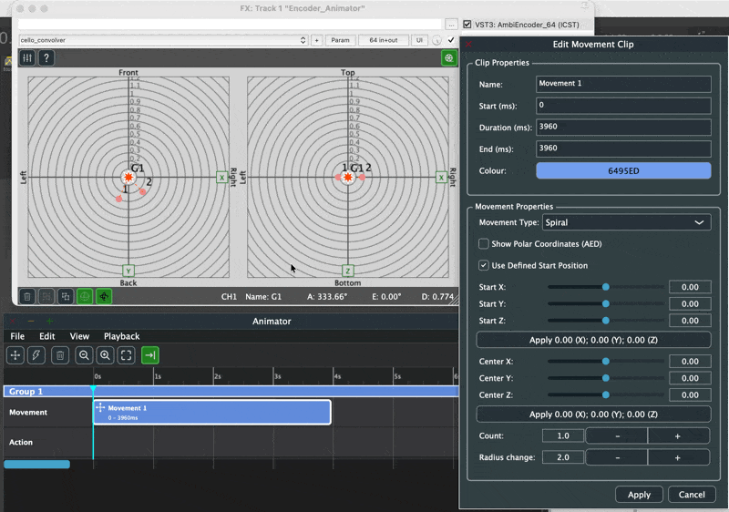

## Überblick

Der Animator ist eine experimentelle Funktion des ICST AmbiEncoder Multi. Er bewegt und transformiert vorhandene Quellengruppen automatisch über eine timeline-basierte Oberfläche.

Der Animator bietet zwei unterschiedliche Arbeitsweisen:

- **Movements** bewegen eine Gruppe von einer Start- zu einer Zielposition innerhalb eines definierten Zeitfensters.
- **Actions** verändern eine Gruppe kontinuierlich, beispielsweise durch Rotation oder Streckung.

### DAW-Transport-Kopplung

Der neue Animator ist an den DAW-Transport gekoppelt. Praktisch bestätigt:

- **Play** in der DAW startet die Animator-Wiedergabe.
- **Pause** in der DAW pausiert die Animator-Wiedergabe.
- **Zurückspulen und erneutes Play** lässt alle Clips erneut abspielen – ohne OFF/ON-Zyklus.

> **Wichtig:** Die Animation wird nur ausgeführt, solange das Animatorfenster geöffnet ist. Beim Schließen des Fensters stoppen alle laufenden Movements und Actions.

## Voraussetzungen

Der Animator setzt den **AmbiEncoder Multi** und mindestens eine vorhandene Gruppe voraus. Im AmbiEncoder Solo sind Gruppenbewegungen nicht verfügbar.

Erstellen und konfigurieren Sie die benötigten Gruppen im Hauptfenster, bevor Sie den Animator öffnen. Nachträglich angelegte oder umbenannte Gruppen erscheinen unter Umständen erst nach erneutem Öffnen des Animatorfensters.

## Animator öffnen

1. Öffnen Sie die Benutzeroberfläche des AmbiEncoder Multi.
2. Klicken Sie oben rechts auf den grünen **Animator**-Button.
3. Das separate Fenster **Animator** erscheint.

Das Fenster kann in der Breite frei verändert werden. Die Höhe ist fest.

> **Hinweis (ältere Builds):** In früheren Versionen war der Animator über ein verstecktes Tastenkürzel erreichbar: `Command` + `Control` + `Option` + `Shift`, dann Klick auf **Help**. In der aktuellen Version (3.2.0.4) ersetzt der grüne Button dieses Tastenkürzel.

## Oberfläche

Das Animatorfenster zeigt für jede Gruppe im AmbiEncoder eine eigene Zeile mit zwei Spuren:

- **Movement** – für Bewegungsclips
- **Action** – für kontinuierliche Transformationsclips

Alle Gruppen werden automatisch als farbige Gruppenköpfe dargestellt. Die Reihenfolge entspricht der Gruppenliste im AmbiEncoder.

Am unteren Fensterrand befinden sich:

- **Add** – fügt der ausgewählten Gruppe einen neuen Clip hinzu
- **Remove** – entfernt den ausgewählten Clip
- **Ready** – Statusanzeige (grünes Häkchen = Animator bereit)

## Schnellstart: Gruppe zu einer Position bewegen

1. Erstellen Sie im AmbiEncoder eine Gruppe und ordnen Sie ihr die gewünschten Quellen zu.
2. Öffnen Sie den Animator über den grünen **Animator**-Button.
3. Stellen Sie sicher, dass der Animator **OFF** ist (grüner Play-Button rechts nicht aktiv).
4. Verschieben Sie die Gruppe im Radar an die gewünschte **Zielposition**.
5. Klicken Sie auf das **Symbol** des Movement-Clips, um den Dialog **Edit Movement Clip** zu öffnen.
6. Klicken Sie im Abschnitt **Movement Properties** auf **Apply** bei **Target**, um die aktuelle Gruppenposition als Ziel zu übernehmen.
7. Klicken Sie auf **Apply** (unten rechts), um den Dialog zu schließen.
8. Verschieben Sie die Gruppe an eine andere Ausgangsposition.
9. Schalten Sie den Animator **ON**.

Die Gruppe bewegt sich nun von ihrer aktuellen Position zur gespeicherten Zielposition. Nach Ende des Clips bleibt sie am Ziel stehen.

> **Wichtig:** Solange der Animator ON ist, können Gruppen nicht manuell positioniert werden. Schalten Sie ihn vor jeder Positionierung auf OFF.

## Movements

Ein Movement speichert die räumliche Zielposition einer Gruppe. Beim Auslösen wird die Gruppe von ihrer aktuellen Position zur gespeicherten Position interpoliert.

### Zielposition speichern

Im Dialog **Edit Movement Clip** übernimmt die Schaltfläche neben **Target** die aktuelle Gruppenposition als Zielposition. Über die Schaltfläche neben **Start** kann ebenso die aktuelle Position als Startpunkt gesetzt werden. Jeder Clip steuert genau eine Gruppe.

### Bewegungsdauer

Die Bewegungsdauer wird im Dialog **Edit Movement Clip** über das Feld **Duration (ms)** festgelegt. Sie entspricht der Länge des Clips in der Timeline.

- Kleine Werte erzeugen schnelle Bewegungen.
- Große Werte erzeugen langsame Übergänge.
- Der kleinstmögliche Wert beträgt **10 ms**. Kleinere Werte werden mit dem Hinweis „End time must be at least 10ms after start time" abgelehnt.

Ein Clip mit `10 ms` Duration entspricht funktional einem sofortigen Sprung.

> **Hinweis:** Ein dediziertes **Smoothing**-Feld wie im alten Animator existiert im neuen Animator nicht. Die Clip-Duration übernimmt diese Funktion vollständig.

### Kartesische Interpolation

Wenn **Movement Type** auf `MoveTo (Cartesian)` gesetzt ist, werden die Koordinaten X, Y und Z linear interpoliert. Die Gruppe bewegt sich auf einer geraden räumlichen Verbindung zwischen Start- und Zielpunkt. Praktisch bestätigt: keine seitliche Abweichung, Z bleibt bei konstantem Zielwert konstant.

Diese Einstellung eignet sich beispielsweise für:

- lineare Fahrten,
- diagonale Bewegungen,
- direkte Übergänge zwischen zwei Raumpositionen.

### Polare Interpolation

Wenn **Movement Type** auf `MoveTo (Polar)` gesetzt ist, werden Azimut, Elevation und Distanz interpoliert. **Show Polar Coordinates (AED)** wird dabei automatisch aktiviert.

Die Gruppe folgt einer **Bogenbahn** und nicht einer geraden Verbindung zwischen Start und Ziel. Praktisch bestätigt: Im Front- und Top-Radar ist die Bogenbahn auf näherungsweise konstanter Distanz vom Ursprung sichtbar; die Bahn unterscheidet sich deutlich von der kartesischen Direktverbindung.

Diese Einstellung eignet sich beispielsweise für:

- Bogen- und Kreissegmentbewegungen auf konstanter Distanz vom Ursprung,
- Änderungen der Höhe (Elevation) bei ungefähr gleichbleibender Entfernung,
- radiale Bewegungen zum oder vom Ursprung mit glatter Winkelführung.

> **Bestätigt:** Beim Übergang über die Grenze zwischen `+180°` und `−180°` wählt `MoveTo (Polar)` immer den **kürzeren Bogen**. Ein Start bei +170° und ein Ziel bei −170° erzeugen eine 20°-Bogenbewegung, keine 340°-Umrundung.

### Movement erneut auslösen

Da der Animator an den DAW-Transport gekoppelt ist, genügt es, die DAW von vorne abspielen zu lassen. Der Clip startet erneut, ohne dass ein OFF/ON-Zyklus erforderlich ist.

### Übergang zwischen zwei Movement-Clips

Liegen zwei Movement-Clips nacheinander auf derselben Gruppenspur, springt die Gruppe beim Start des zweiten Clips zur dort definierten **Startposition** – unabhängig davon, wo der erste Clip geendet hat.

Für einen nahtlosen Übergang muss die Startposition von Clip 2 manuell auf die Zielposition von Clip 1 gesetzt werden.

## Actions

Actions verändern eine Gruppe über den Zeitraum eines Action-Clips. Ein Action-Clip kann mehrere Actions gleichzeitig enthalten.

### Action-Clip anlegen

1. Auf der **Action**-Spur der gewünschten Gruppe das Werkzeug **Add Action Clip** klicken.
2. Der Clip erscheint auf der Spur (Standard: Name **Action 1**, Farbe orange `FFA500`, Dauer `1000 ms`).
3. Den Clip anklicken, um den Dialog **Edit Action Clip** zu öffnen.

### Edit-Action-Clip-Dialog

#### Clip Properties

| Feld | Standardwert |
| --- | --- |
| **Name** | `Action 1` |
| **Start (ms)** | `0` |
| **Duration (ms)** | `1000` |
| **End (ms)** | `1000` |
| **Colour** | `FFA500` (orange) |

#### Action Properties

Der Bereich **Action Properties** enthält eine Liste der dem Clip zugewiesenen Actions sowie die Schaltflächen **Add** und **Remove**.

- **Add** öffnet den Unterdialog **Add New Action**.
- **Remove** entfernt die ausgewählte Action aus der Liste.
- Mehrere Actions können einem einzigen Clip hinzugefügt werden. Ein Clip mit mehr als einer Action zeigt ein **Doppel-Icon** (zwei Blitze) in der Timeline.

### Unterdialog: Add New Action

| Feld | Bedeutung |
| --- | --- |
| **Action Type** | Art der Transformation |
| **Timing Type** | Interpretationsregel für **Value** |
| **Value (°)** | Zielwert oder Rate der Transformation |
| **Use Start Value** | Startwinkel manuell vorgeben |
| **Start Value (°)** | Startwert, wenn **Use Start Value** aktiviert ist |

#### Action Types

| Typ | Beschreibung |
| --- | --- |
| **Rotation X** | Rotation um die X-Achse |
| **Rotation Y** | Rotation um die Y-Achse |
| **Rotation Z** | Rotation um die Z-Achse |
| **Stretch** | Änderung der räumlichen Ausdehnung der Gruppe |

#### Timing Types

| Typ | Bedeutung |
| --- | --- |
| **Absolute Target** | Im beobachteten Zustand deaktiviert; Bedeutung noch nicht bestätigt. |
| **Relative During Clip** | **Value** gibt die gesamte Rotation über die Clip-Dauer an (z. B. `90°` über `4000 ms`). |
| **Constant Per Second** | **Value** gibt eine konstante Rate pro Sekunde an (z. B. `30 °/s`). |

> **Bestätigt (AT-ACT-01 bis AT-ACT-03):** Alle drei Rotationstypen drehen die Quellen um den **Gruppenpunkt**. Der Gruppenpunkt selbst bleibt dabei stationär. `Rotation Z` erzeugt in der Top-Ansicht eine horizontale Kreisbewegung.

### Action stoppen

Eine laufende Action wird auf eine der folgenden Arten gestoppt:

- **Clip löschen:** Clip auswählen → **Delete Selected Clips** in der Werkzeugleiste.
- **Animator OFF:** Alle laufenden Clips stoppen sofort.
- **DAW pausieren:** Animation pausiert synchron zum DAW-Transport.

### Rotation um den globalen Ursprung

Eine Rotation des Gruppenpunkts um den globalen Ursprung ist kein Action-Typ im neuen Animator. Diese Funktion wird über einen **Movement-Clip** mit dem Typ `Circle` realisiert:

1. Movement-Clip auf der gewünschten Gruppenspur anlegen.
2. Movement Type: `Circle`
3. Center X/Y/Z auf `0 / 0 / 0` setzen (globaler Ursprung).
4. Start-Position der Gruppe als Startpunkt übernehmen.
5. `Count` und `Duration` nach Bedarf einstellen.

Der Gruppenpunkt beschreibt so eine Kreisbahn um den Ursprung; die Quellen bewegen sich mit.

## Movements und Actions kombinieren

Movements und Actions können gleichzeitig auf dieselbe Gruppe wirken. Pro Aktualisierungsschritt wird zuerst das Movement angewendet und danach die Action.

Mögliche Kombinationen:

- Movement plus Rotation um den Gruppenpunkt: Die Gruppe fährt zu einem Ziel, während ihre Quellen rotieren.
- Circle-Movement (Kreisbahn um Ursprung) plus Rotation um den Gruppenpunkt: Beide Mechanismen wirken gleichzeitig; die resultierende Bahn ist entsprechend komplex.
- Movement plus Stretch: Die Gruppe bewegt sich und verändert gleichzeitig ihre Ausdehnung.
- Action 1 plus Action 2: Beide Transformationen werden nacheinander ausgeführt.

Für gut vorhersehbare Bewegungen empfiehlt es sich, zunächst nur einen Mechanismus zu verwenden und Kombinationen schrittweise hinzuzufügen.

## Szene speichern und laden

Jede Gruppe besitzt eine eigene Timeline. Clips (Movements und Actions) können per **Copy & Paste** zwischen den Timelines verschiedener Gruppen übertragen werden. Die so zusammengestellten Konfigurationen werden gruppenweise als **Scene** gespeichert und geladen.

### Scene exportieren

**File → Export Scene... → \<Gruppe\>** speichert die Timeline einer einzelnen Gruppe in eine externe Datei. Im Untermenü erscheint ein Eintrag pro vorhandener Gruppe (z. B. „Group 1", „Group 2").

### Scene importieren

**File → Import Scene... → \<Gruppe\>** lädt eine gespeicherte Scene-Datei in die Timeline der gewählten Gruppe. Auch hier erscheint ein Eintrag pro vorhandener Gruppe.

> **Hinweis:** Eine dedizierte Preset-Funktion (Speichern ganzer Animator-Konfigurationen über alle Gruppen hinweg) ist in Version 3.2.0.4 noch nicht implementiert. Als Workaround können alle Gruppen einzeln exportiert und später wieder importiert werden.

## Praxisbeispiele

### Kreisbewegung um den Zuhörer

Ziel: Eine Gruppe soll den globalen Ursprung (Hörposition) horizontal umkreisen.

1. Gruppe im AmbiEncoder mit etwas Abstand zum Ursprung platzieren.
2. Movement-Clip auf der Movement-Spur der Gruppe anlegen.
3. Dialog öffnen: **Movement Type → Circle**.
4. **Center X / Y / Z** auf `0 / 0 / 0` setzen.
5. Aktuelle Gruppenposition als **Start** übernehmen.
6. **Count** (Anzahl Umdrehungen) und **Duration** (Dauer in ms) einstellen.
7. Mit **Apply** bestätigen, dann Animator ON und DAW Play.

Der Gruppenpunkt beschreibt eine Kreisbahn um den Ursprung; alle Quellen bewegen sich mit.

### Quellen innerhalb einer stationären Gruppe drehen

Ziel: Quellen rotieren um den Gruppenpunkt, der Gruppenpunkt selbst bleibt stehen.

1. Gruppe mit mehreren räumlich verteilten Quellen erstellen.
2. Action-Clip auf der Action-Spur der Gruppe anlegen.
3. Dialog öffnen → **Add** → **Action Type: Rotation Z**.
4. **Timing Type: Constant Per Second**, **Value** z. B. `30` (°/s).
5. Mit **Apply** bestätigen, dann Animator ON und DAW Play.

Die Quellen rotieren horizontal um den Gruppenpunkt. Ein negativer Wert kehrt die Richtung um.

### Zwei Positionen sequenziell anfahren

Ziel: Eine Gruppe fährt nacheinander zu Position A und Position B.

1. Ersten Movement-Clip anlegen. Dialog öffnen, Gruppe an Position A positionieren, **Target** übernehmen.
2. Zweiten Movement-Clip direkt nach dem ersten anlegen. Dialog öffnen, Gruppe an Position B positionieren, **Target** übernehmen.
3. Startposition von Clip 2 auf die Zielposition von Clip 1 setzen, damit kein Sprung entsteht.
4. Animator ON und DAW Play – die Gruppe fährt zuerst nach A, dann nach B.

### Kreisbahn mit rotierenden Quellen

Ziel: Gruppe umkreist den Ursprung und die Quellen rotieren dabei gleichzeitig um den Gruppenpunkt.

1. Circle-Movement anlegen (Center = 0/0/0, wie im ersten Beispiel).
2. Rotation-Z-Action anlegen (wie im zweiten Beispiel), auf dieselbe Gruppe.
3. Beide Clips zeitlich überlagern.
4. Animator ON und DAW Play.

Movement und Action wirken gleichzeitig: Die Gruppe beschreibt eine Kreisbahn, während die Quellen um den Gruppenpunkt rotieren.

## Hinweise und Einschränkungen

- Der Animator ist experimentell und wird über den grünen **Animator**-Button im AmbiEncoder Multi geöffnet.
- Er ist für den AmbiEncoder Multi vorgesehen.
- Das Animatorfenster muss während der Animation geöffnet bleiben.
- Die Animation ist an den DAW-Transport gekoppelt (Play/Pause/Stop). Sie ist jedoch nicht temposynchron und nicht samplegenau.
- Die Werte des Animators erscheinen nicht als reguläre DAW-Automationsparameter.
- Die Aktualisierung erfolgt über die Benutzeroberfläche und ist nicht samplegenau.
- Jeder Movement-Clip steuert genau eine Gruppe.
- Neu angelegte Gruppen erscheinen **automatisch** im Animator ohne Neustart des Fensters (bestätigt v3.2.0.4). Der Animator zeigt dabei den generischen Namen „Group N", nicht den im AmbiEncoder vergebenen Namen.
- Gruppenumbenennungen im AmbiEncoder werden im Animator **nicht automatisch** übernommen (v3.2.0.4). Der alte Name bleibt im Animator sichtbar.
- Das **Umsortieren von Gruppen** im AmbiEncoder (via Up/Down-Pfeile) hat keine Auswirkung auf die Spurenreihenfolge im Animator (v3.2.0.4). Die Spuren bleiben in der ursprünglichen Anlagereihenfolge.
- Der angezeigte Stretch-Wert trägt die Einheit `m/s`; seine praktische Skalierung hängt jedoch von den Distanz- und Skalierungseinstellungen des Projekts ab.
- Die CPU-Last des Animators ist gering: im Dauertest (12 Min, laufende Action) wurden **0.11–0.18 % FX-CPU** gemessen (Apple M2 Pro, REAPER 7.74, VST3). Bei hoher Systemlast kurzzeitig bis 0.28 %.

## Fehlerbehebung

### Der Animator öffnet sich nicht

- Verwenden Sie den **AmbiEncoder Multi** (nicht Solo).
- Klicken Sie auf den grünen **Animator**-Button oben rechts im AmbiEncoder-Fenster.

### Ein Movement-Clip zeigt keine Bewegung

- Prüfen Sie, ob der Animator **ON** ist (grüner Play-Button rechts aktiv).
- Prüfen Sie, ob die DAW abspielt und der Playhead den Clip passiert.
- Öffnen Sie den Clip und kontrollieren Sie, ob Start- und Zielposition identisch sind.
- Stellen Sie sicher, dass das Animatorfenster geöffnet bleibt.

### Ein Action-Clip zeigt keine Wirkung

- Prüfen Sie, ob im Dialog **Edit Action Clip** mindestens eine Action eingetragen ist.
- Stellen Sie sicher, dass **Timing Type** und **Value** korrekt gesetzt sind.
- Prüfen Sie, ob der Animator ON ist und die DAW abspielt.

### Die Gruppe springt beim Start von Clip 2

Beim Übergang zwischen zwei Movement-Clips springt die Gruppe zur Startposition von Clip 2. Setzen Sie die **Start**-Position von Clip 2 manuell auf die Zielposition von Clip 1.

### Die Bewegung läuft ungleichmäßig

Der Animator wird von einem UI-Timer aktualisiert. Bei hoher DAW- oder Systemlast kann die Aktualisierung verzögern. Verlängern Sie die Clip-Duration und reduzieren Sie bei Bedarf die grafische Belastung.

### Die Polar-Bewegung nimmt einen unerwarteten Weg

Verwenden Sie `MoveTo (Cartesian)`, wenn eine direkte Gerade im Raum gewünscht ist. `MoveTo (Polar)` wählt immer den kürzesten Bogen zwischen Start- und Ziel-Azimut, auch über die ±180°-Grenze hinweg.

## Empfohlener Arbeitsablauf

1. Gruppen und Quellen im AmbiEncoder vollständig einrichten.
2. Animator über den grünen **Animator**-Button öffnen.
3. Animator **OFF** lassen, während Clips konfiguriert werden.
4. Movement-Clips einzeln anlegen, Ziel- und Startpositionen setzen, mit kurzer Clip-Dauer testen.
5. Action-Clips mit kleinen Werten beginnen (z. B. `10 °/s`), schrittweise erhöhen.
6. Kombinationen (Movement + Action) erst testen, wenn Einzelclips korrekt funktionieren.
7. Fertige Konfiguration pro Gruppe über **File → Export Scene → \<Gruppe\>** sichern.
8. Projekt in der DAW speichern.
