Niveau: Fortgeschritten | Zielgruppe: Komponist, Toningenieur, Student, Interactive-Media-Nutzer. | **Version: 3.2.0.6 (experimentell)**

Diese Seite beschreibt, wie du Quellengruppen im Ambisonics-Feld automatisch bewegen, rotieren oder transformieren kannst.

Vor der Arbeit mit dem Animator müssen die Quellen im **AmbiEncoder Multi** zu Gruppen zusammengefasst sein. Mindestens eine aktive Gruppe ist Voraussetzung.

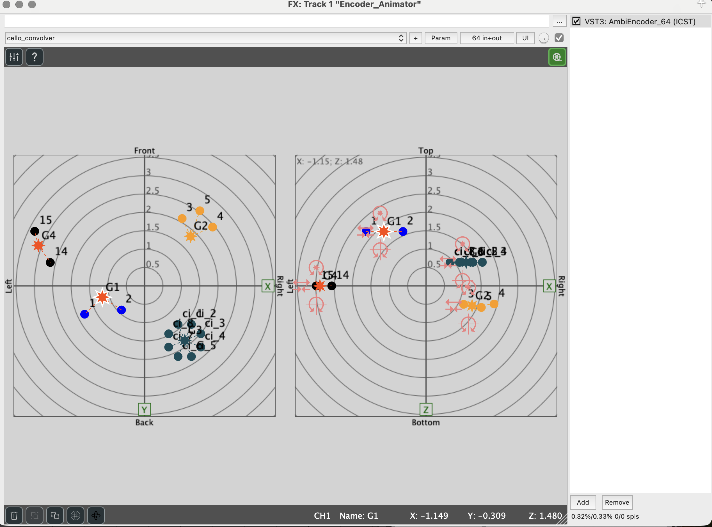

> **Getestet mit** REAPER v7.74 / v7.79, macOS arm64 · Animator v3.2.0.6.


Der Animator ist eine **experimentelle Funktion**. Ein Intro-Overlay und ein permanentes Badge im Fenster erinnern daran, dass mit dieser Version erstellte Animationen in späteren Versionen nicht garantiert ladbar bleiben — exportierte Szenen zusammen mit der verwendeten Plugin-Version archivieren. Der frühere, dialogbasierte Animator wurde mit v3.2.0.5 vollständig entfernt; in bestehenden Projekten gespeicherte Konfigurationen des alten Animators werden nicht mehr gelesen.


## Wann den Animator verwenden

Den **Animator** verwenden, wenn:

- räumliche Bewegungen automatisch und synchron zum DAW-Transport ablaufen sollen
- wiederholbare Bewegungsmuster wie Kreise, Spiralen oder Punkt-zu-Punkt-Fahrten benötigt werden
- kontinuierliche Transformationen (Rotation, Stretch) auf eine Quellengruppe angewendet werden sollen
- räumliche Choreografien pro Gruppe gespeichert und wiedergeladen werden sollen

Für einzelne Quellenpositionierung oder statische Platzierung die Encoder-Bedienelemente direkt verwenden.

## Was der Animator macht

Der **ICST Animator** ist ein timeline-basiertes Plugin, das Bewegungs- und Transformationsanweisungen aus Clips liest und diese in Echtzeit auf Quellengruppen anwendet.

- **Movement-Clips** bewegen eine Gruppe innerhalb einer definierten Dauer von einer Start- zu einer Zielposition.
- **Action-Clips** wenden kontinuierliche Transformationen wie Rotation oder Stretch auf eine Gruppe an.

Beide Clip-Typen können gleichzeitig auf dieselbe Gruppe wirken.

Der Animator ist an den **DAW-Transport gekoppelt**: Play in der DAW startet alle Clips; Pause oder Stop hält sie an.

> **Hinweis:** Das Animator-Fenster kann während der Wiedergabe geschlossen werden — die Animation läuft weiter. Gesteuert wird die Wiedergabe über den Animator-EIN/AUS-Schalter und den DAW-Transport (Play/Pause; Loops werden befolgt).

## Animator öffnen

1. Die Benutzeroberfläche des **AmbiEncoder Multi** öffnen.
2. Den grünen **Animator**-Button oben rechts anklicken.
3. Das Animator-Fenster öffnet sich als separates Panel (in der Breite veränderbar).

## Benutzeroberfläche

Das Animator-Fenster zeigt für jede Gruppe eine Zeile mit zwei Spuren:

- **Movement** – für Bewegungsclips
- **Action** – für Transformationsclips

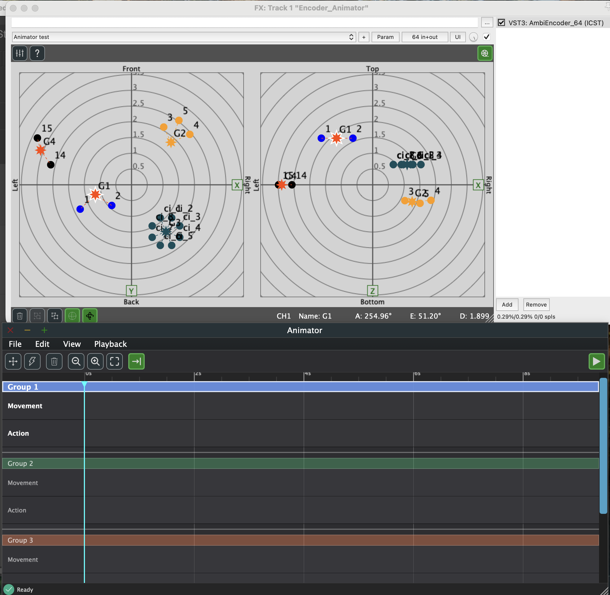

### Werkzeugleiste

| Symbol | Funktion |
|---|---|
| Vier Pfeile | Movement-Clip hinzufügen |
| Blitz | Action-Clip hinzufügen |
| Papierkorb | Ausgewählte Clips löschen |
| Lupe − / + | Zoom verkleinern / vergrößern |
| Rahmen | Zoom zurücksetzen |
| Pfeil zur Linie | Auto-follow ein/aus |
| Play-Button (rechts) | Animator EIN / AUS |

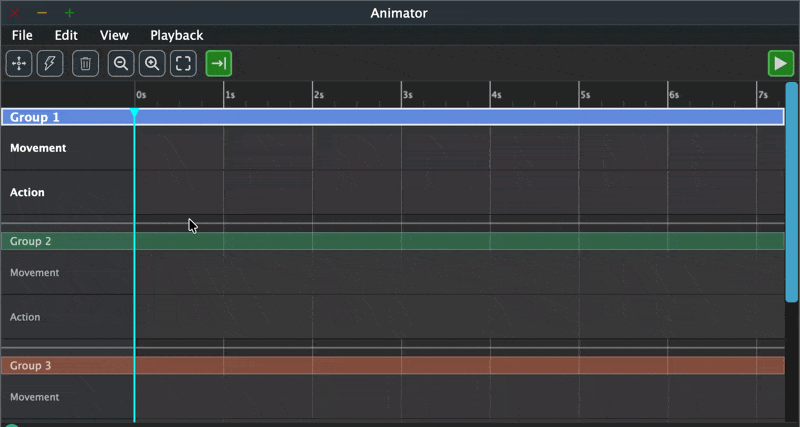

### Menüs

**File** verwaltet Timelines und Szenen: Gruppenspuren hinzufügen oder entfernen (Add Timeline, ⌘N), Szenen über einen Import-Dialog mit Einzelentscheidung pro Gruppe importieren sowie einzelne Gruppen oder alle Gruppen auf einmal exportieren.

**Edit** bietet Zwischenablage-Operationen (Kopieren, Einfügen, Ausschneiden, Duplizieren) sowie Clip-Einfügebefehle. Alle Befehle erfordern einen ausgewählten Clip.

**View** steuert den Timeline-Zoom und das Auto-follow-Verhalten.

**Playback** bietet einen Toggle-EIN/AUS-Befehl, der dem Toolbar-Play-Button entspricht.

## Movement-Clips

Ein Movement-Clip legt fest, wie eine Gruppe während seiner Dauer von einer Position zu einer anderen gelangt.

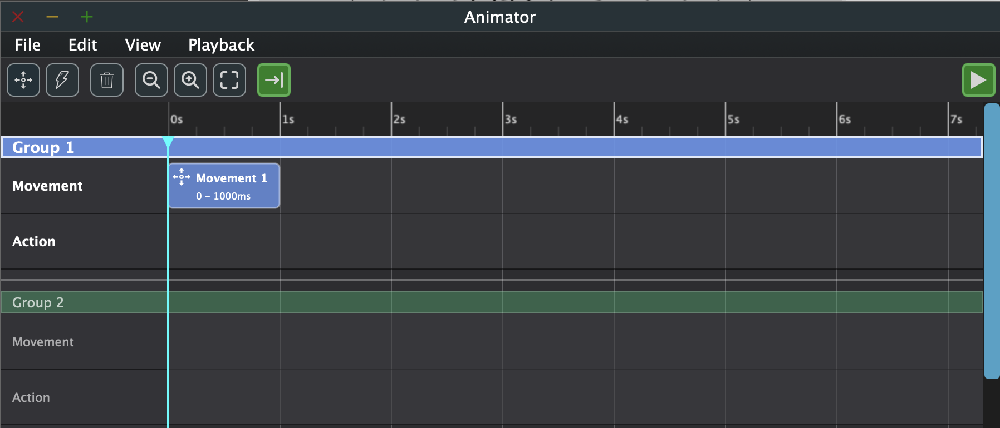

**Doppelklick** auf einen Clip öffnet den Dialog **Edit Movement Clip**, in dem Movement-Typ, Start- und Zielposition sowie die Dauer eingestellt werden. Ein Einfachklick selektiert einen Clip; wiederholtes Klicken an derselben Stelle steppt der Reihe nach durch übereinanderliegende Clips.

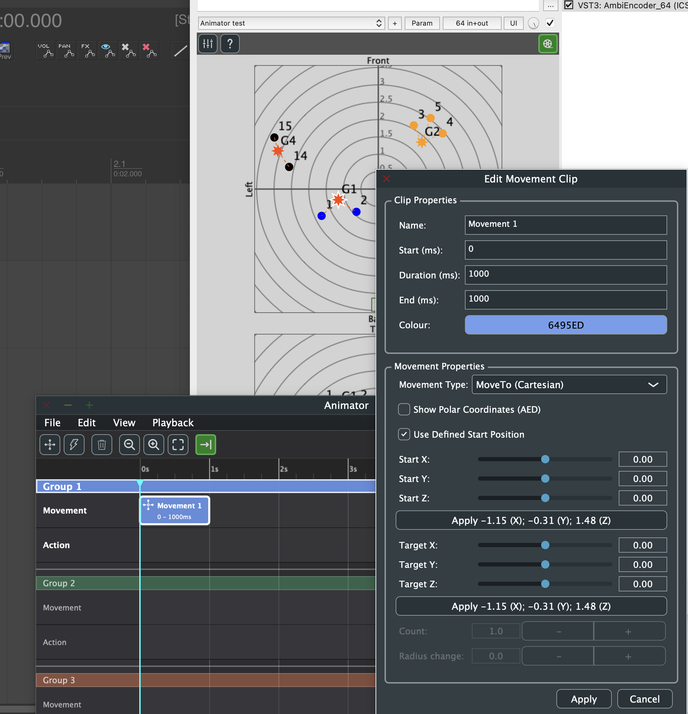

### Movement-Typen

| Typ | Verhalten |
|---|---|
| **MoveTo (Cartesian)** | Gerade Linie von Start zu Ziel im X/Y/Z-Raum. |
| **MoveTo (Polar)** | Bogenbahn auf konstanter Distanz; interpoliert Azimut, Elevation und Distanz. Wählt immer den kürzeren Bogen, auch über die ±180°-Grenze. |
| **Circle** | Gruppe beschreibt eine vollständige oder teilweise Kreisbahn um einen definierten Mittelpunkt. |
| **Spiral** | Wie Circle, mit zusätzlicher Radiusänderung über die Dauer. |

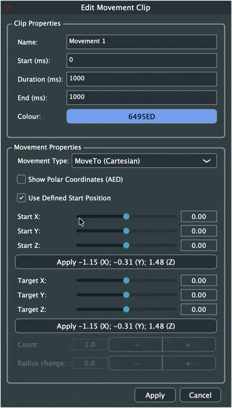

**MoveTo (Polar)** wechselt die Positionsfelder auf Azimut, Elevation und Distanz:

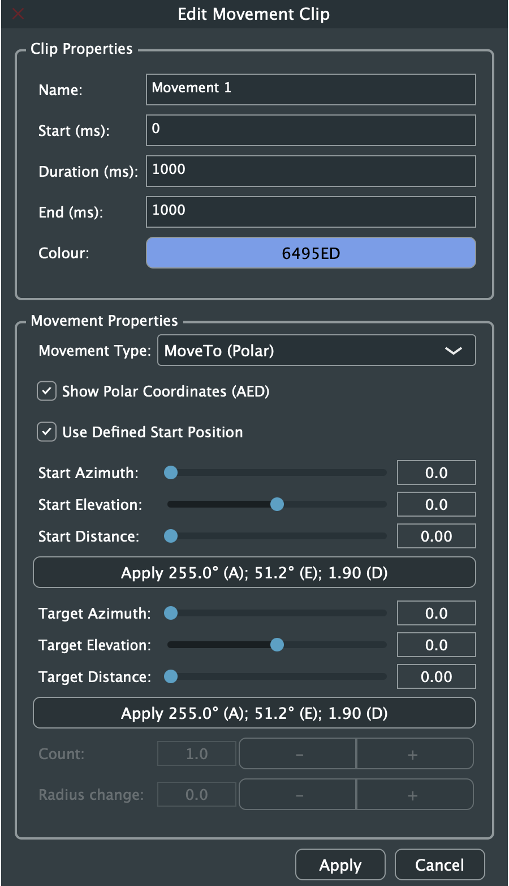

**Circle** aktiviert einen Mittelpunkt und den Count-Parameter:

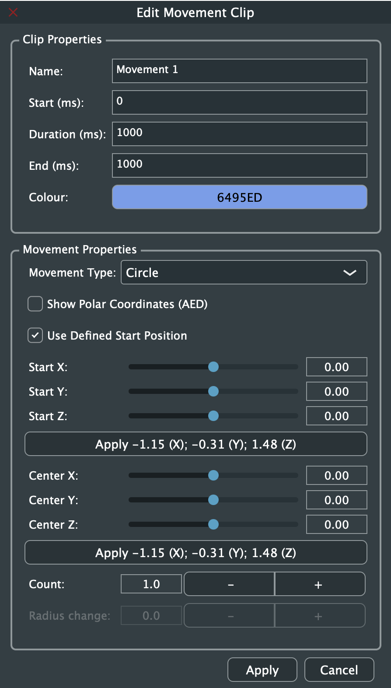

**Spiral** aktiviert zusätzlich Radius change:

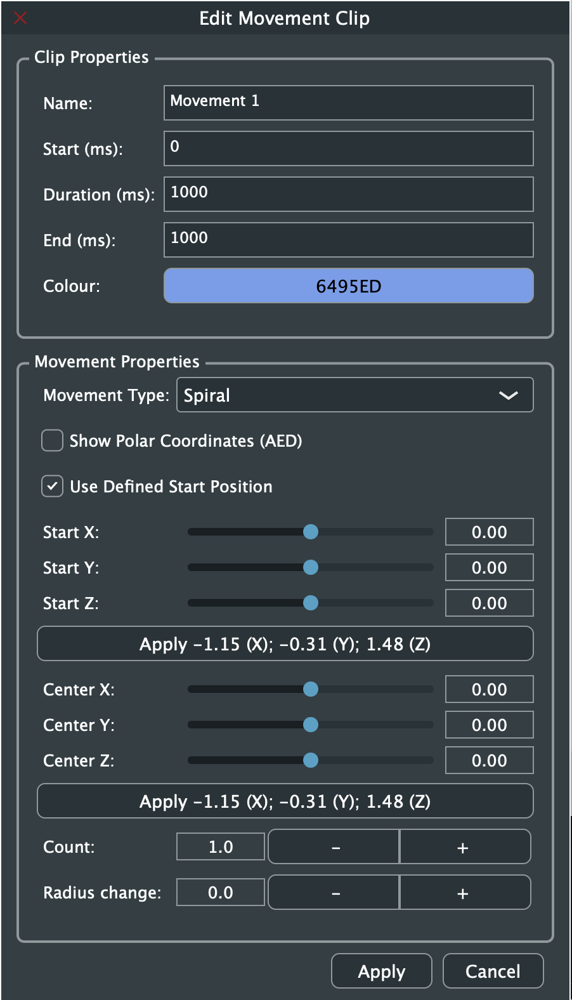

**Circle in der Wiedergabe** – die Gruppe beschreibt eine Kreisbahn um den definierten Mittelpunkt:

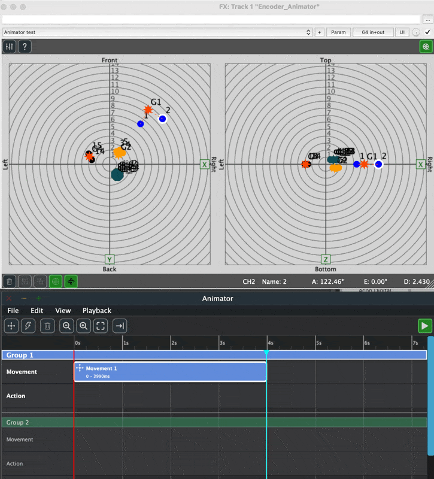

**Spiral in der Wiedergabe** – gleicher Aufbau mit aktivem Radius change:

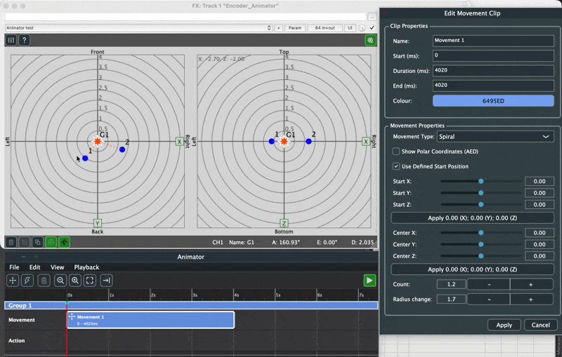

**Spiral vs. Circle bei Radius change = 0.0** – beide Typen erzeugen optisch identische Kreisbahnen, wenn Radius change null ist:

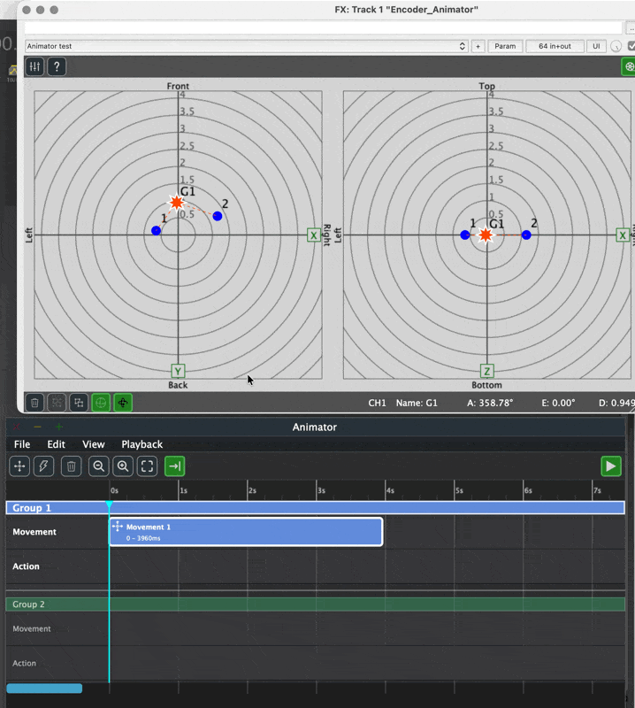

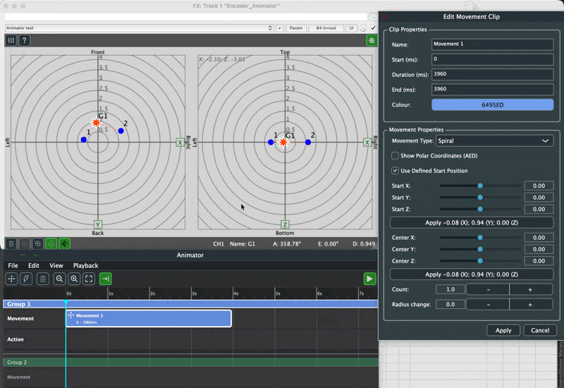

**Radius change ≠ 0** verschiebt die Bahn spiralförmig nach innen oder außen:

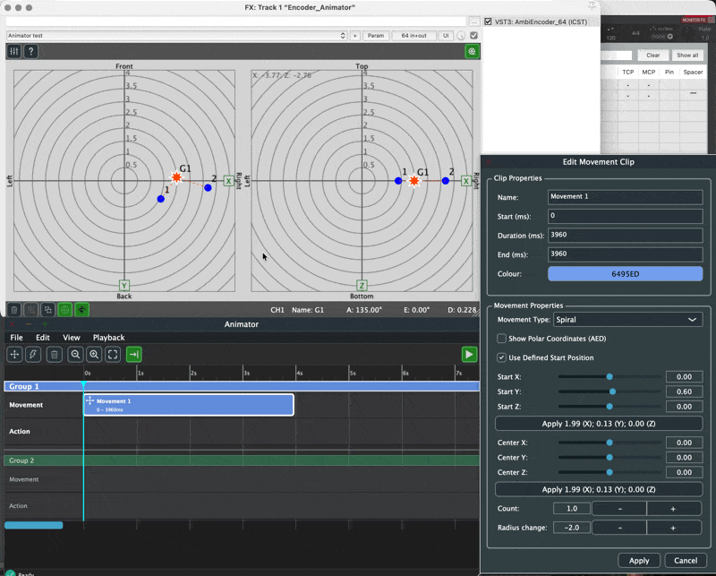

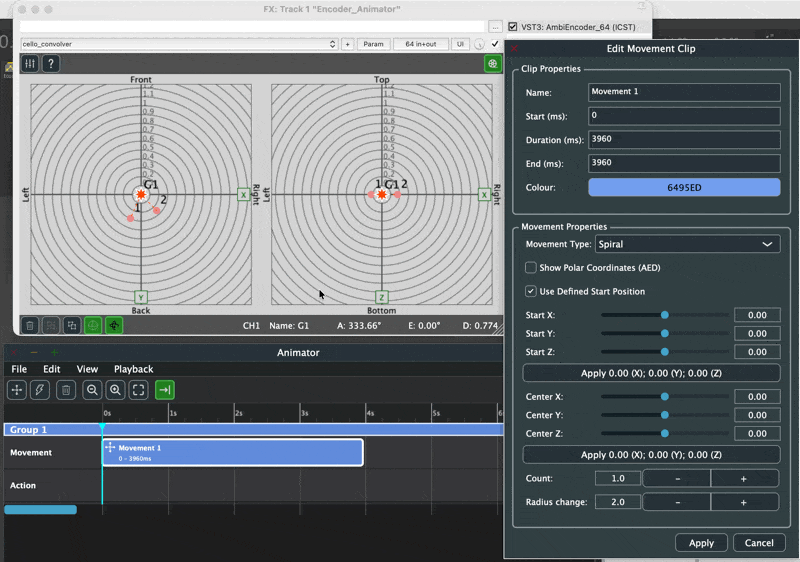

### Wichtige Parameter

- **Duration (ms)** – Clip-Länge; bestimmt die Bewegungsgeschwindigkeit. Minimalwert: 10 ms.
- **Start / Target** – Positionen können manuell eingegeben oder durch den Snapshot-Button von der aktuellen Gruppenposition übernommen werden.
- **Count** – Anzahl der vollständigen Umdrehungen (nur Circle und Spiral). Count 1.0 = eine volle Umdrehung; 1.2 = eine Umdrehung plus 72°. Ein negativer Count kehrt die Drehrichtung um.
- **Radius change** – Radiusdrift pro Umdrehung (nur Spiral; 0.0 ergibt eine Kreisbahn).

**Circle mit Count 1.2** – Dialog mit Count auf 1.2:

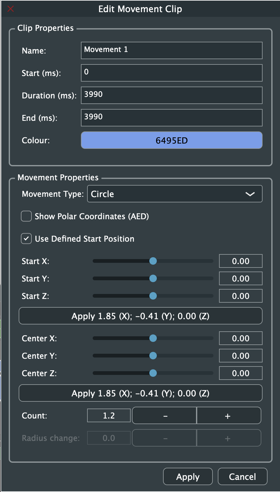

**Spiral mit Count 1.2 und Radius change 0.0** – gleicher Dialog für Spiral:

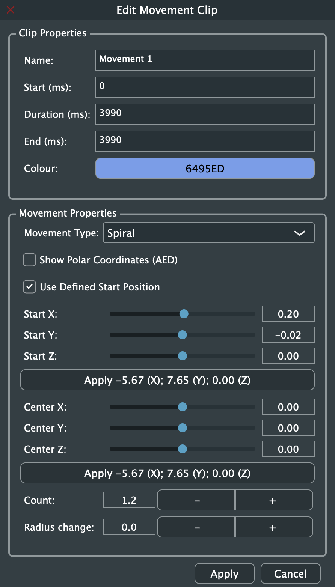

**Circle Count 1.0 in der Wiedergabe** – eine vollständige Umdrehung:

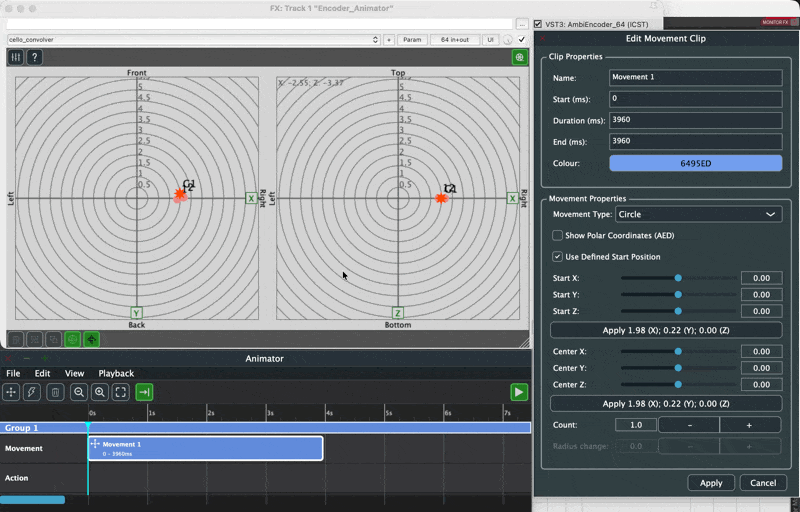

### Clip-Übergänge

Folgen zwei Movement-Clips auf derselben Spur aufeinander, springt die Gruppe beim Start des zweiten Clips zu dessen Startposition. Für einen nahtlosen Übergang die Startposition von Clip 2 auf die Zielposition von Clip 1 setzen.

## Action-Clips

Ein Action-Clip wendet eine kontinuierliche Transformation auf eine Gruppe an. Ein einzelner Clip kann über den **Add**-Button mehrere Actions enthalten.

### Action-Typen

| Typ | Verhalten |
|---|---|
| **Rotation X** | Dreht Quellen um die X-Achse durch den Gruppenpunkt. |
| **Rotation Y** | Dreht Quellen um die Y-Achse durch den Gruppenpunkt. |
| **Rotation Z** | Dreht Quellen um die Z-Achse durch den Gruppenpunkt (horizontale Rotation). |
| **Stretch** | Vergrößert oder verkleinert die räumliche Ausdehnung der Gruppe um ihr Zentrum. |

### Timing-Typen

| Typ | Verhalten |
|---|---|
| **Relative During Clip** | Wert gibt die Gesamtrotation über die Clip-Dauer an (z. B. 90° über 4000 ms). |
| **Constant Per Second** | Wert gibt eine konstante Rate pro Sekunde an (z. B. 30 °/s). |

> Bei allen Rotationstypen bleibt der **Gruppenpunkt stationär** – nur die Quellen umkreisen ihn.

### Rotation um den Ursprung

Eine Rotation des Gruppenpunkts um den globalen Ursprung (Hörposition) ist kein Action-Typ. Dafür einen **Circle-Movement-Clip** mit Center X/Y/Z = 0/0/0 verwenden.

## Movements und Actions kombinieren

Movement- und Action-Clips können gleichzeitig auf dieselbe Gruppe wirken. Pro Aktualisierungsschritt wird zuerst das Movement, dann die Action angewendet.

Nützliche Kombinationen:

- Circle-Movement (Ursprung) + Rotation-Z-Action: Gruppe umkreist den Hörer, während Quellen um den Gruppenpunkt rotieren.
- MoveTo-Movement + Stretch-Action: Gruppe fährt zu einem Ziel und dehnt sich gleichzeitig aus oder zieht sich zusammen.
- Zwei gestapelte Actions (z. B. Rotation X + Rotation Z): Beide Transformationen wirken gleichzeitig in einem einzigen Clip.

## Szenen speichern und laden

Jede Gruppe hat eine eigene Timeline. Clips können per **Edit → Kopieren / Einfügen** zwischen Gruppenspuren übertragen werden. Alle Timelines werden zusätzlich im Plugin-State gespeichert — das Speichern des DAW-Projekts sichert die Animation; Szenen-Dateien dienen als zusätzliches Backup und zum Austausch zwischen Projekten.

- **File → Export → \<Gruppe\>** speichert die Timeline einer Gruppe in eine XML-Datei.
- **File → Export → All Groups** speichert alle Timelines zusammen in einer Datei — der empfohlene Weg für ein Session-Backup.
- **File → Import** öffnet die Dateiauswahl und danach einen Import-Dialog mit einer Zeile pro Gruppe in der Datei: für jede **Ignore**, **Replace** oder **Insert at Cursor** wählen, mit einer bestehenden Gruppe oder **New Group** als Ziel. *Insert at Cursor* verschiebt die importierten Clips so, dass der früheste an der Cursor-Position beginnt (verfügbar, wenn ein Cursor gesetzt ist). Ältere Einzelgruppen-Exporte laden auf demselben Weg.

## Einschränkungen (v3.2.0.6)

- Gruppennamen werden zwischen AmbiEncoder und Animator nicht synchronisiert. Der Animator verwendet generische Namen (Group 1, Group 2, …).
- Umbenennen einer Gruppe im AmbiEncoder aktualisiert die Animator-Beschriftung nicht.
- Umsortieren von Gruppen im AmbiEncoder hat keine Auswirkung auf die Spurenreihenfolge im Animator.
- Das Löschen einer Gruppe im AmbiEncoder markiert die zugehörige Animator-Spur als **(No Source)**. Über **File → Remove Timeline → Remove all invalid timelines** können solche Spuren bereinigt werden.
- Das Deaktivieren von **Use Defined Start Position** in einem Movement-Clip hat derzeit keine Wirkung — für nahtlose Übergänge die Startposition von Clip 2 manuell auf die Zielposition von Clip 1 setzen.
- **Preferences** sowie **Undo/Redo** sind noch nicht implementiert.
- Die Wiedergabe folgt dem DAW-Transport (inklusive Loops), ist aber nicht samplegenau (Verarbeitung pro Audio-Block) und nicht temposynchron (Clip-Zeiten in Millisekunden).
- Animator-Parameter sind nicht als reguläre DAW-Automationsparameter verfügbar.

## Häufige Fehler

- Animator öffnen, bevor Gruppen im AmbiEncoder eingerichtet wurden
- Animator ON lassen, während Gruppen manuell im Radar positioniert werden sollen
- Startposition von Clip 2 nicht auf die Zielposition von Clip 1 abgestimmt → Position springt
- Constant-Per-Second-Werte zu hoch wählen, sodass sie die Aktualisierungsrate überschreiten

## Weiterführende Seiten

- [ICST Encoders](/icst-ambisonics-plugins/10_icst_encoders/)
- [OSC](/icst-ambisonics-plugins/13_osc/)
- [Best Practices](/icst-ambisonics-plugins/17_best_practices/)
