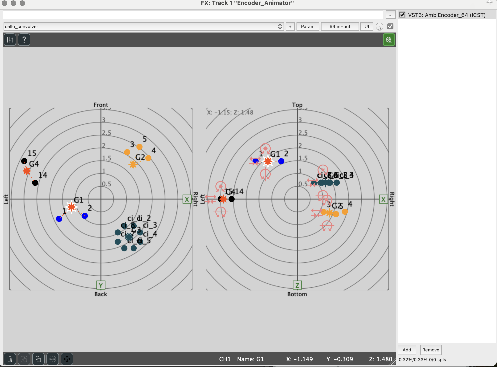
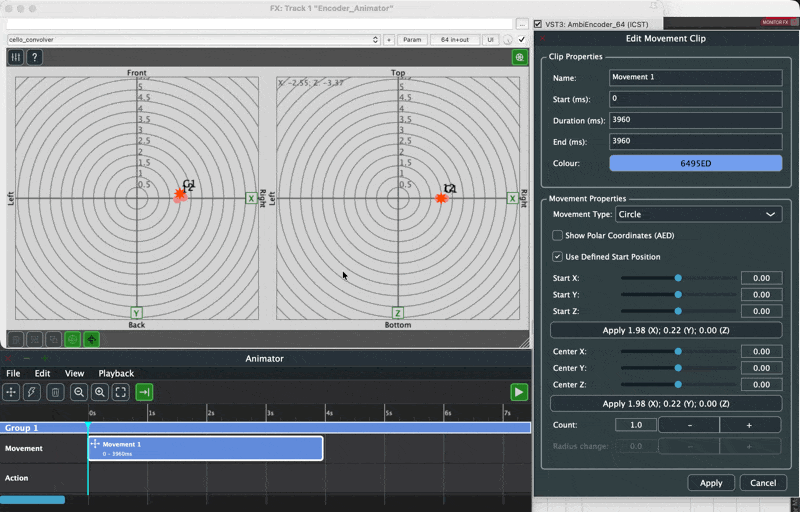

Level: Intermediate | Audience: Composer, technician, student, interactive-media user.

Use this page when you want to move, rotate, or transform source groups automatically over time inside the Ambisonics field.

Before using the Animator, make sure your sources are organized into groups inside the **AmbiEncoder Multi**. The Animator requires at least one group to be active.

> **Tested with** REAPER v7.74 / macOS arm64.

## When to use the Animator

Use the **Animator** when:

- you want automated spatial movement that follows the DAW transport
- you need repeatable movement patterns such as circles, spirals, or point-to-point trajectories
- you want to apply continuous transformations (rotation, stretch) to a group of sources
- you want to save and reload spatial choreographies per group

Do not use the Animator for single-source positioning or simple static placement — use the encoder controls directly for that.

## What the Animator does

The **ICST Animator** is a timeline-based plugin that reads movement and transformation instructions from clips and applies them to source groups in real time.

- **Movement clips** move a group from a start position to a target position over a defined duration.
- **Action clips** apply continuous transformations such as rotation or stretch to a group.

Both clip types can run simultaneously on the same group.

The Animator is **coupled to the DAW transport**: pressing Play in the DAW starts playback of all clips; pressing Pause or Stop halts them.

> **Note:** The Animator window must remain open during playback. Closing it stops all running clips.

## Opening the Animator

1. Open the **AmbiEncoder Multi** plugin interface.
2. Click the green **Animator** button in the top-right corner.
3. The Animator window opens as a separate, resizable panel.

## User interface

The Animator window shows one row per group, each with two tracks:

- **Movement** — for movement clips
- **Action** — for transformation clips

### Toolbar

| Icon | Function |
|---|---|
| Four arrows | Add Movement Clip |
| Lightning bolt | Add Action Clip |
| Trash | Delete Selected Clips |
| Magnifier − / + | Zoom Out / Zoom In |
| Frame | Reset Zoom |
| Arrow to line | Toggle Auto-follow |
| Play button (right) | Turn Animator ON / OFF |

### Menus

**File** manages timelines and scenes: add or remove group timelines, export or import per-group scene files.

**Edit** provides clipboard operations (copy, paste, cut, duplicate) and clip insertion commands. All commands require a clip to be selected.

**View** controls timeline zoom and auto-follow behavior.

**Playback** provides a Toggle ON/OFF command equivalent to the toolbar play button.

## Movement clips

A movement clip defines how a group travels from one position to another during its duration.

Click the clip icon to open the **Edit Movement Clip** dialog, where you set the movement type, start and target positions, and duration.

### Movement types

| Type | Behavior |
|---|---|
| **MoveTo (Cartesian)** | Straight line from start to target in X/Y/Z space. |
| **MoveTo (Polar)** | Arc at constant distance; interpolates azimuth, elevation, and distance. Takes the shorter arc, including across the ±180° boundary. |
| **Circle** | Group traces a full or partial circle around a defined center point. |
| **Spiral** | Like Circle, with an additional radius change over the duration. |

**MoveTo (Polar)** switches the position fields to azimuth, elevation, and distance:

**Circle** adds a Center point and activates the Count parameter:

**Spiral** activates both Count and Radius change:

**Circle in playback** — the group traces a circular path around the defined center while the Playhead moves through the timeline:

**Spiral in playback** — same setup with Radius change active:

**Spiral vs. Circle at Radius change = 0.0** — the two movement types produce visually identical circular paths when Radius change is zero:

**Radius change ≠ 0** shifts the path away from a circle. Negative and positive values both produce a visible spiral:

### Key parameters

- **Duration (ms)** — clip length; determines movement speed. Minimum: 10 ms.
- **Start / Target** — positions can be entered manually or captured from the current group position using the snapshot button.
- **Count** — number of full revolutions (Circle and Spiral only). Count 1.0 = one full revolution; 1.2 = one revolution plus an extra 72°.
- **Radius change** — radial drift per revolution (Spiral only; 0.0 gives a circular path).

**Circle with Count 1.2** — dialog showing Count set to 1.2:

**Spiral with Count 1.2 and Radius change 0.0** — identical dialog for Spiral:

**Circle Count 1.0 in playback** — one complete revolution:

### Clip transitions

When two movement clips follow each other on the same track, the group jumps to the start position of the second clip at the moment it begins. For a smooth transition, set the start position of clip 2 to match the target position of clip 1.

## Action clips

An action clip applies a continuous transformation to a group for its duration. One clip can contain multiple actions stacked via the **Add** button.

### Action types

| Type | Behavior |
|---|---|
| **Rotation X** | Rotates sources around the X axis through the group point. |
| **Rotation Y** | Rotates sources around the Y axis through the group point. |
| **Rotation Z** | Rotates sources around the Z axis through the group point (horizontal rotation). |
| **Stretch** | Expands or contracts the spatial spread of the group around its center. |

### Timing types

| Type | Behavior |
|---|---|
| **Relative During Clip** | Value is the total rotation over the full clip duration (e.g. 90° over 4000 ms). |
| **Constant Per Second** | Value is a constant rate per second (e.g. 30 °/s). |

> In all rotation types, the **group point stays stationary** — only the sources orbit around it.

### Rotation around the origin

A rotation of the group point around the global origin (listener position) is not an action type. Use a **Circle movement clip** with Center X/Y/Z set to 0/0/0 instead.

## Combining movements and actions

Movement and action clips can run simultaneously on the same group. Per update step, the movement is applied first, then the action.

Useful combinations:

- Circle movement (origin) + Rotation Z action: group orbits the listener while sources spin around the group point.
- MoveTo movement + Stretch action: group travels to a target while expanding or contracting.
- Two stacked actions (e.g. Rotation X + Rotation Z): both transformations apply simultaneously within one clip.

## Saving and loading scenes

Each group has its own timeline. Clips can be copied between group timelines using **Edit → Copy / Paste**.

- **File → Export Scene → \<Group\>** saves one group's timeline to a file.
- **File → Import Scene → \<Group\>** loads a saved scene into a group's timeline.

A single export covers one group. To back up a full session, export each group individually.

## Limitations (v3.2.0.4)

- Group names are not synchronized between AmbiEncoder and Animator. The Animator uses generic names (Group 1, Group 2, …).
- Renaming a group in AmbiEncoder does not update the Animator label.
- Reordering groups in AmbiEncoder does not reorder Animator tracks.
- Deleting a group in AmbiEncoder marks its Animator track as **(No Source)**. Use **File → Remove Timeline → Remove all invalid timelines** to clean up.
- The Animator is not sample-accurate; updates are driven by a UI timer.
- Animation parameters are not exposed as standard DAW automation.

## Common mistakes

- opening the Animator before groups are set up in AmbiEncoder
- leaving the Animator ON while trying to reposition groups manually in the radar
- not matching the start position of clip 2 to the end position of clip 1, causing position jumps
- using Constant Per Second timing with very high values that exceed the update rate

## Next steps

- [ICST Encoders](/icst-ambisonics-plugins/10_icst_encoders/)
- [OSC](/icst-ambisonics-plugins/13_osc/)
- [Best Practices](/icst-ambisonics-plugins/15_best_practices/)
