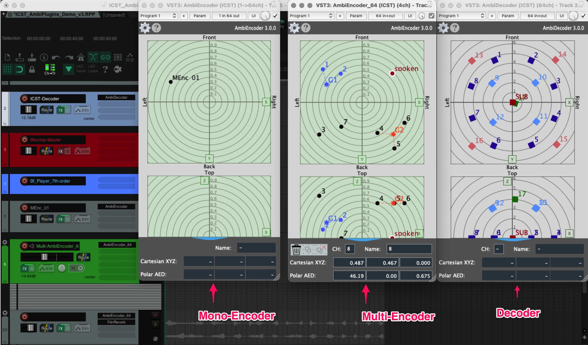

Institute for Computer Music and Sound Technology / (ICST) Zurich University of the Arts

All of the following examples were created for and with the [REAPER](https://www.reaper.fm/) Digital Audio Workstation (DAW)!

The ICST Ambisonics Plugins consisting of the Plugin Formats:

-   VST3
-   Components (AU)
-   LV2 (LV2 version does currently NOT support automation parameters)

Find individual pages here:

-   [ICST AmbiEncoder](https://github.com/schweizerweb/icst-ambisonics-plugins/wiki/ICST-AmbiEncoder) (Mono & Multi Encoder)
-   [ICST AmbiDecoder](https://github.com/schweizerweb/icst-ambisonics-plugins/wiki/ICST-AmbiDecoder) (Decoder)

**Download:** [ICST Ambisonics Plugins](https://github.com/schweizerweb/icst-ambisonics-plugins/releases)