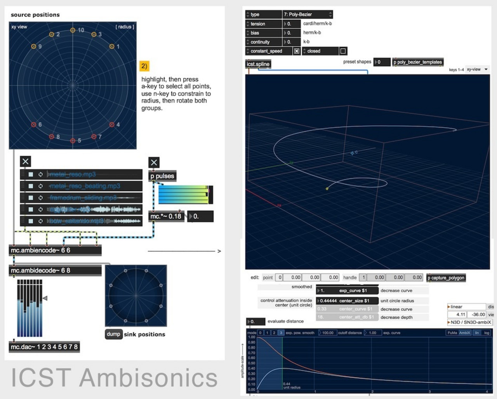
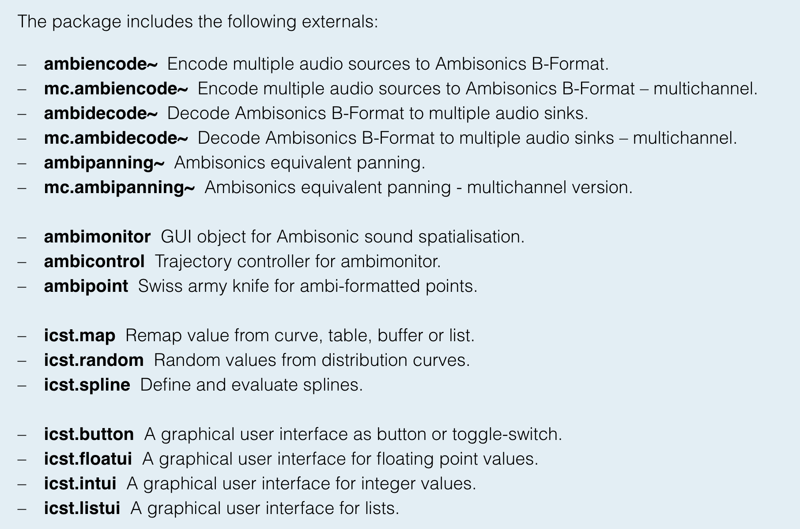
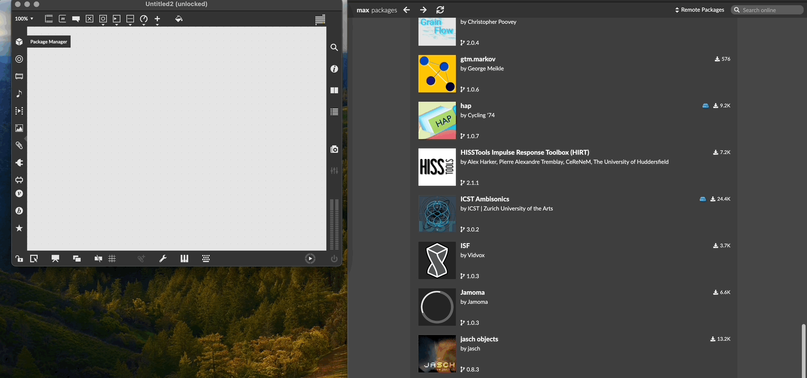

Institute for Computer Music and Sound Technology / (ICST) Zurich University of the Arts

------------------------------------------------------------------------

### ICST Ambisonics Tools

A collection of **MaxMSP externals** for **Ambisonics** surround sound processing and 3D source control. Developed through research and practice since 2000, these tools have been extensively tested and used in concerts, compositions, and installations.
  
- The tools have found broad adoption in the audio community and are applied in music studios, dedicated listening spaces and acoustics labs worldwide.  

- As an extension for the MaxMSP audio environment it also powers spatial audio workflows in Ableton Live, a widely used production tool for electronic music.  
  
- The current release represents an important update in which almost every aspect of the tools has been reworked, refined and extended.  
  
First released in 2003, this new version will give the users of the ICST Ambisonics Tools a solid foundation for further years of advanced spatial music and sound productions.
#### **Included Externals:**

### Licensing & Installation

The **ICST Ambisonics Tools** are distributed under the **Revised BSD License** (included in the package).
#### **Current Version: 3.0.1**

- Released **May 2021** for **Max 8.1 (64-bit)**
- Compatible with **macOS** and **Windows 10**
#### **Installation**

Install **ICST Ambisonics Tools** in **Max 8+** via the **Package Manager**:

Info at ZHdK: https://www.zhdk.ch/en/research/icst/software-downloads-5379/downloads-icst-tools-for-maxmsp-5385

Advantage:

> * Modular and therefore highly flexible
> * Individual patching for individual applications

Disadvantage:
> * Requires Max programming knowledge
> * Not time-based.
> * (Except Envelop in Ableton)

**Recommendation:**

> * For LiveElectronic
> * Special Performances

---
©2025 ICST