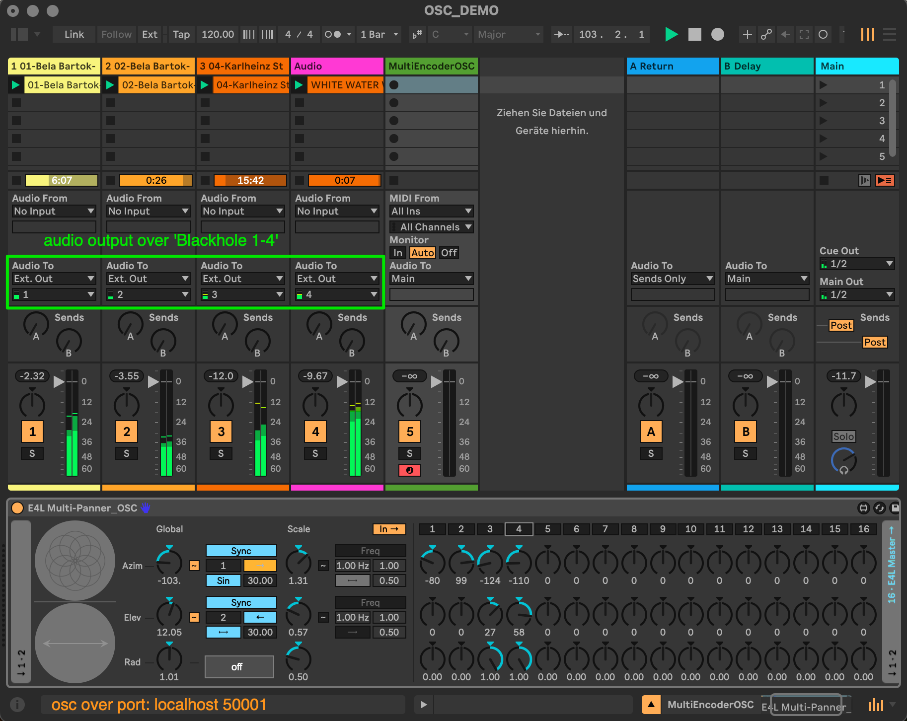
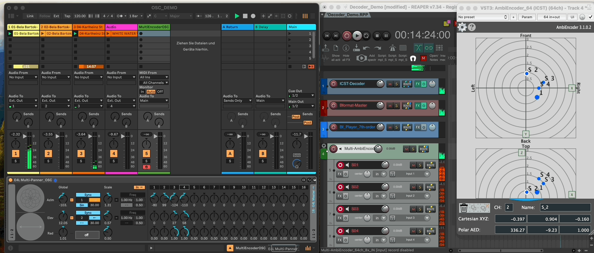
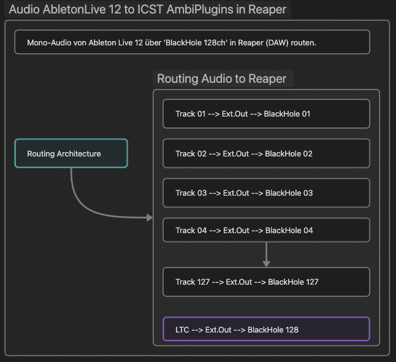

Institute for Computer Music and Sound Technology / (ICST) Zurich University of the Arts

* * *

### Ableton to ICST MultiEncoder in Reaper

Ableton plays the audio channel via “Blackhole” (up to 64 channels)
to the Reaper Blackhole input devices.

The Multi-Panner-OSC can send up to 16 OSC channels to the ICST Multi-AmbiEncoder via the localhost at port 50001.  
  
In the Reaper DAW, you receive the audio inputs from BlackHole (1-4) and in the ICST Multi-AmbiEncoder the OSC sources (1-16).

This allows you, to record  a Bformat up to the 7th order of Ableton Live 12.

### How it works

Schemata:

#### Preparation:

- Install [AbletonLive 12](https://www.ableton.com/de/live/)
- Install [Reaper (DAW)](https://www.reaper.fm/)
- Install [BlackHole64](https://www.blackhole.audio/)
- Download: [E4L_Multi-Panner_OSC.adv](https://github.com/joambi/icst-ambisonics.github.io/blob/main/static/downloads/E4L%20Multi-Panner_OSC.adv)  This is a modified panner from [EnvelopforLive](https://github.com/EnvelopSound/EnvelopForLive/wiki)

#### Setup:
coming soon

----
©2025 ICST