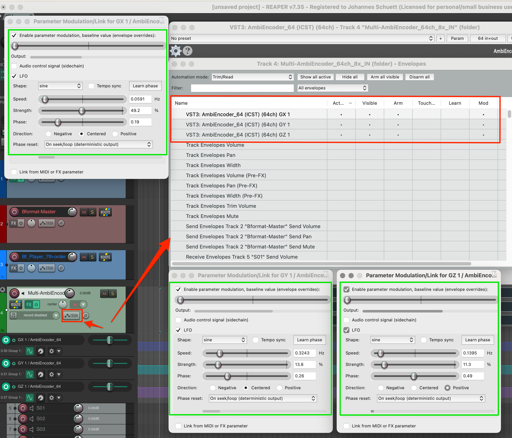
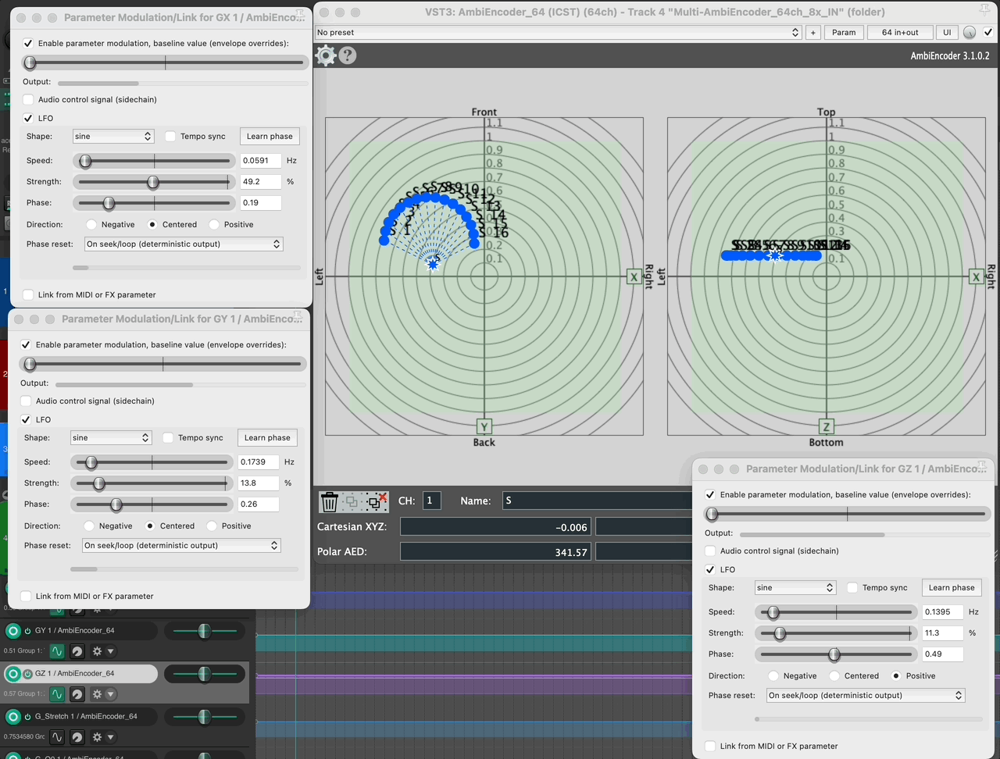
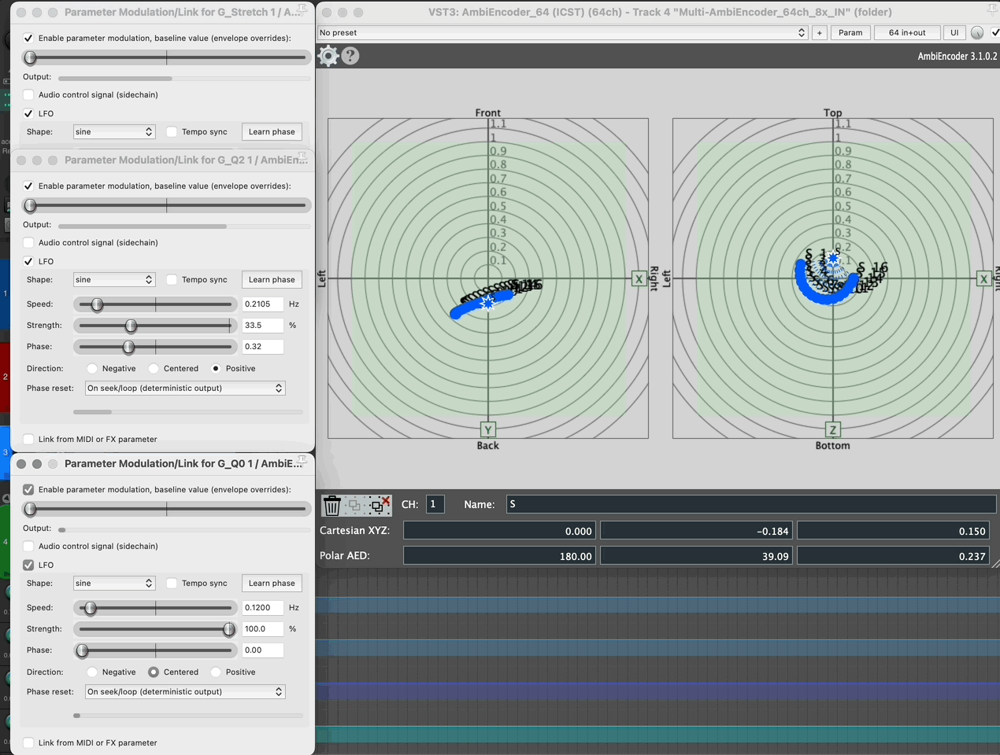

Institute for Computer Music and Sound Technology / (ICST) Zurich University of the Arts

---
# Group Animation

The **ICST Multi-Ambisonics Encoder v.2+** features a **Group Animation** tool for dynamically manipulating grouped audio sources in the **Radar Display**. By selecting a group point and holding **Option (Alt) on Mac**, you unlock advanced functions like **group animation** and **group stretch**, enabling synchronized movement and transformation of multiple sources for enhanced 3D spatialization.

📺 **Tutorial:** [Points and Radar](https://youtu.be/aDa-vNWriLM) (3:15)

---
### Simple animation of a group

1. **Select Points** – Click to select a point; use **Shift + Click** for multiple points.
2. **Create Group** – Click the **Group** symbol to generate a group point (e.g., 'S').
3. **Move Group** – Hold **Shift** and drag the group point.
4. **Rotate Points Around Group** – Hold **Alt**, then drag and drop the **Rotate-Around-Group** symbol.
5. **Stretch Group** – Hold **Alt**, use the **Stretch Symbol**, then move the mouse **up/down** to adjust.
6. **Rotate Group Around Origin** – Hold **Alt**, then drag and drop the **Rotate-Around-Origin** symbol.

💡 **Tip:** These functions also apply to height adjustments in the **Z-Radar**.

----
### LFO Animation of a Group
 
1. Open the **LFO Parameter Modulation** in the **AmbiEncoder** track and activate the parameters for **GX, GY, and GZ**.
 
2. Adjust the LFO parameters, such as **speed**, to achieve the desired movement.  
Now, the group moves automatically in the radar.

 

💡 **Tip:** If you connect the LFO parameters to a **MIDI/OSC interface**, you can control the movement live.

----
### LFO Group Animation with Quaternions

This is a more advanced example of animating a group using **quaternion parameters**.

💡 **Tip:** You can also drive the parameters using an **audio control signal** via sidechain.

----
©2025 ICST

