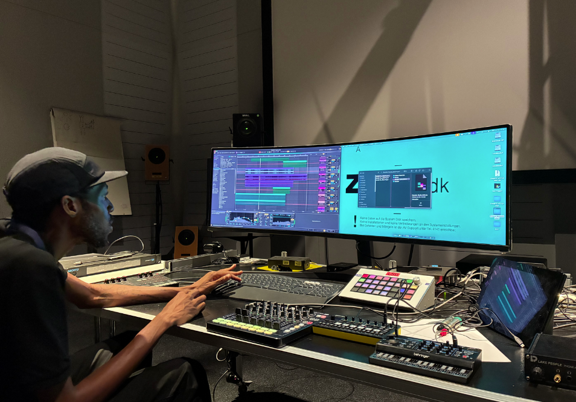
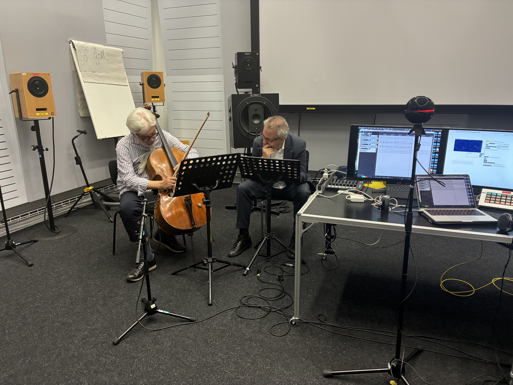

  
  

    
Nandele Maguni

    16 Jun – 06 Jul 2025
    
During his three-week ICST Studio Residency, Nandele Maguni produced a new release entitled <em>Kampfumo</em> based on his field recordings from Maputo.

  

  
  

    
Youngjae Cho

    07 Jul – 27 Jul 2025
    

      <a href="https://www.youngjaecho.com/about.html">Website</a>
      <a href="../youngjae-cho/">Full profile & B-Format project →</a>
    

    
Composer based in Korea and Germany, working with electroacoustic music, live electronics, and immersive multi-channel audio. His accolades include the George Enescu Competition (1st Prize) and the Via Nova Competition (1st Prize).

  

  
  

    
Dániel Péter Biró

    18 Aug – 07 Sep 2025
    
Professor of Composition at the Grieg Academy, University of Bergen. His research project <em>Sounding Philosophy</em> is funded by the Norwegian Artistic Research Program (2021–2025).

  

  
  

    
Ana Gonzalez Gamboa Prix CIME 2025

    08 Sep – 16 Sep 2025
    

      <a href="https://anagonzalezgamboa0.wixsite.com/anagamboa">Website</a>
      <a href="https://www.instagram.com/ana___gamboa/">Instagram</a>
      <a href="../ana-gonzalez-gamboa/">Full profile →</a>
    

    
<em>Lúmina</em> is a composition that intertwines travel recordings with fragments of anime, constructing an imaginary world where memory and fiction intersect.

  

