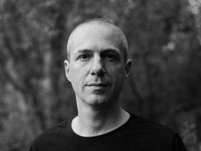
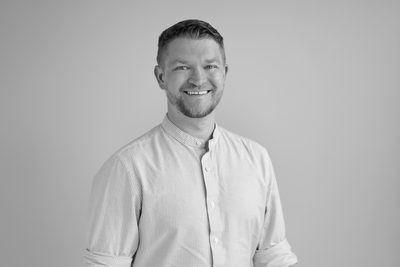

Institute for Computer Music and Sound Technology (ICST) Zurich University of the Arts

---

  
  

    
Pierre Alexandre Tremblay

    28 Apr – 21 Aug 2026
    

      <a href="https://www.zhdk.ch/forschung/icst/icst-air/pierre-alexandre-tremblay-25360">ICST Projektseite</a>
      <a href="https://www.pierrealexandretremblay.com/">Website</a>
    

    
Born in Montréal in 1975, Pierre Alexandre Tremblay is a composer and performer specialising in bass guitar and electronic devices. His work spans electroacoustic music, contemporary jazz, mixed music, and improvisation, with releases on the empreintes DIGITALes label. He served as Professor of Composition and Improvisation at the University of Huddersfield from 2005 to 2024, and currently holds a research professor position in composition at the Conservatorio della Svizzera italiana.

    <table class="sessions-table">
      <tr><th>Session</th><th>Von</th><th>Bis</th></tr>
      <tr><td>1.</td><td>28 Apr 2026</td><td>01 Mai 2026</td></tr>
      <tr><td>2.</td><td>22 Jun 2026</td><td>24 Jun 2026</td></tr>
      <tr><td>3.</td><td>13 Jul 2026</td><td>17 Jul 2026</td></tr>
      <tr><td>4.</td><td>27 Jul 2026</td><td>30 Jul 2026</td></tr>
      <tr><td>5.</td><td>17 Aug 2026</td><td>21 Aug 2026</td></tr>
    </table>
  

  
  

    
Yoko Konishi

    24 Aug – 13 Sep 2026
    

      <a href="https://www.zhdk.ch/forschung/icst/icst-air/yoko-konishi-25367">ICST Projektseite</a>
    

    
Yoko Konishi is a Japanese sound artist and performer currently based in France. Her practice centres on the intersection of sound, body, and technology through spatial audio, interactive systems, and sensor-based processes. She holds a Master's degree in ambisonics and spatial sound composition from Université Paris 8, attended a post-master's programme at the mdw – University of Music and Performing Arts Vienna, and completed IRCAM's Cursus programme in 2024–25.

    
From 24 August to 13 September 2026, Konishi will be at ICST for her Studio Residency. She will create a new work for presentation at the <strong>Sonic Matter Festival 2027</strong>, deepening the integration of narrative structures and sensory immersion in spatial composition.

  

  
  

    
Eli Stine

    29 Jun – 06 Jul 2026
    Prix CIME 2025
    

      <a href="https://elistine.com/">Website</a>
    

    
Eli Stine is a composer, programmer, and educator. He holds a Ph.D. and Master's in Composition and Computer Technologies from the University of Virginia and bachelor's degrees in Technology in Music and Computer Science from Oberlin College. He is a Visiting Assistant Professor at Oberlin Conservatory. His work explores electroacoustic sound and multimedia technologies using custom-built software, video projection, and multi-channel speaker systems. His piece <em>Where Water Meets Memory</em> won the <strong>Prix CIME 2025</strong> international electroacoustic music competition.

  

---

©2026 ICST