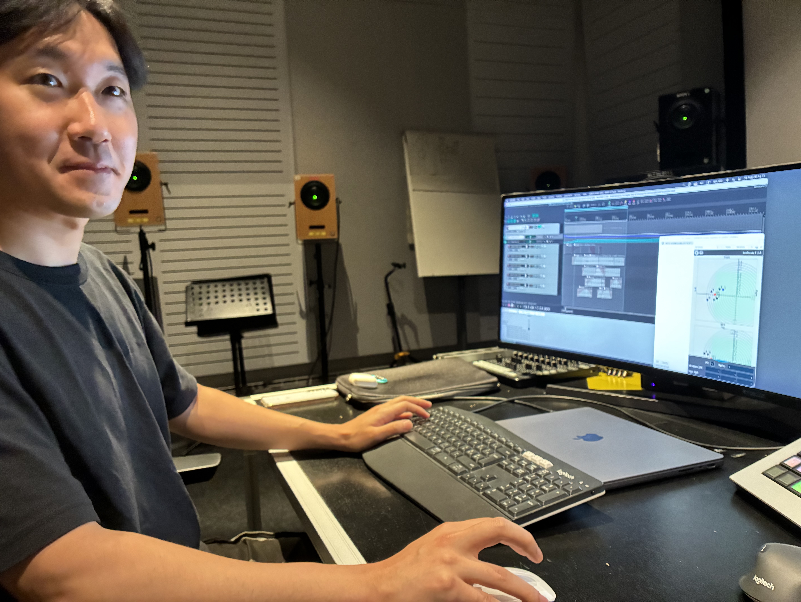

Institut für Computermusik und Soundtechnologie / (ICST) Zürcher Hochschule der Künste

---

# Youngjae Cho

ICST Artist in Residence vom **07.07.2025 bis 27.07.2025** (Studio-Residenz)

---

## Zur Person

Youngjae Cho (geboren 1990) ist ein Komponist mit Basis in Korea und Deutschland. Sein Schaffen umfasst Solo- und Kammermusik, elektroakustische Musik, Live-Elektronik und immersives Mehrkanalformat-Audio. Inspiriert von Alltagsgeräuschen und Klanglandschaften entstehen Kompositionen, die auf Festivals in Europa, Asien und Nordamerika aufgeführt werden. Er studierte Komposition bei Peter Gahn an der Hochschule für Musik Nürnberg und schloss einen Master in elektroakustischer Komposition an der Hochschule für Künste Bremen ab.

Auszeichnungen: **George Enescu Wettbewerb** (1. Preis), **Via Nova Wettbewerb** (1. Preis).

**Links:**
- [Website](https://www.youngjaecho.com/about.html)

---

## Projekt am ICST

**B-Format zu SPS/T-Format Konvertierung**

Während seiner Residenz erforschte Youngjae Cho einen Workflow zur räumlichen Audioverarbeitung, der auf der Umwandlung von B-Format-Aufnahmen in das SPS-Format (Spatial PCM Sampling) basiert — einem alternativen Ansatz zu Higher-Order Ambisonics, bei dem räumliche Information als raumabhängige Filterkanäle enkodiert wird. Dadurch können klassische Audioprozesse (Rauschreduzierung, EQ) auf immersive Aufnahmen angewendet werden, bevor diese zurück in B-Format konvertiert werden.

Der am ICST entwickelte Workflow:
1. Feldaufnahme in 3rd-order ambiX B-Format konvertieren
2. Dekodierung in T-Format (SPS) mit dem SPARTA AmbiDEC Plugin
3. Traditionelle Bearbeitung der PCM-Audiokanäle
4. Rückkodierung von T-Format zu 3rd-order ambiX B-Format
5. Upscaling auf 7th-order ambiX für die Wiedergabe

---

©2025 ICST
