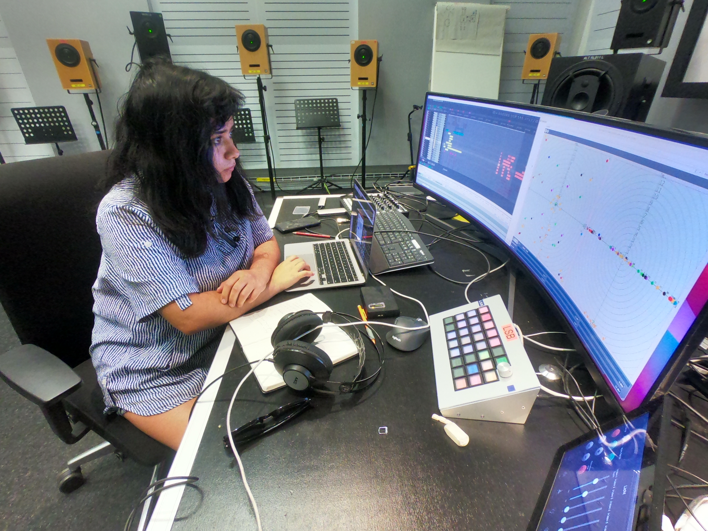

---
tags:
title: Ana Gonzalez Gamboa
description: "Ana González Gamboa — ICST-Studioresidenz an der ZHdK Zürich, September 2025. Komponistin an 'Lúmina', einer räumlichen Komposition aus Field Recordings im ecuadorianischen Amazonas."
date: 2025-09-03T18:35:00
slug: ana-gonzalez-gamboa
aliases:
  - /de/residenzen/Ana Gonzalez Gamboa/
build:
  list: never
  render: always
---

ICST Artist in Residence vom **08.09.2025 bis 16.09.2025**
(Studio-Residenz)

"Lúmina" ist eine Komposition, die Reiseaufnahmen mit Fragmenten von Anime verflechtet und eine imaginäre Welt konstruiert, in der sich Erinnerung und Fiktion überschneiden – ein grenzenloser Raum, der mit der Fluidität eines Traums entsteht, in dem sich das Alltägliche verwandelt und das Imaginäre die Textur des Realen annimmt.

Unter diesen Aufnahmen befinden sich Klänge von meiner Reise nach Nuevo Rocafuerte, einer kleinen Stadt im ecuadorianischen Amazonas am Ufer des Napo-Flusses, nahe der Grenze zu Peru. Ich bin dort nach einer 15-stündigen Bootsfahrt angekommen, umgeben von Regen, Vogelgesang und den Rufen exotischer Tiere, die meine Begleiter wurden.

In dieser Arbeit reflektiere ich die Interaktion zwischen Klanglandschaften, menschlicher Präsenz und Alltag. Klang erscheint dabei sowohl als Form der Kommunikation als auch als Mittel, Bedeutung in Raum und Zeit zu erzeugen. Indem ich die Stadt höre, als wäre sie ein Instrument mit eigenen Parametern von Tonhöhe, Rhythmus, Intensität, Timbre und Dauer, verschmelzen diese Aufnahmen mit anderen Klangmaterialien zu einer dynamischen und veränderlichen Klanglandschaft.

Ana Gamboa lebt in Buenos Aires und wurde in Ambato, Ecuador geboren. Sie ist Cellistin, Komponistin und Soundkünstlerin, deren Arbeit die Hybridität von akustischen und elektronischen Praktiken erforscht. Seit 2018 baut sie ein persönliches Archiv von Klängen aus ihren Reisen durch Lateinamerika auf und verflechtet diese mit kollaborativer Improvisation und experimenteller Komposition. Ihre Praxis erforscht Gedächtnis, Identität und das Imaginäre durch Klang.

Web: <https://anagonzalezgamboa0.wixsite.com/anagamboa>

Ig: <https://www.instagram.com/ana___gamboa/>
