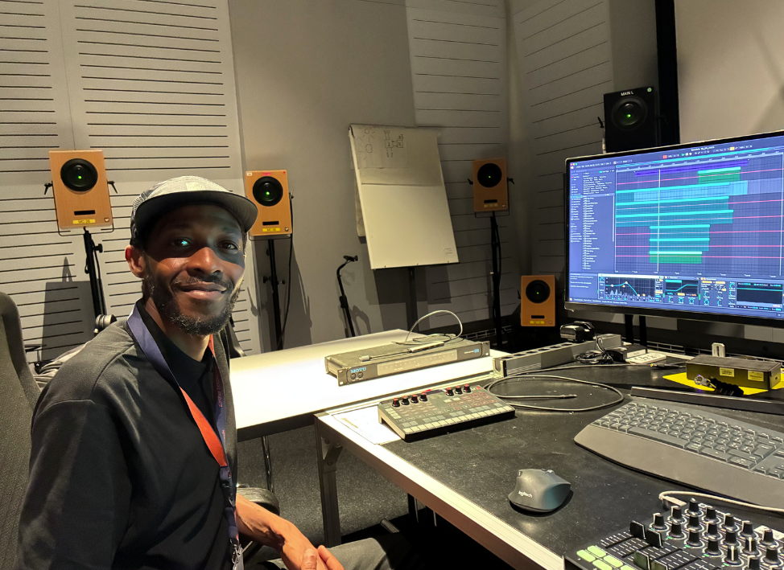

ICST Artist in Residence vom **16.06.2025 bis 06.07.2025** (Studio-Residenz)

Während seiner dreiwöchigen ICST Studio-Residenz produzierte Nandele Maguni eine neue Veröffentlichung mit dem Titel "Kampfumo", basierend auf seinen Feldaufnahmen aus Maputo.

### Klang an der ZHdK – ICST erforschen

Die Residenz an der ZHdK – Zurich University of the Arts im ICST war für mich eine inspirierende Erfahrung.

Ich entwickle derzeit das Projekt Kampfumo, eine klangkünstlerische Erkundung der Alltagsklangwelt von Maputo, insbesondere des Chapa-100-Transportsystems und der lebendigen Energie des Kampfumo-Distrikts.

Im räumlichen Audio-Studio des ICST experimentiere ich mit immersiven Technologien, um ein kinematisches und multidimensionales Hörerlebnis zu schaffen.

### Höre die neue Veröffentlichung von Nandele Maguni:
- [Nandele Maguni "Kampfumo" Stereo](https://e.pcloud.link/publink/show?code=XZcB96ZIpQd93jYp9YJyyVLT0aWOSThvLNV)
- [Nandele Maguni "Kampfumo" Binaural](https://e.pcloud.link/publink/show?code=XZk296ZezHI5GUzScpbYWV0SADkCjkigCbV)
- [Nandele Maguni "Kampfumo" Binaural+ ](https://e.pcloud.link/publink/show?code=XZV296ZHgMAiKBRIB0EGXgbV9g5V0hDomjk)

- (Binaural+ funktioniert ähnlich wie im Heimkino)

Es geht nicht nur um Klang, sondern um Bewegung, Gedächtnis und Raum.

----
