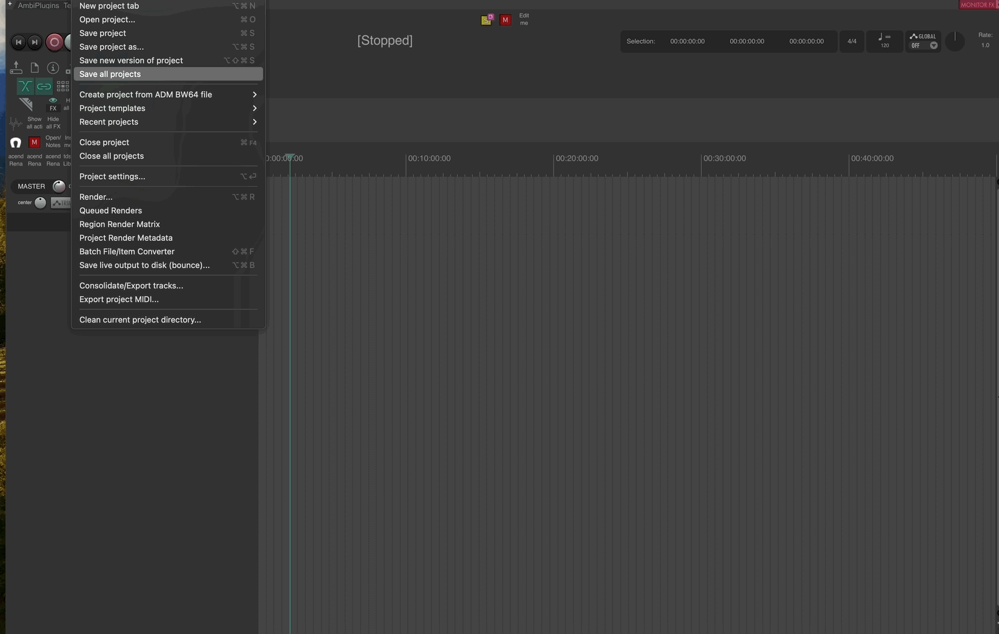
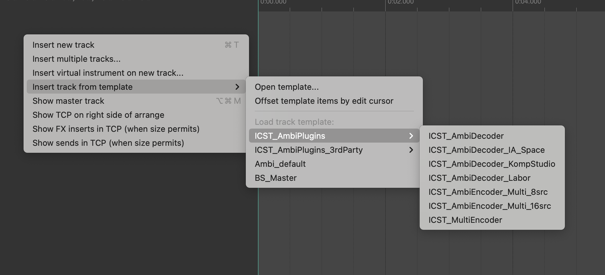

Institute for Computer Music and Sound Technology / (ICST) Zurich University of the Arts

* * *

# 01_Overview

# Overview
The ICST Ambisonics Plugins encode and decode the Ambisonics B-Format and several additional spatial audio production tools. The following examples were created for and with the [REAPER](https://www.reaper.fm/) Digital Audio Workstation (DAW)!

The ICST Ambisonics plugins consist of the following plugin formats:
-   VST3 / Components (AU) /LV2 (LV2 version does NOT support automation parameters at this time)

Find individual pages here:
[ICST AmbiEncoder](https://github.com/schweizerweb/icst-ambisonics-plugins/wiki/ICST-AmbiEncoder) (Mono & Multi Encoder
[ICST AmbiDecoder](https://github.com/schweizerweb/icst-ambisonics-plugins/wiki/ICST-AmbiDecoder) (Decoder)

**Developer - team**:

-   Christian Schweizer/Johannes Schuett/Martin Neukom
-   Video Editor: Axel Kolb
-   2025 the ICST

**Free download here:**

-   Binary Download: <https://github.com/schweizerweb/icst-ambisonics-plugins/releases>
-   Documentation: <https://github.com/schweizerweb/icst-ambisonics-plugins/wiki>
-   Tutorials, Blog: <https://joambi.github.io/icst-ambisonics.github.io/home/>
-   Youtube: [https://www.youtube.com/\@ICSTAmbisonics](https://www.youtube.com/@ICSTAmbisonics)

Issues: LV2 is very experimental

**Download: <https://github.com/schweizerweb/icst-ambisonics-plugins/releases/>**

----

## Quickstart with the ICST_AmbiPlugins_MultiEncoder.RPP
1. Open the Reaper DAW
2. Open “ICST_AmbiPlugins_MultiEncoder.RPP” via the Reaper menu.
3. Save the template under a new <name>

----

## Open the TrackTemplates

1. Right-click in the empty Reaper track field
2. Select 'Insert track from template
3. Select the desired 'TrackTemplate'

