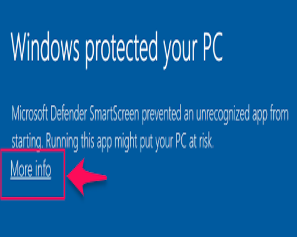
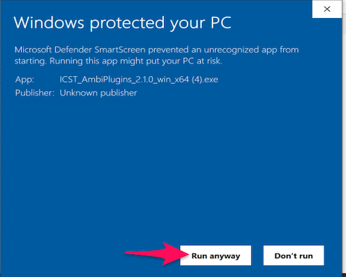

Institute for Computer Music and Sound Technology / (ICST) Zurich University of the Arts

* * *

# 02_Installation

### 01_Install the ICST Ambisonics Plugins (OSX)

1. Download Reaper(DAW) (arm64/intel_64) from [reaper.fm](http://reaper.fm/)
2. Follow the Reaper Installation guide.
3. Run the Reaper (DAW) by click the _[Reaper64.app](http://Reaper64.app)_
4. Close _Reaper64._
5. Install the _reaper plugin extension (SWS/S&M)_ from this link: <https://www.sws-extension.org/> (<https://www.sws-extension.org/download/REAPERPlusSWS171.pdf>)
6. Install the _ReaPack_ (Package manager for Reaper) from here: <https://reapack.com/>
7. Follow this installations guide: <https://reapack.com/user-guide#installation>
8. Download the ICST AmbiPlugin osx installer: <https://github.com/schweizerweb/icst-ambisonics-plugins/releases>

### What is installed by 'ICST_AmbiPlugins_macOS':

- /Library/Audio/Plugins/VST3
- /Library/Audio/Plugins/Components
- /Library/Audio/Plugins/LV2 (experimental)
- Users/Shared/AmbiPluginsTemp/ProjectTemplates
  - ICST_AmbiPlugins_MonoEncoder.RPP
  - ICST_AmbiPlugins_MultiEncoder.RPP
- Users/Shared/AmbiPluginsTemplatesTemp
  - TrackTemplates
    - ICST_AmbiPlugins
    - ICST_AmbiPlugins_3rdParty
    - 
INFO: https://github.com/schweizerweb/icst-ambisonics-plugins/wiki

> [!VIDEO]
> https://www.youtube.com/watch?v=UmPnUTVem0Q

---

### 02_Installation(win):

1. Download Reaper64 (Windows 64-bit) from [reaper.fm](http://reaper.fm/)
2. Follow the Reaper Installation guide.
3. Run the Reaper (DAW) by click the _[Reaper64.app](http://Reaper64.app)_
4. Close _Reaper64._
5. Install the _reaper plugin extension (SWS/S&M)_ from this link: <https://www.sws-extension.org/> (<https://www.sws-extension.org/download/REAPERPlusSWS171.pdf>)
6. Install the _ReaPack_ (Package manager for Reaper) from here: <https://reapack.com/>
7. Follow this installations guide: <https://reapack.com/user-guide#installation>
8. Download the ICST AmbiPlugin windows installer: <https://github.com/schweizerweb/icst-ambisonics-plugins/releases>
9. Extract _ICST\_AmbiPlugins\_3.0\_win\_x64.exe_ to _C:\\Program Files\\Common Files\\VST3_

![[96c29ac7-ad6b-54f9-aaa3-3671dd52a223.png]]
![[61162f76-55c0-9331-36f4-6aafe078f0a3.png]]
![[5bfb790c-a319-a78a-6c52-0979b4c4a0f0.png]]
![[0f6150aa-72d5-3fef-b1a5-b9b5a91fa910.png]]
![[b423a22c-122a-989a-70b1-1cfeffd12c4d.png]]
Restart the PC!

----
